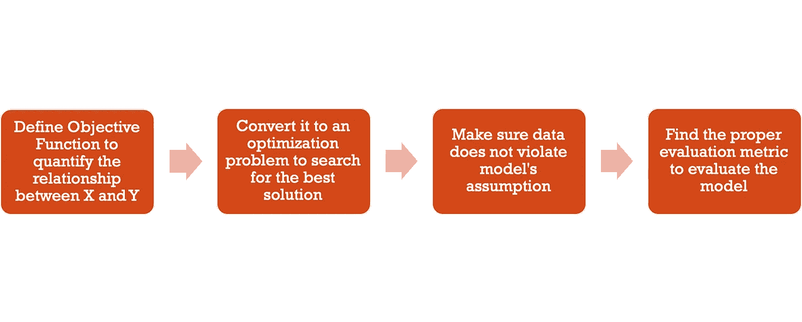

# 线性回归解释 101

> 原文：<https://medium.com/analytics-vidhya/linear-regression-explained-101-ebc9f1d63685?source=collection_archive---------22----------------------->

机器学习已经成为当今最热门的话题，但我发现每个人都专注于花哨的算法，没有人关心这一切从何开始。当我回顾我的学术道路时，我发现即使算法变得越来越先进，基本概念仍然没有改变:

理解模型的步骤

这些步骤是我通过最经典的机器学习算法——线性回归学到的。我想要…