# 线性回归解释

> 原文：<https://medium.com/analytics-vidhya/linear-regression-explained-5a5e9027cd6d?source=collection_archive---------8----------------------->

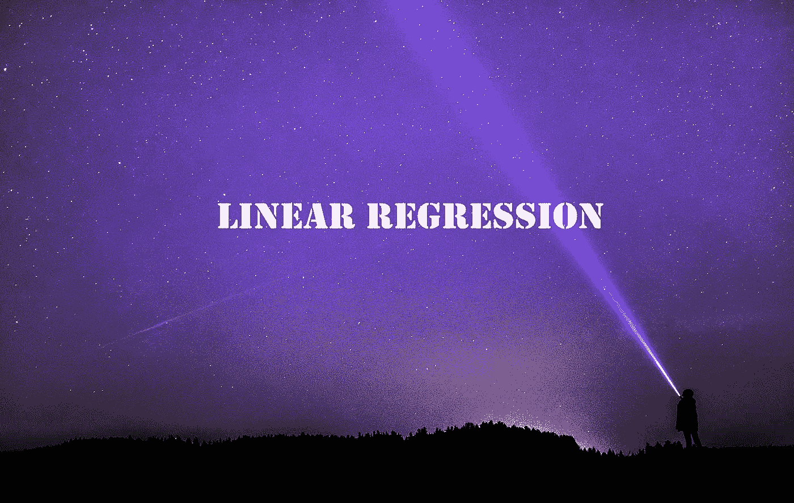

线性回归是你开始学习机器学习时弹出的第一个算法。这是最简单的学习算法之一，很容易理解。点击这里查看如何在你的浏览器中运行 ML 程序。我们将思考它的工作原理，然后用 Python 实现它。我试着用很多图片和图形来解释，以帮助你理解这个概念。让我们看看它是如何工作的！

# 什么是回归？

回归是一种估计具有连续值域的变量之间关系的方法。相比之下，分类是将变量分成不同的类或组。比方说，我们必须模拟人的身高和体重之间的关系。所以，给定一个人的体重，我们必须预测他的身高。这里，身高和体重都有一个连续的取值范围。但是，在分类任务中，输出只能属于一组类或组。一个这样的例子是预测图像是“猫”还是“狗”。

关键是，当目标变量连续时，这是一个回归任务。

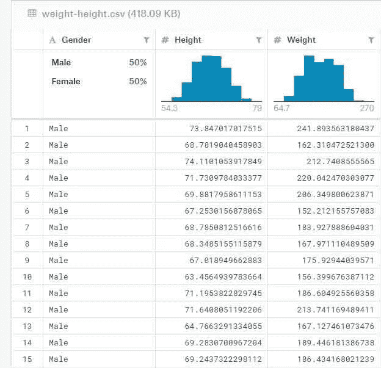

**身高英寸，体重磅**

在上面的数据集中，我们可以使用两个变量中的任何一个来预测另一个。我用体重来预测身高。为了简单起见，我们将忽略表中的性别列。你看到“身高”和“体重”都有一个连续的数值范围吗？

# 线性回归简介

线性回归是使用线性预测模型来预测目标变量。我们用‘用体重预测身高’这个问题来详细了解一下。这里，权重作为输入或自变量。并且身高是使用输入体重预测的因变量。体重与身高的关系是用直线建立的。

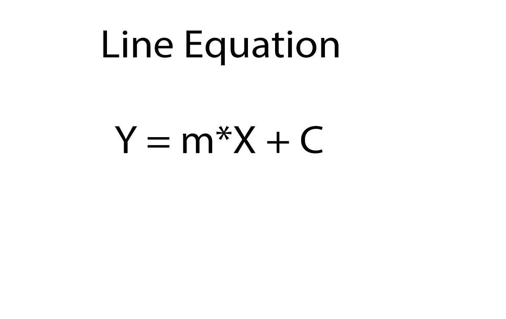

**一条线的数学方程**

我们在数学上将线表示为 Y = m*X+ C，其中 X 是输入要素，Y 是目标变量。在上面的等式中，“m”和“C”是决定直线斜率和截距的参数。

不能理解什么是“斜率”和“截距”？没问题，我掩护你。

# 斜率和截距。它们是什么？

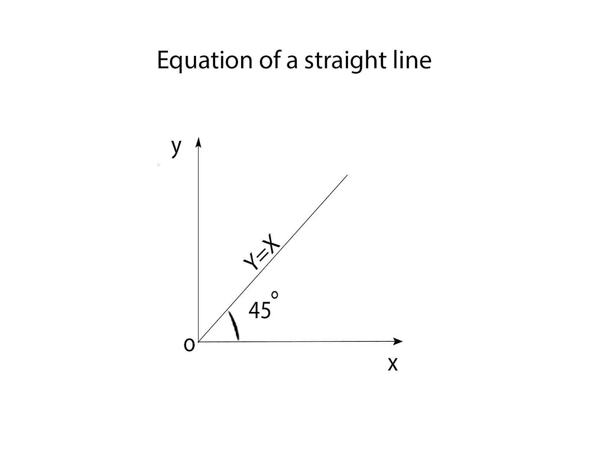

**直线方程**

任何直线的斜率“m”决定了该直线相对于水平 X 轴的倾斜程度。在上图中，这条线的倾角为 45 度。因此，直线的斜率是正切(45)或 tan(45)，即 1。截距是直线与相应轴相交的地方。在我们的例子中，“C”是 Y 轴截距，其值为零。因此，线方程是 Y=1*X + 0，即 Y=X。

# 将线拟合到数据集

现在，让我们回到我们的“体重-身高”数据集，看看我们的数据是什么样子的。

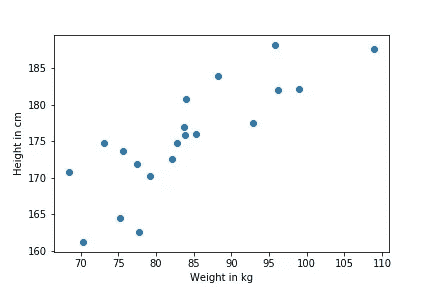

在这个 20 个样本的散点图中，数据点以倾斜的方式分布。如果我们想用一条线来拟合这个数据，那也是一条斜线。但是，我们要使它倾斜到什么程度呢？我们把线放在哪里呢？还记得斜率和截距吗？通过调整它们的值，我们将能够定位线条以适应数据。但是我们如何知道我们的线性回归模型的斜率和截距的值应该是多少呢？训练部分来了。

在训练过程中，我们让我们的模型看到输入和输出数据(体重和身高)，并调整其参数，使线完美拟合。但是在我们开始训练之前，我们从‘m’和‘C’的随机值开始。因此，该模型预测给定输入集的随机输出值。然后，该模型通过使用损失函数将其输出与真实输出进行比较，来查看它预测的有多差。

# 线性回归模型的损失函数

为了了解我们的模型预测得有多糟糕，我们使用了一个叫做均方差(MSE)的指标。因为只有当我们看到误差有多大时，我们才能通过最小化误差来纠正它。MSE 取整个训练数据集的实际高度值和预测高度值之差的平方和的平均值。

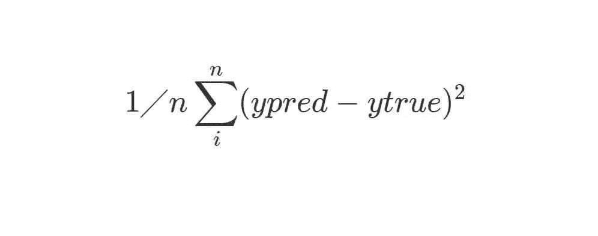

**均方误差成本函数**

在上面的等式中，“pred”是模型预测的值，而“true”是基本事实标签。但是，为什么是 MSE 呢？因为平方项会使大误差变大，非常小的误差变小。对整个数据集求和以计算误差。

# 最小化成本

我们在上面看到的成本应该被最小化，以得到我们模型的最佳拟合。这是通过他们所谓的“梯度下降”来实现的。基本上，梯度下降调整“m”和“c”的值，使得总损失最小。它通过对‘m’和‘C’取成本函数的偏导数(使用链式法则)并更新它们的值来做到这一点。

# 梯度下降

成本函数在分别对‘m’和‘C’进行部分微分时，分别产生每个模型参数(m 和 C)的更新值。

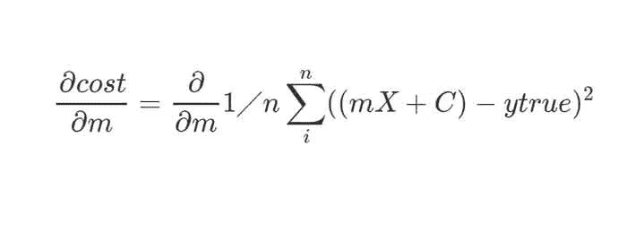

**均方差的偏导数 w.r.t 'm'**

接下来，使用微积分的链式法则，我们区分成本函数元素。

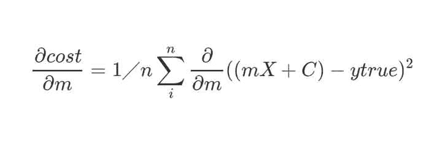

**在偏导数外取常数 1/n**

根据标量乘规则，常数乘数可以移到导数之外。

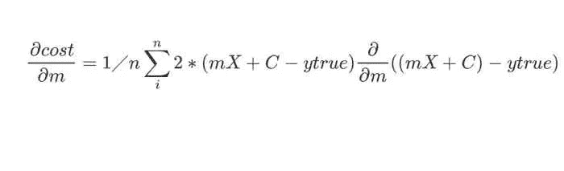

**根据幂法则，平方项被微分**

现在，常数‘2’也可以去掉，留下“(mX+C-ytrue)”项在里面。

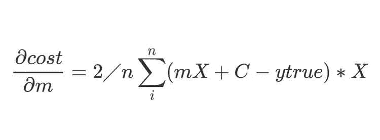

**最终方程式**

“m*X+C-ytrue”相对于“m”的偏导数是 X，因为所有其他项在偏导数中被视为常数。因此,“X”项与表达式的其余部分相乘。

这个过程对于 C 的导数也是一样的。它的结果方程将是这样的。

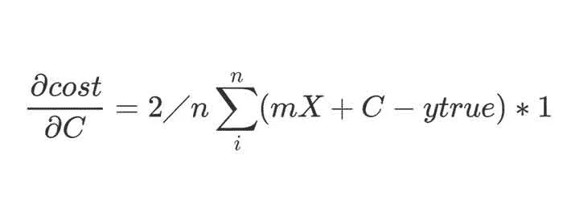

**成本函数相对于‘C’的偏导数**

这些导数用于使用梯度下降更新公式来更新‘m’和‘C’的现有值。我们使用参数‘alpha’来定义应该更新多少参数。alpha 越高，更新越大。但是，α值应该被最佳地设置，以便不超过参数的最佳值。更新等式如下所示。

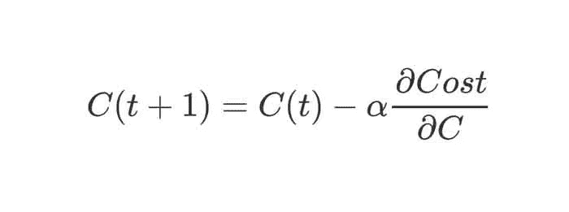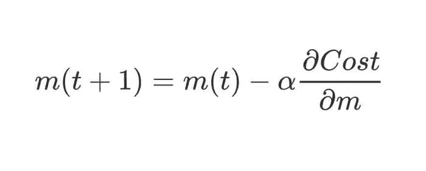

**更新‘C’和‘m’**

“t+1”是更新值，“t”是现值。

# 它看起来怎么样？

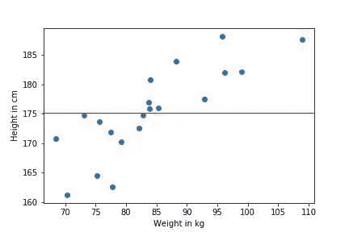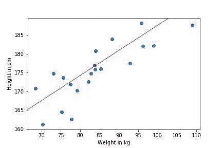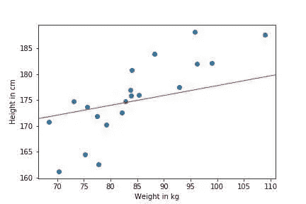

1)随机适合 2)完美适合 3)不完美适合

随着参数的更新，直线与数据集的拟合更加完美，最终的线性回归线是最佳拟合。

# 线性回归完成！

我希望这篇文章能让你清楚地了解线性回归的工作原理。在下一篇文章中，我们将只使用 Python 从头开始编写一个线性回归模型。

直到那时，[快乐黑客](https://hackerstreak.com)！

*原载于*[*https://hackerstreak.com*](https://hackerstreak.com/)