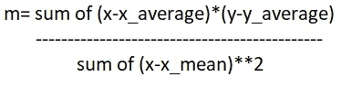
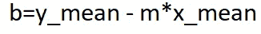
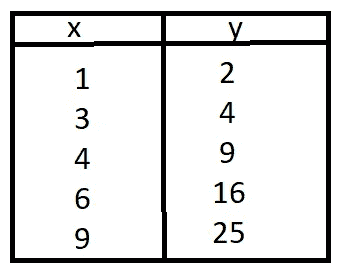
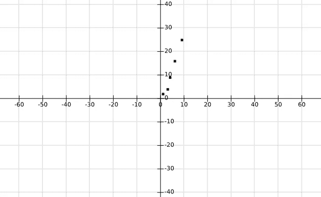
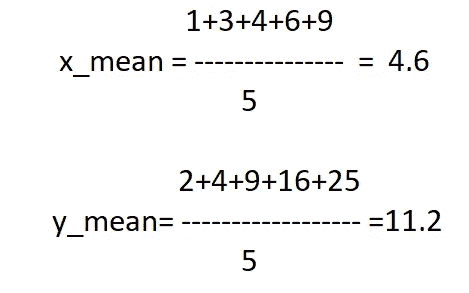
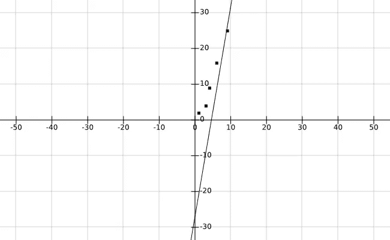
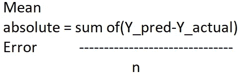
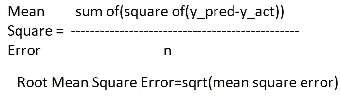
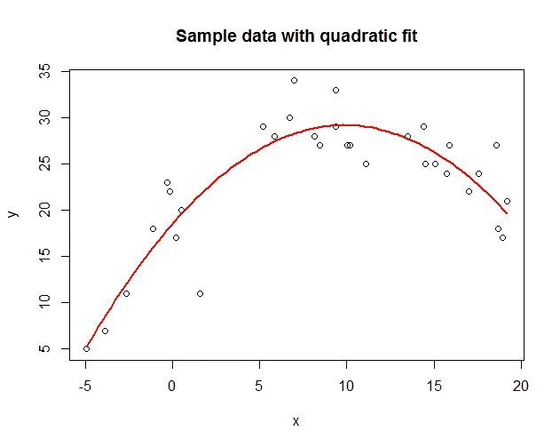

# 线性回归举例说明

> 原文：<https://medium.com/analytics-vidhya/linear-regression-explanation-with-example-300d164dc824?source=collection_archive---------26----------------------->

> 首先什么是线性？

遵循某种顺序或次序的事物。

例:2，4，6，8，10(增加 2)

> 接下来什么是回归？

在统计学中，回归是输出的一个因变量和输入的一系列自变量之间的关系。

假设你想根据体重预测身高。你有 4 个人的身高和体重数据集。你会预测吗？。是的，你会预测，但可信度较低。

如果我给 1000 个数据，10000 个数据，100000 个数据呢？因此，当数据增加时，你的信心水平也会增加。如果你能掌握这么多的数据，你就能在头脑中形成一个模式，并预测身高。因此，许多模式可以根据许多外部因素形成，如父母的身高、体重、饮食习惯、职业等。但这属于多元线性回归的概念。

再次预测，你的结果可能无法保证 100%。因为我们无法预测自然。那是上帝的游戏😎

现在来看机器。应用这些类型的知识是单调乏味的任务。现在计算机科学是从统计学中借用线性回归的概念来实现这些知识的。

今天我要讲的是简单的线性回归。所以，有两个变量(一个自变量，一个因变量)。所以你们大多数人知道的等式是

> y=mx+b

如果你想了解更多关于 y=mx+b 的信息，请访问下面的链接

[https://www.mathsisfun.com/equation_of_line.html](https://www.mathsisfun.com/equation_of_line.html)

y-因变量

x —独立变量

m —斜率

b —偏差

假设你想根据一个人的体重预测他的身高。这里高度是 y，重量是 x，那么 m 和 c 呢，所以预测给定数据集的最佳 m 和 c 是个问题。计算 m 和 bis 的公式

斜率公式(**表示的幂)

偏差公式

考虑以下数据

当我们为这一点作图时

现在我们计算 m 和 b

x-x_mean 为(1- 4.6，3-4.6，4-4.6，6-4.6，9-4.6)=(-3.6，-1.6，-0.6，1.4，4.4)

y-y_mean 为(2–11.2，4–11.2，9–11.2，16–11.2，25–11.2)=(-9.2，-7.2，-2.2，4.8，13.8)

替换我们得到的所有值

m=5.857

b=-26.94

所以方程是 y=5.857x-26.94。现在，这个方程图看起来像

你可能会想，为什么那条线不正好穿过所有的点。首先，我说预测永远不可能是 100%。对于这个数据，这条线是最好的。如果我给出 x=(1，2，3，4，5)和 y=(1，4，9，16，25)这样的数据，那么直线正好符合这一点。因为对于 x，它增加 1，y 是 x 的平方，所以我们找到了模式。所以对于 6 它预测 36。但是在给定的数据中，我找不到确切的模式。因为 x 突然增加 1 和 2，y 也不是 x 的平方。

如果我们替换方程中的 x 值

x=1 y=-21.083(但实际 y 值为 2)

x=3 y=-9.369(但实际 y 值为 4)

x=4 y=-3.512(但实际 y 值是 9)

x=6 y=8.202(但实际 y 值是 16)

x=9 y=25.773(实际 y 值是 25，接近于 25)。在图表中，该点更接近于直线。

我们的模型太差了。在 5 个值中，它实际上预测了 1 个正确的值。我们也不怪机器，因为我们只给了 5 个数据。由此它学会并正确预测 1 值好工作。它需要更多的数据！！

这是营养不良的情况。该模型无法预测训练数据。在实时考虑中，如果我们有 1000 个数据，我们花费不是全部的数据用于训练，我们把它分成 800(用于训练)200(用于测试目的)。在模型被训练之后，我们将这 200 个数据传递给模型并观察输出。将该输出与原始输出进行比较，以测试准确性。

如果模型在训练数据上失败了(比如我们自己),那么它就处于欠拟合状态。

如果模型正确地预测了训练数据，但在新数据上失败了，那么它就处于(过度拟合)状态

有三个术语来衡量我们模型的无误差程度:

平均绝对误差，均方误差，均方根误差。上述各项的计算公式

上述模型在上述计算中得分很低。如果你得到 0 意味着你的模型是百分之零误差。但这可能会导致过度拟合问题。我得到了 180 左右的均方根。你可能会想如何在训练者数据较少的情况下提高效率。有概念可用。

通过增加方程的阶数，如二阶、三阶、四阶。我将在以后讨论这个问题。

