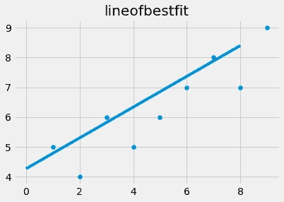
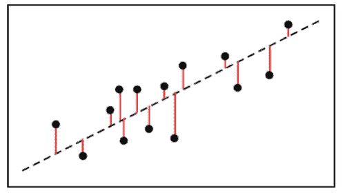

# 线性回归

> 原文：<https://medium.com/analytics-vidhya/linear-regression-faa4795bc73c?source=collection_archive---------17----------------------->


[https://cdn . Lynda . com/course/578082/578082-637199624574737751-16x 9 . jpg](https://cdn.lynda.com/course/578082/578082-637199624574737751-16x9.jpg)

回归可能是你第一次进入机器学习领域时学习的第一个机器学习算法，因为它简单有效，是更高级的机器学习算法(包括神经网络和推荐算法)的基础，并且相对容易理解。

回归是一种统计方法，采用一组随机变量并确定它们之间的数学关系。换句话说，回归计算许多变量来预测结果或分数。

今天，我们将从头开始实施线性回归，并绘制出最适合我们数据的直线。要继续下去，你应该有一些基本的 python 知识来理解代码和基本的数学知识。在线性回归中，我们简单地应用二维形式的公式 **y=mx + b** ，随着维度的增加，公式变得越来越复杂。因此，在我们的公式中,“y”是目标值，它取决于 x 坐标的值,“m”是斜率,“b”是 y 轴截距。


[https://scontent . fdel 3-1 . FNA . FBC dn . net/v/t 1.0-9/50170539 _ 10161259674865203 _ 3294943719437893632 _ o . png？_ NC _ cat = 103&_ NC _ sid = da 1649&_ NC _ OHC = 7 rrav _ nzlroax 85 F3 x _&_ NC _ ht = s content . fdel 3-1 . FNA&oh = bca8d 6495836 a 1626748261478095 a 28&OE = 5 eee 56 e 8](https://scontent.fdel3-1.fna.fbcdn.net/v/t1.0-9/50170539_10161259674865203_3294943719437893632_o.png?_nc_cat=103&_nc_sid=da1649&_nc_ohc=7RraV_NZlroAX85F3X_&_nc_ht=scontent.fdel3-1.fna&oh=bca8d6495836a1626748261478095a28&oe=5EEE56E8)

```
from statistics import mean
import numpy as np
import matplotlib.pyplot as plt
from matplotlib import stylexs= np.array([1, 2 ,3 ,4 ,5 ,6 ,7 , 8, 9], dtype= np.float64)ys= np.array([5,4,6,5,6,7 ,8, 7 ,9], dtype= np.float64)
```

首先，我们导入必要的库并创建 x 和 y numpy 数组。然后我们使用 matplotlib 库可视化我们的数据。

```
plt.scatter(xs,ys) #scatter plot
plt.show()
```


现在我们将创建计算斜率和 y 轴截距的函数。

```
def best_slope(xs,ys):
    x_bar = mean(xs)
    y_bar = mean(ys)
    m= (((x_bar * y_bar) - mean(xs*ys)) /
        ((x_bar* x_bar) - mean(xs * xs)))

    return m
```


[https://python programming . net/static/images/machine-learning/best-fit-slope . png](https://pythonprogramming.net/static/images/machine-learning/best-fit-slope.png)

```
def best_intercept(xs , ys):
    y_bar= mean(ys)
    x_bar = mean(xs)
    m=best_slope(xs ,ys)

    b=(y_bar - (m*x_bar))
    return breg_line = [ (m*x) +b for x in xs]
```

现在我们用 m、x 和 b 的值绘制回归线，也称为“最佳拟合线”

```
plt.scatter(xs, ys)
plt.plot(reg_line)
plt.title(“lineofbestfit”)
plt.show()
```



但是我们如何保证我们的公式预测的线真的是最佳拟合的线呢？我们可以通过计算最佳拟合线的精确度来做到这一点，最佳拟合线也被称为 **R 或决定系数**

我们通过计算数据点和回归线之间距离的平方来计算。



[https://www . my accounting course . com/financial-ratios/images/r-squared-graph . png](https://www.myaccountingcourse.com/financial-ratios/images/r-squared-graph.png)

这就是线性回归的工作原理，通过找到相关特征的系数来找到一条最佳查找线，从而预测输出值或目标值。

你可以查看我的 github 链接，我在那里提供了 *i* -python 笔记本，其中包括我在这里使用的所有代码及其解释。我要感谢 youtube 频道“sentdex”以如此简单的方式解释了线性回归，您可以通过单击下面的链接观看视频。

我的 github 链接:【https://github.com/akshayakn13/LinearRegression 

建议总是受欢迎的。别忘了看看我的其他文章。

[从零开始线性回归。](https://ak95ml.blogspot.com/2020/06/linear-regression.html)

[美汤刮痧](https://www.blogger.com/blog/post/edit/1004924421828631592/5881650886724527591#)

[我如何开始我作为机器学习爱好者的旅程](https://www.blogger.com/blog/post/edit/1004924421828631592/5881650886724527591#)。