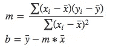

# 从头开始线性回归

> 原文：<https://medium.com/analytics-vidhya/linear-regression-from-scratch-98688848bd4e?source=collection_archive---------14----------------------->

线性回归无需介绍。这是机器学习世界的“你好世界”。让我们深入探究线性回归的用例及其背后的数学直觉。

我们身处一个由数据驱动的世界。一般说，[***【数据是新油】***](https://www.economist.com/leaders/2017/05/06/the-worlds-most-valuable-resource-is-no-longer-oil-but-data) 。回归是最重要的数据分析类型之一。回归旨在建立一个数学模型，该模型可用于根据一个*自变量*的值来预测一个*因变量*的值。如果你曾经在大学里上过统计学入门课程，那么你最后涉及的话题很可能是线性回归。

回归是机器学习中的一个基本问题，回归问题出现在各种研究领域和应用中，包括时间序列分析、控制和机器人、优化和深度学习应用。

线性回归是我们工具包中最简单的监督学习算法之一。线性模型使用输入要素的线性函数进行预测。当目标向量是一个量化值(如房价、工资等)时，这是一种常见且有用的预测方法。

线性回归有两种类型，简单线性回归和多元线性回归:

1.  **一元线性回归:**单个自变量用于预测因变量的值。
2.  **多元线性回归:**用两个或两个以上的自变量来预测因变量的值。

唯一的区别在于自变量的数量。在这两种情况下，只有一个因变量。为了理解和简单起见，我们将集中讨论一元线性回归。

**将哪些列标识为从属或独立列？**

数据集的自变量不能基于数学模型等进行预测。因变量，也称为“目标值”，是我们得到的观察值。它依赖于独立变量。让我们用一个例子来理解

这里，**经验**栏是*自变量*而**工资**栏是*因变量*

让我们把这些数据画在图表上，使之形象化

如果我们能找到一条最佳拟合直线 y=f(x ),我们就能预测出对应于 x 值的 y 值。

直线方程由下式给出:

y= m*x + b，

其中 m 是斜率

b 是截距，

您可能想知道不同的线可以适合不同的斜率和截距值。那么如何在所有曲线中选择**‘一’**曲线呢？

为了解决这种不确定性，我们引入了误差平方和或残差平方和的概念，其公式如下

点的残差是因变量的观测值( *y* )和预测值( *ŷ).)*高于预测值的观测值为正值，低于预测值的观测值为负值，因此我们取每个点的残差平方和，这样大的残差会受到惩罚。

残差平方和最小的线是 ***最佳拟合线。***

> 真的有必要拟合一条直线吗？为什么我们不能绘制一条拟合所有数据点的不同次数的多项式曲线？不是更可取吗？

不，我们的模型有过度拟合的问题。术语 [***过度拟合***](/@martinezbielosdaniel/bias-variance-tradeoff-overfitting-and-underfitting-c63799cb4851) 指的是一个模型非常适合它用来训练的数据，但它很难概括这些数据，这意味着当面对新值时，该模型产生的结果很差。

我们的目标是找到斜率和截距的值，使得残差平方和最小。最简单和最常见的方法是，使用普通的最小二乘法

使用**普通最小二乘法的斜率和截距公式；**

让我们进入代码部分:

现在，我们的模型已经训练好了。让我们预测一下

Tada！！我们已经学习了线性回归的基础知识。

结论:

普通的最小二乘法易于理解和实现，但它需要自己的甜蜜时间来训练模型。它的计算量很大。它对异常数据点很敏感。异常值有时会扭曲结果。 [**梯度下降**](https://youtu.be/sDv4f4s2SB8) 是另一种线性回归算法，计算速度更快，节省了大量计算时间，我们将在下一篇文章中介绍。