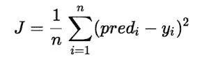
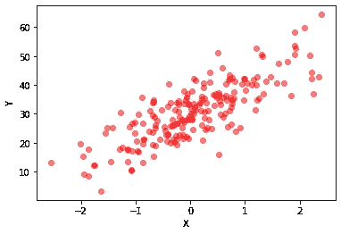

# 从零开始线性回归和基本直觉！

> 原文：<https://medium.com/analytics-vidhya/linear-regression-from-scratch-and-basic-intuition-e2564172bdc3?source=collection_archive---------19----------------------->

> 线性回归基本上是机器学习领域的序幕。理解线性回归并不难，但却是非常重要的一步。线性回归是最容易实现的机器学习算法之一。


也许渐变只是一种错觉！:ROFL:！

线性回归是借助直线找到两个变量之间关系的过程。我们的目标是找到以最小损失拟合这些点的线。这条线称为回归线。创建这条线性回归线的过程将是一个非常简单的过程。如果你到现在还不能理解任何事情，不要担心。我们将一步一步地介绍它们。

**线性回归定义:**

正如我们前面看到的，线性回归是一种寻找两个变量(X 和 y)之间关系的方法，其中 X 是自变量，y 是因变量。

**y*= w1 * X+w0***

*其中，*

*y—因变量*

*X —独立变量*

*w0—偏置*

*w1——比例因子或系数*

偏差因子(w0)给出了模型的自由度。

我们的工作是找到 m 和 b 的值，使得损失最小。求 m 和 b 值的两种方法是**普通最小二乘法**和**梯度下降法。**

我们将使用梯度下降法来实现梯度下降。



j 是成本函数。它找出预测值和实际值之间的差异。

我们的目标是找到一条成本最低的线路。(即最小化成本)。


让我们进入编码部分！！！

让我们在 sklearn 库的帮助下创建一个玩具数据集。这是我们唯一会用到 sklearn 的部分。整个线性回归的实现只有在 numpy 的帮助下才能完成。

```
**#LINEAR REGRESSION FROM SCRATCH**from sklearn.datasets.samples_generator import make_regressionX, y = make_regression(n_samples=200, n_features=1, n_informative=1, noise=6, bias=30, random_state=200)
m = 200from matplotlib import pyplot as plt
plt.scatter(X,y, c = "red",alpha=.5, marker = 'o')
plt.xlabel("X")
plt.ylabel("Y")
plt.show()
```



*h( )* — h 函数是假设函数。它返回 w1*x1 + w0。

*cost( )* —成本函数计算预测值和实际值之间的 MSE(均方误差)

*grad( )* — grad 函数计算成本函数 w.r.t 对 w0 和 w1 的一阶导数。

*下降()* —下降功能负责梯度下降操作。(即)它负责权重更新过程，并试图找到每个点的损失最小的点。

*lr* —学习率

*graph()&formula()*—用于绘图目的。

```
import numpy as np**def h(X,w):**
    return (w[1]*np.array(X[:,0])+w[0])**def cost(w,X,y):**
    return (.5/m) * np.sum(np.square(h(X,w)-np.array(y)))**def grad(w,X,y):**
    g = [0]*2
    g[0] = (1/m) * np.sum(h(X,w)-np.array(y))
    g[1] = (1/m) * np.sum((h(X,w)-np.array(y))*np.array(X[:,0]))
    return g**def descent(w_new, w_prev, lr):**
    print(w_prev)
    print(cost(w_prev,X,y))
    j=0
    while True:
        w_prev = w_new
        w0 = w_prev[0] - lr*grad(w_prev,X,y)[0]
        w1 = w_prev[1] - lr*grad(w_prev,X,y)[1]
        w_new = [w0, w1]
        print(w_new)
        print(cost(w_new,X,y))
        if (w_new[0]-w_prev[0])**2 + 
                              (w_new[1]-w_prev[1])**2 <= pow(10,-6):
            return w_new
        if j>500: 
            return w_new
        j+=1w = [0,-1]
w = descent(w, w , 0.01)**def graph(formula, x_range):**  
    x = np.array(x_range)  
    y = formula(x)  
    plt.plot(x, y, color="blue")  

**def my_formula(x):**
    return w[0]+w[1]*xplt.scatter(X,y, c = "red",alpha=.5, marker = 'o')
graph(my_formula, range(-2,3))
plt.xlabel('X')
plt.ylabel('Y')
plt.show()
```


就是这样。简单的线性回归就搞定了！

虽然精度不会很大，但这是一个很好的开始模型。

> 这个博客到此为止。我希望你们能学到一些有用的东西。请跟随我的叙述。欢迎在评论中提出关于博客的问题，并通过鼓掌表示感谢。还有，通过我的 [LinkedIn](https://www.linkedin.com/in/venkatesha-prasad-sridar/) 账号和我联系。感谢阅读。