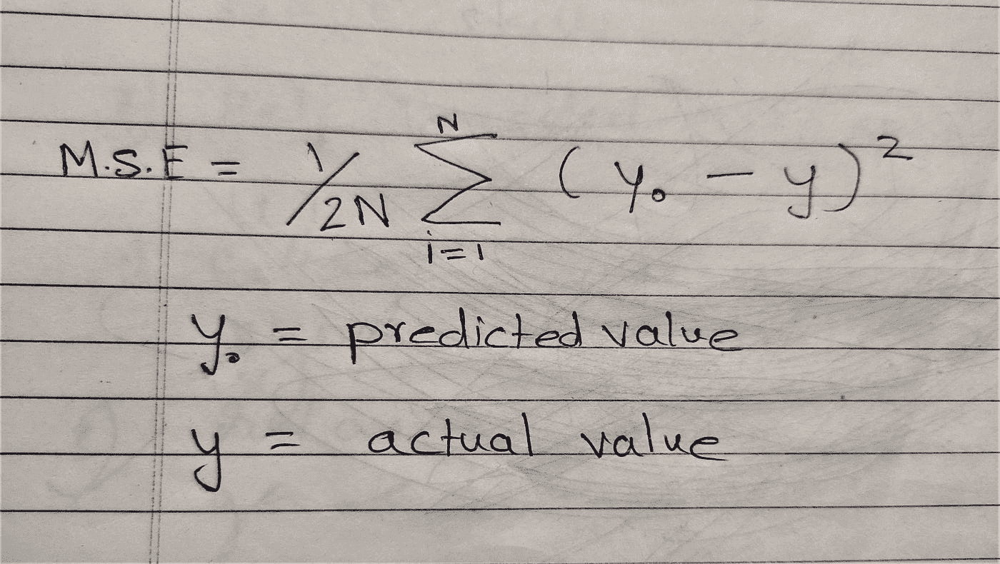

# 在 Java 中从头开始线性回归

> 原文：<https://medium.com/analytics-vidhya/linear-regression-from-scratch-in-java-dc7aead2ba04?source=collection_archive---------10----------------------->

为什么是 AI/ML:当我们缓慢而稳定地走向算法时代时，是时候思考我们是如何传统地使用现有的工具解决问题了。对人工智能/人工智能的需求不能被忽视，因为有更具挑战性的问题不能用现有的工具来解决。例如，尝试编写代码来预测输入图像是橙色还是苹果色。如果你解决了这个问题，再想想其他情况。如果输入图像是黑白的呢？如果图像包含叶子和水果会怎样？当然，增加中频和开关模块并不是解决这个问题的理想方法。

在本文中，我试图解释如何在不使用任何框架的情况下，用 java 为 scratch 编写线性回归。不使用任何框架背后的逻辑是理解和详细解释算法的内部原理。理论讲够了，让我们回到编码上来。

线性回归:根据数学定义，一个变量的线性方程可以定义如下。

```
y = mx+c
```

为了将它与现实世界的例子联系起来，让我们假设一家小公司想要根据一个月的平均温度来预测该月所需的 25 升饮用水瓶的数量。他们想要建立瓶子数量和月平均温度之间的模式[为了简单起见，我们假设员工数量是固定的]。该公司希望使用他们的历史数据来建立模型，以帮助他们实现这一目标。

数据集的例子。

```
Month's Avg Temperature   Number of Bottles consumed in month
35                                  4
37                                  8
```

让我们试着把它和方程式联系起来。

```
Temperature is x  and y is bottles now we have to find m and c. so that when we put x in below equation it should help with prediction of number of bottlesy = mx+c
```

问题陈述:找出 m 和 c 的最佳值，以便我们可以使用上面的等式来预测值。

解决方案:为了找到 m 和 c 的最佳值，我们必须从两者的一些随机初始值开始。我们将逐步修正这些值，以达到预测所需的精度[现在请不要考虑过度拟合]。这种逐渐纠正价值观的过程，就是我们会用到高中所学数学的空间。值的修正是在训练阶段使用历史数据完成的。更新 m 和 c 公式如下所示。

```
m1 = m0 - learningRate * differentitaion of M.S.E with respect to mlearning rate is fixed 0001d [ Learning rate hyper parameter which can be optimized using GridSearch or Randomoptimizer (Out of scope )]M.S.E = Mean squared error [ I find it difficult type maths formula using keyboards hence attaching image]
```



现在让我们用微分来计算 MSE 相对于 m 和 c 的变化率，我在高中时总是想知道为什么我们在学习微积分，现在看到它在运行是一种享受。


对于这篇文章，我们将使用随机梯度下降[其他类型是批处理，迷你批处理]。随机梯度下降法仅从训练数据集中选取一个条目，并为其计算预测值。然后，它根据使用该值计算的值调整权重。微分方程将 n 作为考虑的记录数，但是在这个方程中，它是 1，因此 1/n 可以从 MSE 导数中忽略。在这里，epoch 也是一个暂时固定的超级参数，但它也可以使用 GridSearch /RandomOptimizer 作为学习率进行优化。

```
 public void trainSGD(double[][] trainData, double[] result) {

  if (trainData == null || trainData.length <= 0) {
   throw new RuntimeException("Input data can not be null");
  }
  // Stochastic Gradient descent
  for (int e = 0; e < epochs; e++) {
   double mse = 0d;
   for (int i = 0; i < trainData.length; i++) {
    double[] tempInput = trainData[i];

    Optional<Double> predictedValueOptional = this.predict(tempInput);

    double predictedValue = predictedValueOptional.get();

    double error = predictedValue - result[i];
    mse = error * error + mse;

    for (int j = 0; j < weights.length; j++) {
     weights[j] = weights[j] - learningRate * error * tempInput[j];

    }
    beta = beta - learningRate * error;

   }
   mse = (Math.sqrt(mse)) / trainData.length;
   System.out.println(" MSE " + mse + " Weights " + Arrays.toString(weights) + " Beta " + beta);
  }
 }
```

为了更详细地解释代码，我使用了 for 循环，但理想情况下，我们应该使用矩阵运算而不是 for 循环。我将在下一篇文章中介绍它。

这是完整的代码

```
package org.ai.hope.core;

import java.util.Arrays;
import java.util.Optional;

public class LinearRegression {

 private double beta;

 private double[] weights;

 private double learningRate = 0.001d;

 private int epochs;

 //private Function<T, R>

 public LinearRegression(int featuresCount, int epochs) {
  weights = new double[featuresCount];
  this.epochs = epochs;
 }

 public Optional<Double> predict(double[] inputs) {
  if (inputs == null || inputs.length <= 0) {
   return Optional.empty();
  }

  double result = 0d;
  for (int i = 0; i < inputs.length; i++) {
   result = inputs[i] * weights[i] + result;
  }

  result = result + beta;

  return Optional.of(result);
 }

 @Override
 public void trainSGD(double[][] trainData, double[] result) {

  if (trainData == null || trainData.length <= 0) {
   throw new RuntimeException("Input data can not be null");
  }
  // Stochastic Gradient descent
  for (int e = 0; e < epochs; e++) {
   double mse = 0d;
   for (int i = 0; i < trainData.length; i++) {
    double[] tempInput = trainData[i];

    Optional<Double> predictedValueOptional = this.predict(tempInput);

    double predictedValue = predictedValueOptional.get();

    double error = predictedValue - result[i];
    mse = error * error + mse;

    for (int j = 0; j < weights.length; j++) {
     weights[j] = weights[j] - learningRate * error * tempInput[j];

    }
    beta = beta - learningRate * error;

   }

   mse = (Math.sqrt(mse)) / trainData.length;
   System.out.println(" MSE " + mse + " Weights " + Arrays.toString(weights) + " Beta " + beta);
  }

 }

}
```

用样本数据运行程序的代码。

```
 private static void trainModel()
 {
  double[][] trainSet = {{20},{16},{19.8},{18.4},{17.1},{15.5}};
  double[] result = {88.6,71.6,93.3,84.3,80.6,75.2};
  LinearRegression linearRegression = new LinearRegression(trainSet[0].length, 1000);
  linearRegression.train(trainSet, result);

 }

 public static void main(String[] args) {
  //trainModel();
  trainModel1();
  //testRandom();
 }
```

敬请关注。

请在 nirmal1067@gmail.com 给我留言