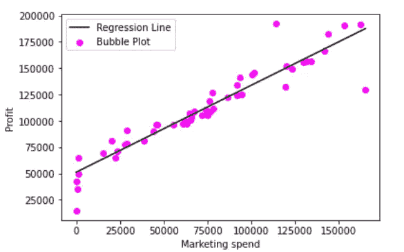
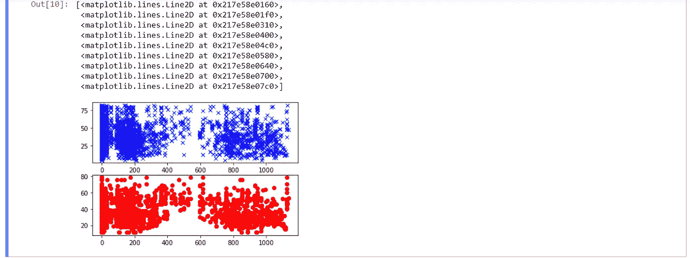

# 线性回归(7 步)

> 原文：<https://medium.com/analytics-vidhya/linear-regression-in-7-steps-b7362af795aa?source=collection_archive---------9----------------------->

> **简介**

在这篇文章中，我将讲述“如何通过 7 个步骤构建自己的线性回归模型！”

> **线性回归:**线性回归表示因变量(y)和自变量(x)之间的某种关系。

它用于对数据进行分类。

> **我们将通过 7 个步骤用 Python 实现线性回归:**

(你可以在这里找到用于建立这个模型的数据集)

**第一步:** **导入所需的库**

在这里，我们导入了 Pandas、NumPy、math、statsmodels、matplotlib 和 sklearn 库进行工作。

**第二步:使用 Pandas 库读取数据**

我们将使用 pd.read_csv 函数来读取数据。

**第三步:将数据分配到 X 轴和 Y 轴**

我们将把数据列分布到 X 轴和 Y 轴上，以可视化和预测模型。

**步骤 4:将数据分成训练集和测试集**

我们将把数据分成(7:3)的比例。也就是说，训练数据=70%，测试数据=30%。

**第五步:拟合模型并进行预测**

然后，我们将使用 fit()方法拟合模型，并预测数据来构建我们的模型。

**第六步:使用 matplotlib** 可视化数据

我们将使用 matplotlib 库来可视化模型的数据，以获得更好的视觉效果

**第七步:计算模型的精度**

我们将计算并打印模型的精度，这将告诉我们预测的模型有多精确。

> **输出:**

concrete.csv 数据输出

> **结论**

因此，我们可以得出结论，线性回归是机器学习中的强大工具，用于基于表示 x 和 y 之间关系的连续变量来建立和分析模型。