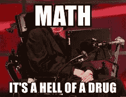

# 线性回归

> 原文：<https://medium.com/analytics-vidhya/linear-regression-in-machine-learning-4718064102a4?source=collection_archive---------24----------------------->


你熟悉机器学习和监督学习这些术语吗？如果是的话，那很好，但是如果你不是，那么我建议你一定要在[机器学习](https://link.medium.com/MboZTHpqm2)上看看这篇文章，这样你就不会像坐过山车一样。

如果您不熟悉 Python 库 Pandas 和 Matplotlib，也可以阅读它们。

> *老学校数学*


让我们用老办法，试着回忆一下这个图表在当时意味着什么。没那么难，但是如果你不能回忆起简单的线方程，让我来帮你做这个任务。


是的，就是这个，如果你把这个方程做对了，你就会知道线性回归到底是什么。

在这个方程中，X 和 Y 变量对应于 x-y 平面的坐标。变量 C 表示截距值，即直线偏离 y 轴原点(0，0)的值。变量 M 代表直线的斜率。

X 是一个独立变量，因为它不依赖于任何其他变量，但 Y 是一个因变量，其值取决于 X 的值。简单地说，Y 是我们需要预测其值的变量，而 X 是我们可以用来预测 Y 值的变量。

线性回归只在因变量只依赖于一个变量的情况下有效。

你一定想知道如果因变量依赖于多个变量会怎样。恭喜你！你已经开始理解机器学习的概念，但目前我需要你只关注这种情况。多元线性回归模型是你的问题的答案，其中有一个以上的自变量来预测因变量。一旦你掌握了线性回归的基本算法，多元回归模型只需要做一些改变。

> *是时候深入了解机器学习的魔力了*

年资和薪资数据集可以从[这里](https://www.kaggle.com/rohankayan/years-of-experience-and-salary-dataset#Salary_Data.csv)下载。我们将使用这个数据集来理解线性回归模型。


上表由两列组成，一列是工作年限，另一列是员工的工资，也就是说，只有一个自变量 X，我们可以用它来预测因变量 y 的值。

基于我们对数据的理解，我们可以假设经验的年数可以帮助我们预测一个雇员的工资。

经验年数只是一个数字或数量，告诉我们员工在组织中度过的时间，不依赖于任何其他可量化的值，因此，它是一个独立变量，我们可以将其视为 X。另一方面，员工的工资取决于员工在组织中度过的时间，因此，它是一个因变量，可以视为 Y。在技术术语中，我们也可以将 X 称为输入值，将 Y 称为目标值。如果在某些地方看到输入值和目标值，不要混淆。

让我们试着把上面的(X，Y)值画在图上。


这是图表的样子。现在，让我们试着将所有这些点拟合在一条直线上，也就是说，让我们试着画一条通过最大值点的直线，对于那些不在直线上的点，这些点和直线之间的距离是最小的。这条线被称为“*最佳拟合线*”。

让我们假设，我们被分配了一项任务，在工作经验年限的帮助下确定员工的工资。如果我们被要求在没有任何先验知识的情况下这样做，这是不可能的，但是因为我们已经有了工资趋势的先验知识，我们可以使用上面的图表预测工资的值。

是的，你没看错。如果我们知道员工的工作年限，这个图表可以用来确定员工的工资。

我们知道经验的年数，即 X 的值。现在，在 X 值的帮助下，我们可以从 X 轴画一条垂直于图表的直线，使用该点，我们可以在 y 轴画一条平行于 X 轴的直线。这条线和 y 轴相交的点就是工资的预测值。



如果您很好地理解了上面的含义，那么是时候使用 Python 在您的机器上实现它了。只需遵循以下简单步骤:

1.导入库

有一些 Python 库可以帮助你建立你的第一个机器学习模型。这些库是 Pandas 和 Matplotlib。

```
#importing the libraries
import numpy as np
import pandas as pd
import matplotlib.pyplot as plt
```

2.导入数据集

为了开始处理数据集，重要的是我们首先使用 pandas 库导入数据集，然后我们需要给 X 和 Y 变量赋值。工作经验的年数将作为 X 变量，工资将作为 Y 变量。为了检查事情是如何工作的，我们将把数据分成 80-20 的比例，也称为训练测试分割。80%的数据将用于训练模型，而 20%将用于测试目的。

```
#loading the dataset
dataset = pd.rad_csv("F:\\datasets\\Salary.csv")#assigning input and target values
X = dataset.iloc[:,0].values.reshape(-1,1)
Y = dataset.iloc[:,1].values.reshape(-1,1)#splitting the dataset into training and testing data
from sklearn.model_selection import train_test_split
X_train, X_test, Y_train, Y_test = train_test_split(X, Y, test_size = 0.2, random_state = 0)
```

3.创建线性回归模型

为了创建线性回归模型，我们需要 scikit 学习库中可用的线性回归器类。我们需要创建一个线性回归类的对象。然后，我们将使用拟合函数将数据集拟合到线性回归对象。

```
#creating the linear regression model
from sklearn.linear_model import LinearRegressor
regressor = LinearRegression()
regressor.fit(X_train, Y_train)
```

4.用线性回归模型预测工资

一旦线性回归模型输入了数据集，它就为 X 分配了一定的权重/偏差，这在数学术语中称为斜率。现在我们要做的就是调用 predict()函数，这样我们就可以知道雇员的预期工资。在 predict()函数中，我们传递雇员的经验数。

该函数使用雇员的工作年限返回其预期工资。

```
#predicting salary of the testing data
Y_pred = regressor.predict(X_test)
print(Y_pred)
```

获取斜率和截距的值

您可以获得最佳拟合线的斜率和截距值。

```
#fetching the intercept and slope of the best fit line
print(regressor.intercept_)
print(regressor.coef_)
```

绘制数据集以说明最佳拟合线

```
plt.scatter(X_train, Y_train)
plt.plot(X_test, Y_pred, color='red', linewidth=2)
plt.title("Number of years of experience vs Salary")
plt.xlabel("Number of years of experience")
plt.ylabel("Salary")
plt.show()
```

很明显，我们得到了一条直线，证明我们的算法运行良好。


最佳拟合线的图示

你终于建立了你的第一个机器学习模型，你必须在不同的数据集上做同样的尝试。

感谢您的阅读！

如果您有任何疑问，请在 [Instagram](http://instagram.com/h_ahuja_) 、 [LinkedIn](http://linkedin.com/in/hahuja7) 、 [Twitter](http://twitter.com/iamharshitahuja) 和[电子邮件](http://ahujaharshit007@gmail.com)上找到我！