# Python 中的线性回归从零开始

> 原文：<https://medium.com/analytics-vidhya/linear-regression-in-python-from-scratch-24db98184276?source=collection_archive---------0----------------------->

线性回归是机器学习中最基本和最流行的算法之一。当任何有抱负的数据科学家开始涉足这一领域时，线性回归必然是他们遇到的第一个算法。它很直观，有很好的使用范围，并且很容易理解。

在本文中，我们将从头开始用 Python 构建一个简单的单变量线性回归模型来预测房价。

首先，我会告诉你线性回归背后的基本思想。假设您有给定任何特征的房屋价格(目标变量)的数据集(训练集)，如房屋的大小或房屋中的房间数量(预测值或特征)。现在，您的工作是预测任何其他房屋的价格，给定训练数据集中给定的相同特征(如房间数量)。

线性回归技术所做的是，它找到适合该训练集的最佳可能直线，然后预测任何看不见的房子(即不在训练集中的房子)的价格。

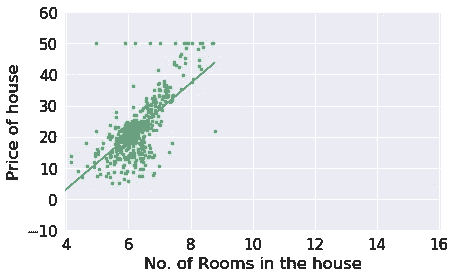

线性回归找出最符合数据的那条线的参数，即在这种情况下的斜率(θ1)和截距(θ0)。

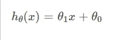

使用参数(即斜率和截距)预测价格的假设

这可能看起来非常简单，但它是该算法的最基本实现，其中 b/w 特征和目标变量之间存在线性关系，并且仅适用于单个变量。尽管它可以被容易地转换以用于多种特征。但在我们面临的大多数问题中，情况可能并非如此。在现实世界中，您经常会发现目标可能会随着特征而非线性变化，并且会使用多个特征来预测目标变量。在这种情况下，将使用具有高阶特征项的曲线，并且用图形显示具有两个以上特征的模型也不方便。

因此，在许多问题中，线性回归可能是有用的。但我们将从最基本的开始，即单变量，其中一个特征与目标具有非常线性的关系，我们将在上面讨论的房价问题上实现它。

首先，让我们导入一些库:

NumPy 是一个 python 库，它使得数值计算变得容易，特别是在数组上。 [Pandas](https://pandas.pydata.org/) 帮助构建和清理数据，以便以系列和数据框架的形式进行分析。 [Matplotlib](https://matplotlib.org/) 和 [Seaborn](https://seaborn.pydata.org/) 用于可视化。

“%matplotlib inline”确保图表显示在 Jupyter 笔记本内部。

现在我们将使用 pandas read_csv 函数读取数据。我们的[房价数据集](https://github.com/Nimishkhurana/Linear-Regression/blob/master/Univariate_LinearRegression_HousingPrice.ipynb)看起来像这样:

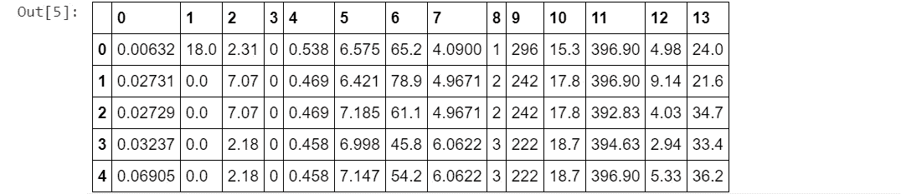

我们将为列命名

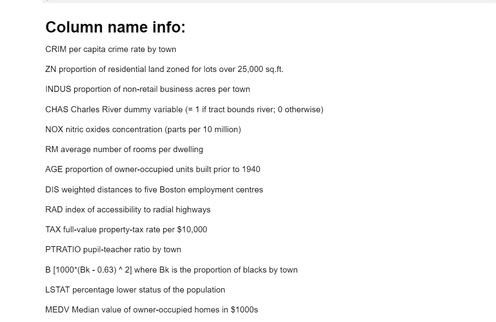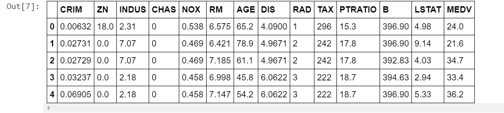

现在，数据集看起来很好，信息量也很大。

使用 matplotlib 以散点图形式绘制黑白特征和目标变量关系的实用函数:

这给出了下面的图表。

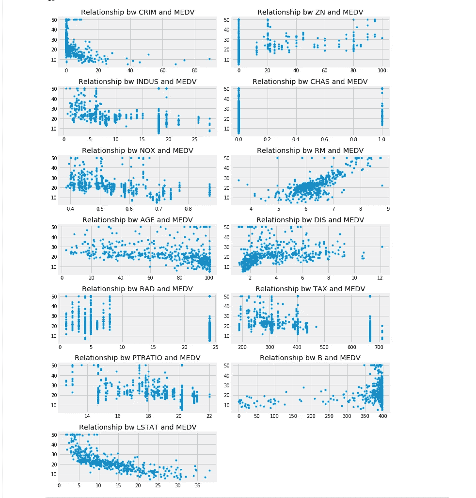

这些图表清楚直观地显示了目标变量与特征之间的关系。我们可以看到 RM(Avg。每所住宅的房间数)与 MEDV 有非常线性的关系。

查看这种关系的另一种方法是使用 seaborn 的热图绘制特征和目标变量之间的相关性。这也更具描述性。

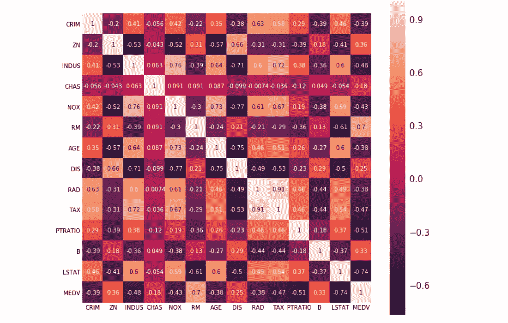

MEDV 与 RM 的相关系数为 0.7，这意味着它们与其他特征相比呈线性变化。因此，我们将只考虑这一特性，因为我们不打算使用任何高阶项。

> **如何找到最佳参数？？**

现在我们知道，我们必须找到最适合训练数据的参数。但直到知道我们不知道如何这样做。让我们把那部分也展开。

我们首先要做的是将参数初始化为一个随机值(比如 0)。然后我们将对它们实施梯度下降。

# 梯度下降

> **为我们的线(或曲线)寻找最佳参数的技术**

初始化参数后，我们将找到这些参数下的成本函数值。 ***成本函数*** 是计算由我们的假设 *h* 预测的房屋(目标)价值与训练集中房屋的实际价格之间的误差的函数。所以梯度下降的目标是最小化成本。有许多方法来计算成本函数最常见的是通过计算差异，平方它，并采取其平均。

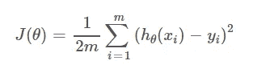

价值函数

这里 *h* 是给定其特征的任何房屋的预测值 *x* (在这种情况下为 RM)并且 *m* 是训练集中的记录数量。

除以 2 只是为了简化数学计算。

因此 *h* 可以替换为:-

为了最小化成本函数，我们将使用微积分来说明如何最小化任何函数。任何函数在一点都有局部极小值，如果它在该点的斜率为 0。如果你不懂微积分，实际上我们会找到特定值下成本函数 w . r . t .θ1 和θ0 的斜率，并继续分别从θ1 和θ0 中减去该斜率。因此，这将使θ0 和θ1 在每次迭代后将成本函数更多地移向最小值。

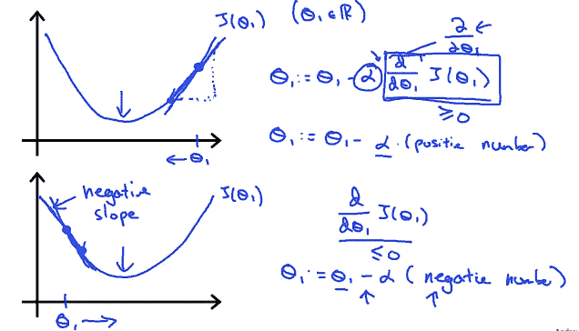

来源:Coursera 上的机器学习课程

alpha 是学习率，即我们希望参数更新的速度。它不应该非常小，因为这将使梯度下降缓慢，也不应该非常大，因为这可能使梯度下降超过最小值，它将发散而不是收敛。一般来说，b/w 保持在 0.01 和 0.5，但是每个问题都有不同的 alpha。它可以通过反复试验来发现，从小值开始，然后增加，直到每次迭代的成本降低。如果在任何迭代中成本增加，这是大 alpha 的标志，您应该减少 alpha。

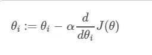

现在让我们用代码实现这一切。我们对每个任务都有单独的函数，如 predictPrice、calculateCost 和 gradientDescentLinearRegression。我们已经实现了以θ为向量的所有代码。

`*abline*`是一个效用函数，在每 1000 次迭代后绘制图形，以显示拟合线。

当我们用默认参数调用*GradientDescentLinearRegression*函数时

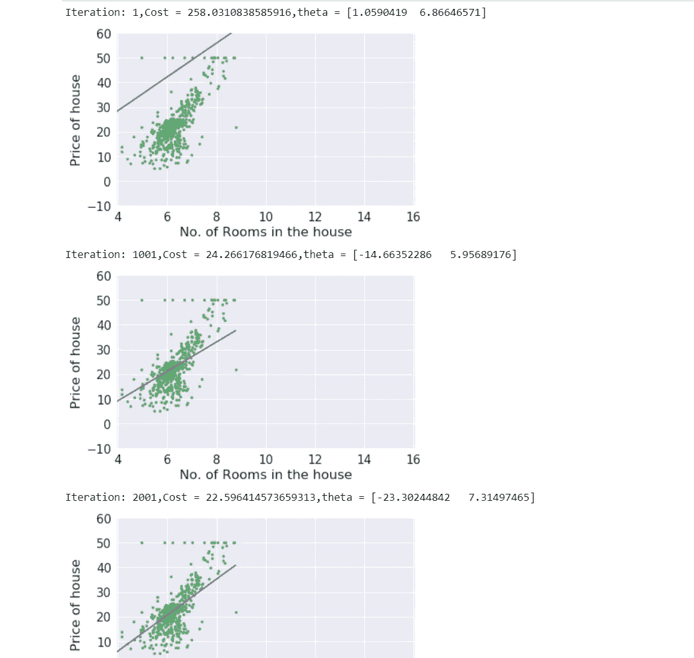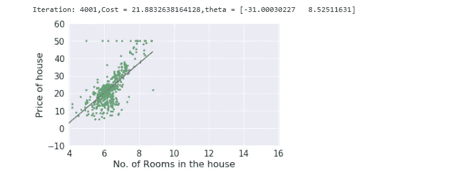

因此，我们找到了最能描述黑白特征和目标之间关系的线条。这条线现在可以用来预测其他房子的价格。

您可以在此处找到笔记本和数据集:

[https://github.com/Nimishkhurana/Linear-Regression](https://github.com/Nimishkhurana/Linear-Regression)

👏如果你喜欢并跟随阅读更多这样的文章。

与我联系:-

领英简介:[https://www.linkedin.com/in/nimish-khurana-306255148/](https://www.linkedin.com/in/nimish-khurana-306255148/)

github:[https://github.com/Nimishkhurana/](https://github.com/Nimishkhurana/)

一个学习 ML 的互动网站:[https://pytholabs.com/?utm_source=LKDN&UTM _ medium = MYNK&UTM _ campaign = personal](https://pytholabs.com/?utm_source=LKDN&utm_medium=MYNK&utm_campaign=personal)