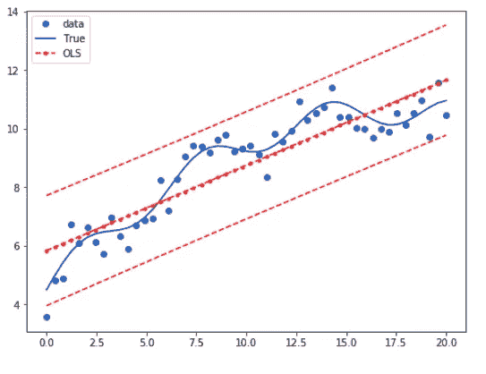

# 使用 scipy、statsmodels、sklearn 在 python 中从头开始进行线性回归

> 原文：<https://medium.com/analytics-vidhya/linear-regression-in-python-from-scratch-with-scipy-statsmodels-sklearn-da8e373cc89b?source=collection_archive---------4----------------------->

在这里，我们将使用 numpy 实现线性回归所需的代码。结果将与来自 scipy 和 statsmodels 的结果进行比较

数据点，线性最佳拟合回归线，区间线。

# 1.导入库

和往常一样，我们从导入库开始。我们从最低限度开始，在数据帧中绘制和存储数据。