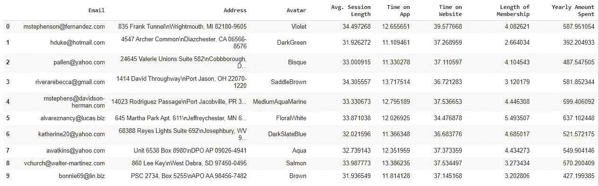
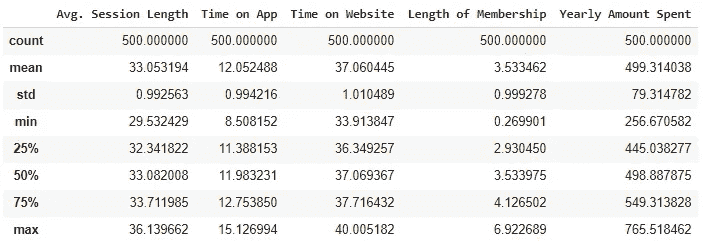
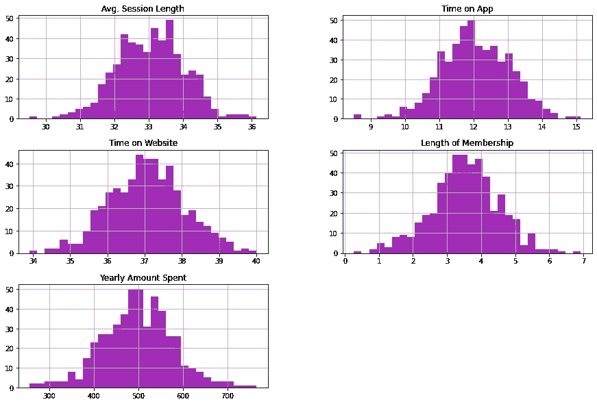
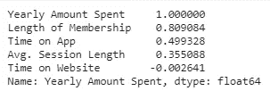
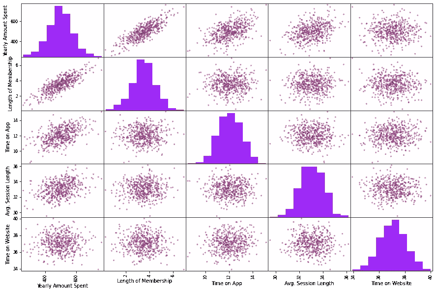
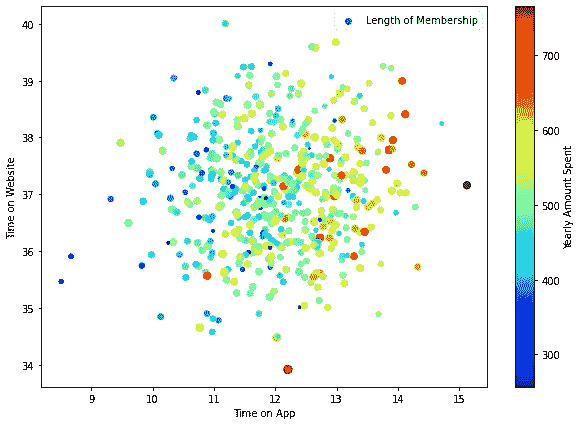
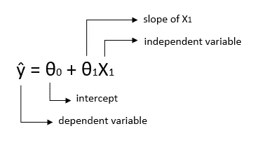
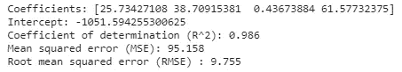
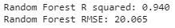

# Python 中的线性回归:预测电子商务收入

> 原文：<https://medium.com/analytics-vidhya/linear-regression-in-python-predict-e-commerce-revenue-dd8e0c8bed2f?source=collection_archive---------1----------------------->

[ev](https://unsplash.com/@ev?utm_source=unsplash&utm_medium=referral&utm_content=creditCopyText) 在 [Unsplash](https://unsplash.com/s/photos/data-science?utm_source=unsplash&utm_medium=referral&utm_content=creditCopyText) 上的照片

在这篇文章中，我们的目标是在 Python 中使用简单的线性回归和随机森林建立一个预测模型。[数据集](https://www.kaggle.com/srolka/ecommerce-customers)在 Kaggle 上可用，我的[代码](https://github.com/aycaerbasi/Linear-Regression-in-Python)在我的 Github 账户上。

让我们开始了解数据集。

# **发现和可视化数据**

在该数据集中，有 3 个分类特征电子邮件、地址和头像；平均 5 个数字特征。会话时长、在应用上的时间、在网站上的时间、会员时长和每年花费的金额。有 500 个例子。这是小的，但对初学者来说很完美。

图 1:数据帧的前 10 列。

下面是与这些列相关的统计信息的摘要。

图 2:统计摘要。

为直观解释数字数据而创建的属性直方图。

图 3:属性直方图。

**寻找相关性**

让我们看一下“每年花费的金额”与其他属性有多大关联。

相关的输出。

“会员资格年限”这一属性似乎与“每年花费的金额”最相关。“年花费金额”与“上网时间”呈负相关。所以，这表明在网站上停留时间越长的顾客花的钱就越少。

让我们使用散点图来检查相关性。

图 4:散点图。

因此，收入与会员时间最相关，在 app 上的时间是相关性高的第二个属性。让我们比较一下 app 上的时间和 web 上的时间。我们可以在图 5 中看到花钱最多的客户属于哪一组。

红点代表较高的消费金额，蓝点代表较低的金额，点的宽度代表会员资格的长度。当点数的宽度增加时，意味着会员资格的长度变长。(乘以 10 无所谓，只是让图上的点变大了。)图 5 告诉我们，使用 app 的客户花了更多的钱。而长期会员可以解读为更喜欢使用 app。

图 5

# **线性回归**

[线性回归](https://en.wikipedia.org/wiki/Linear_regression)是一种监督学习技术。回归是预测连续值的过程。这是通过训练模型来完成的，模型使用以前标记的数据来预测未来的实例。x 代表自变量，y 代表因变量，它也被称为目标，这个变量将被尝试预测。

回归的关键点是因变量应该是连续的。

**线性回归公式**:

θ0 和θ1 也是线性方程的系数，y 是预测变量。

**训练模型**

大多数机器学习算法不能处理空值。该数据集已经过检查，没有缺失值。

我定义了 X 和 y 的值。我只为 x 选择了数字属性。

以下是模型评估输出:

这些系数分别是这些特征的平均值。会话长度、在应用上的时间、在网站上的时间、会员资格的长度，这就是我们定义的 x。

r 平方显示了数据与拟合线的距离。最好的分数是 1。r 平方值接近 1 表示模型的适用性。对于我们的模型，它是 0.986。

RMSE 测量预测向量和目标值向量之间的距离。我们的型号是 9.755 美元。

# 随机森林

让我们用随机森林回归来评估这个模型。

随机森林回归的输出。

线性回归为该数据集提供了更好的结果。

# 参考

1.  [*杰龙，a，2019。使用 Scikit-Learn、Keras 和 Tensorflow 进行机器学习。奥赖利。*](https://www.amazon.com/Hands-Machine-Learning-Scikit-Learn-TensorFlow/dp/1492032646/ref=pd_lpo_14_img_0/135-9437164-5211348?_encoding=UTF8&pd_rd_i=1492032646&pd_rd_r=360fa819-e944-461f-a643-b9dc38359802&pd_rd_w=jzU0t&pd_rd_wg=tQsaa&pf_rd_p=7b36d496-f366-4631-94d3-61b87b52511b&pf_rd_r=2TPXGCT5YJG8QMZ4NRXX&psc=1&refRID=2TPXGCT5YJG8QMZ4NRXX)
2.  [https://scikit-learn.org/stable/](https://scikit-learn.org/stable/)
3.  [认知类:ML0101ENv3](https://courses.cognitiveclass.ai/courses/course-v1:CognitiveClass+ML0101ENv3+2018/course/)

请不要犹豫给我反馈。

感谢您的阅读。