# Python 中的线性回归与 Scikit-Learn

> 原文：<https://medium.com/analytics-vidhya/linear-regression-in-python-with-scikit-learn-e1bb8a059cd2?source=collection_archive---------1----------------------->

## 用线性回归预测房价

[哈维·卡夫雷拉](https://unsplash.com/@xavi_cabrera?utm_source=medium&utm_medium=referral)在 [Unsplash](https://unsplash.com?utm_source=medium&utm_medium=referral) 上的照片

# 介绍

在监督机器学习中，有两种算法:回归算法和分类算法。比如预测房价是回归问题，预测房子能不能卖出去是分类问题。

> 代数中的“线性”一词是指两个或多个变量之间的线性关系。

在本文讨论的简单线性回归中，如果在二维空间中画出这种关系，就会得到一条直线。

让我们考虑一个场景，我们想要确定房子平方英尺和房子售价之间的线性关系。当我们给定一所房子的平方英尺时，我们能估计能卖多少钱吗？

我们知道一条回归线的公式基本上是: ***y = mx + b***

其中 ***y*** 为预测目标标号， ***m*** 为直线斜率， ***b*** 为 ***y*** 截距。

如果我们将自变量(平方英尺)标在 x 轴上，将因变量(销售价格)标在 y 轴上，线性回归会给出一条最符合数据点的直线，如下图所示。

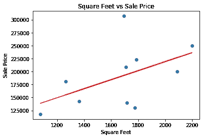

# Python 中的线性回归与 Scikit-Learn

在本节中，我们将学习如何使用 Python Scikit-Learn 库进行机器学习来实现回归函数。我们将从涉及两个变量的简单线性回归开始。在这个回归任务中，我们将根据房子的平方英尺来预测销售价格。这是一个简单的线性回归任务，因为它只涉及两个变量。

# 密码

1.  **导入库**

要为此任务导入必要的库，请执行以下导入语句:

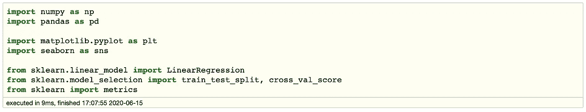

**2。导入数据集**

以下命令通过 pandas 导入 CSV 数据集:

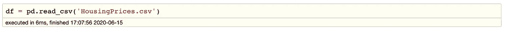

**3。了解数据**

现在让我们来探索数据集。执行以下脚本:`df.shape`。

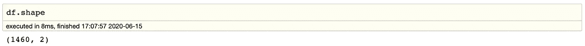

之后，您应该会看到下面的输出。数据集包含 1，460 行和 2 列。让我们看看我们的数据集实际上是什么样子。输入`df.head()`,它将从我们的数据集中检索前 5 条记录。

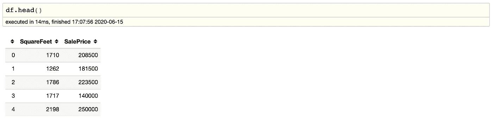

要查看数据集的统计细节，我们可以使用`df.describe()`:

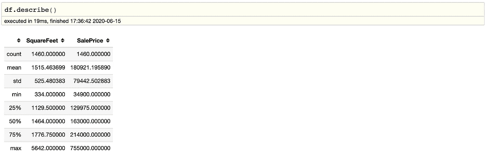

最后，我们可以在二维图形上绘制数据点，以关注数据集，看看我们是否可以手动找到数据之间的任何关系。我们使用 pandas dataframe 的`df.plot()`函数，并传递给它 x 坐标和 y 坐标的列名，分别是“SquareFeet”和“SalesPrice”。我们可以使用下面的脚本来创建图形:

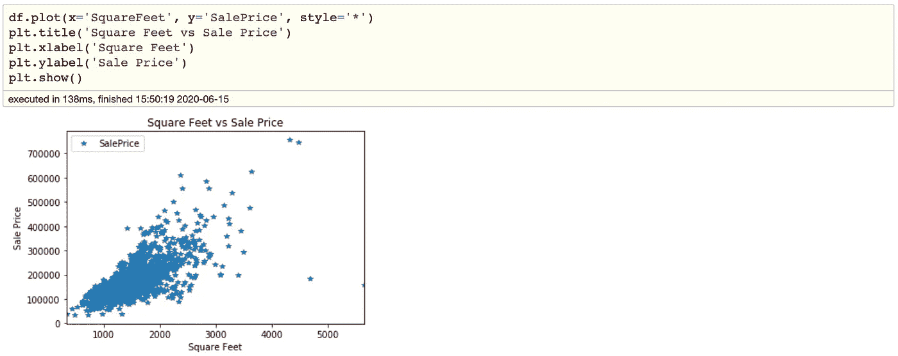

从上面的图表中，我们可以清楚地看到，房子的平方英尺和房子的销售价格之间存在着正的线性关系。

**4。准备数据**

现在我们对数据统计的细节有了想法。下一步是将数据分为“属性”和“目标标签”。属性是自变量，目标标签是因变量，其值是要预测的。在我们的数据集中，我们只有两列。我们想根据房子的平方英尺来预测销售价格。因此，我们的属性集将由“平方英尺”列组成，标签将是“销售价格”列。要提取属性和标签，请执行以下脚本:

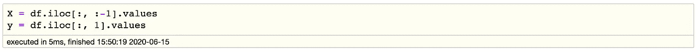

属性存储在 X 变量中。我们指定“-1”作为列的范围，因为我们希望属性集包含除最后一列“SalesPrice”之外的所有列。类似地，y 变量包含标签。我们为 label 列指定了 1，因为“SalesPrice”列的索引是 1。请记住，列索引从 0 开始，1 是第二列。

既然我们有了自己的属性和标签，下一步就是将这些数据分成训练集和测试集。我们将通过使用 Scikit-Learn 内置的`train_test_split()`方法来实现这一点:

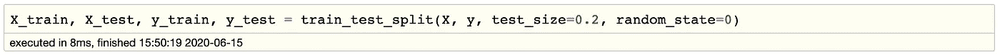

上面的脚本将 80%的数据分割成训练集，而将 20%的数据分割成测试集。`test_size`变量是我们实际指定测试集比例的地方。

**5。建模**

我们已经将数据分为训练集和测试集，现在终于到了训练模型的时候了。执行以下脚本:

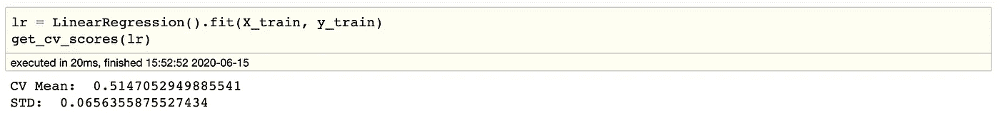

使用 Scikit-Learn 实现线性回归模型非常简单，因为您真正需要做的只是导入 linear regression 类，实例化它，并调用 fit()方法以及我们的训练数据。这就像使用机器学习库对数据进行训练一样简单。

在理论部分，我们说过线性回归模型基本上可以找到截距和斜率的最佳值，从而得到最符合数据的直线。要查看由线性回归算法为数据集计算的截距和斜率的值，请执行以下脚本来检索截距:。

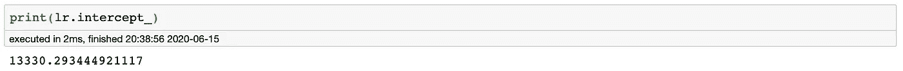

您看到的结果值应该大约为:13330.26。然后执行以下脚本来检索斜率(系数 x):

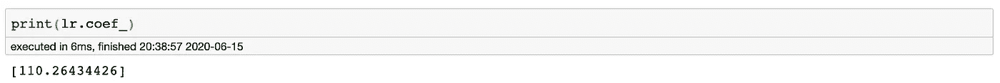

结果应该大约是:110.26。

这意味着每单位平方英尺的变化，销售价格的变化约为 110.26 英镑。

**6。预测**

现在我们已经训练了我们的算法，是时候做一些预测了。为此，我们将使用我们的测试数据，看看我们的算法预测百分比分数的准确性如何。要对测试数据进行预测，请执行以下脚本:

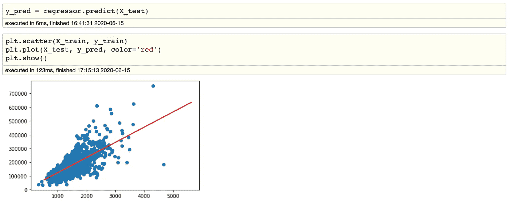

y_pred 是一个 numpy 数组，包含 X_test 系列中输入值的所有预测值。

要将 X_test 的实际输出值与预测值进行比较，请执行以下脚本，输出如下所示:

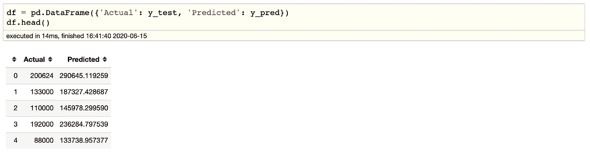

虽然我们的模型不是很精确，但是预测值接近实际值。

**7。评估**

最后一步是评估算法的性能。这一步对于在特定数据集上比较不同算法的性能特别重要。对于回归算法，通常使用三个评估指标:

1.  平均绝对误差(MAE)是误差绝对值的平均值。
2.  均方误差(MSE)是平方误差的平均值。
3.  均方根误差(RMSE)是平方误差平均值的平方根

Scikit-Learn 库预先构建了可用于为我们找出这些值的函数。让我们使用测试数据找出这些指标的值。执行以下脚本:

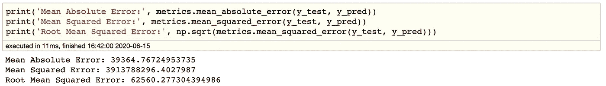

您可以看到均方根误差值为 62560.28，大于销售价格平均值的 10%，即 180921.2。这意味着我们的算法只是一般。

造成这种不准确性的因素有很多，下面列出了其中一些:

1.  我们使用的特征可能与我们试图预测的值没有足够高的相关性。
2.  我们假设这个数据是线性关系，但事实并非如此。视觉数据可以帮助你确定。

# 然后

为了改进模型，我们需要使用更多的自变量并尝试差分模型，如 SVR、Lasso 和 ElasticNet。

感谢阅读！如果你喜欢这篇文章，请通过鼓掌来感谢你的支持(👏🏼)按钮，或者通过共享这篇文章让其他人可以找到它。

最后，我希望你能学会如何使用简单的线性回归技术。你也可以在 [GitHub](https://github.com/kindersham/100DaysDS/tree/master/Housing%20Prices%20-%20Linear%20Regression) 库上找到完整的项目。