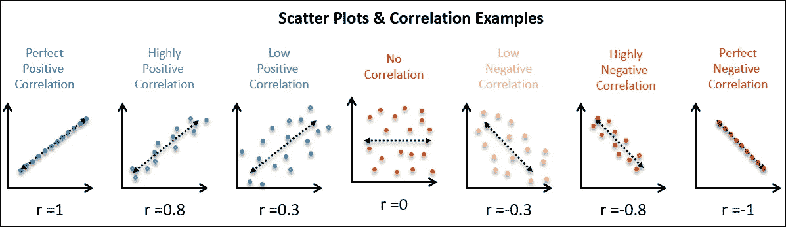
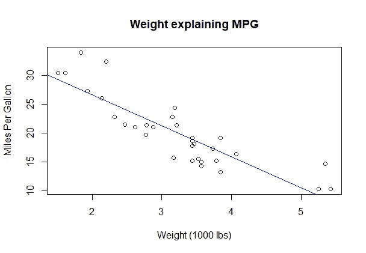

# R 中的线性回归—用 15 行代码进行预测

> 原文：<https://medium.com/analytics-vidhya/linear-regression-in-r-make-a-prediction-in-15-lines-of-code-204752b6bfff?source=collection_archive---------3----------------------->

# 介绍

这个博客将解释如何在 r 中创建一个简单的线性回归模型。它将把这个过程分解成五个基本步骤。理解本教程不需要统计学或线性代数或编码的先验知识。

butttt…这个博客是在假设你在一个可访问的设备上安装了 RStudio 的情况下创建的。RStudio 是免费的！如果您还没有安装 RStudio，请使用下面的链接下载。https://rstudio.com/products/rstudio/download/
T3

# **你为什么要读这篇博客？**

这是对机器学习的温和的高级介绍。本教程将为您提供足够的背景知识，使您能够创建自己的预测模型。

**最重要的**——在这篇博客结束时，你会觉得机器学习(或统计学或数据科学，无论你想叫它什么)适合你！

# **步骤**

1.  **加载**您的数据
2.  就您的数据提出一个**问题**
3.  检查 X 是否是 Y 的**良好预测器**
4.  创建您的**线性回归模式** l
5.  对看不见的数据做一个**预测**！！

在经历这些步骤之前，我想添加完整的代码，让人们知道他们正在进入什么。或者，您可以复制这 15 行代码，在 R 中进行测试，然后返回到这里查找需要进一步解释的部分。

# **第一步:**加载你的数据

```
# Load our data ("mtcars" comes installed in R studio)
data("mtcars")
View(mtcars)
```

我们的第一步是加载数据。我们将保持简单，加载 RStudio 附带的数据。为此，运行数据(“mtcars”)。要查看已加载的数据，请运行第二行代码。当您运行第二行时，应该会出现一个新窗口，显示您的 mtcars 数据。

*   如果您想了解更多关于 mtcars 数据帧的信息，请输入
    " **？**进入 R

# 第二步:问一个问题

```
# Is the weight of the car a good predictor of what the cars mpg will be?
x <- mtcars$wt
y <- mtcars$mpg
```

加载并查看数据后，您现在可以提问了。在这种情况下，我们问我们是否可以创建一个预测模型，根据汽车的重量来预测汽车的 mpg。

上面的代码显示了如何将 mtcars 数据帧中的列‘wt’插入到新创建的‘x’中。同样的事情也适用于 y(但是 w/ mpg 栏)。现在 x 和 y 是重量和英里数栏中的数字。如果你想看到 R 中的数字，只需写 print(x)

# 第三步:检查 X 是否是 Y 的一个好的预测值

> 回归分析是预测建模技术的一种形式，它调查依赖于**的**和独立于**的**变量之间的关系。



希望我们的结果类似于上图中的“**高度正相关**或“**高度负相关**”。

**第一部分。视觉化**

```
# Plot Weight (x) to MPG (Y)
plot(x, y, main = "TikTok lol",
     xlab = "Weight (1000 lbs)", 
     ylab = "Miles Per Gallon")# Add regression line
abline(lm(y ~ x, data = mtcars), col = "blue")
```



从上面的散点图可以看出，MPG 和体重之间存在负相关。随着重量的增加，一辆汽车的英里数会下降。

**Pt 2。**检查相关性

```
# Is Weight & MPG correlated ??
cor(x, y)
[1] -0.8676594
```

使用函数 cor()找出 x 和 y 之间的相关性。我们的结果是-0.87。两个变量的关联越强，皮尔逊相关系数 *r* 将越接近+1 或-1，这取决于关系是正还是负。我们的 x 与 y 负相关，这进一步证实了我们的散点图。重量的增加导致每加仑汽油的消耗量减少

*   **cor()** 计算**相关系数(r)**

# **第四步**:创建你的线性回归模型

```
# LinearRegression_mpg is our model
LinearRegression_mpg <- lm(mpg ~ wt, data = mtcars)
```

**lm** 代表线性模型。代码读作 mpg 是由 wt 解释的(~)。我们用于创建此线性模型的数据来自 mtcars 数据框。

*   如果您想了解有关 lm()的更多信息，请键入？lm 进入 RStudio，更深入的描述会出现在右上角

# **第五步**:对未见过的数据进行预测！！

```
# If my car weighed 4,000 pounds how much MPG will it have?
unseen <- data.frame(wt = 4)# Prediction 
predict(LinearRegression_mpg, unseen)
       1 
15.90724
```

哒哒！您已经使用机器学习创建了一个预测模型:)

根据历史数据，我们预测一辆 4000 磅重的汽车每加仑(T21)能跑 15.9 英里

**mtcars 数据摘自 1974 年美国汽车趋势杂志*

如果有任何不清楚的地方，请让我知道，这样我就可以把事情搞清楚了！希望这对某人有所帮助。

