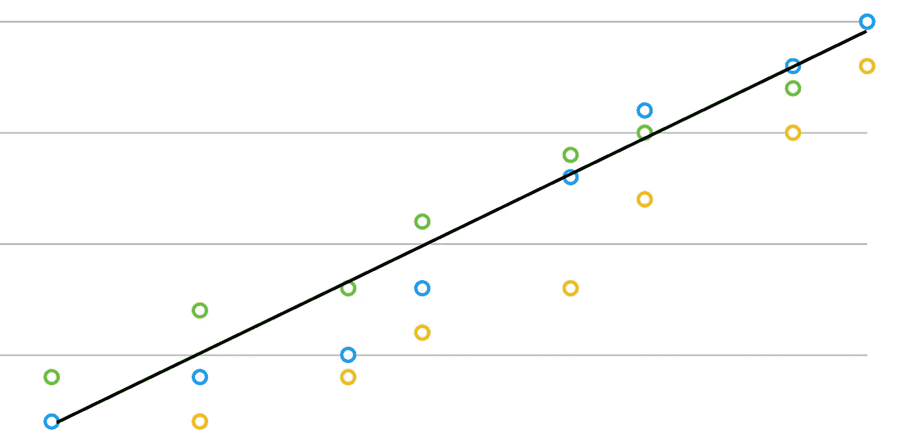
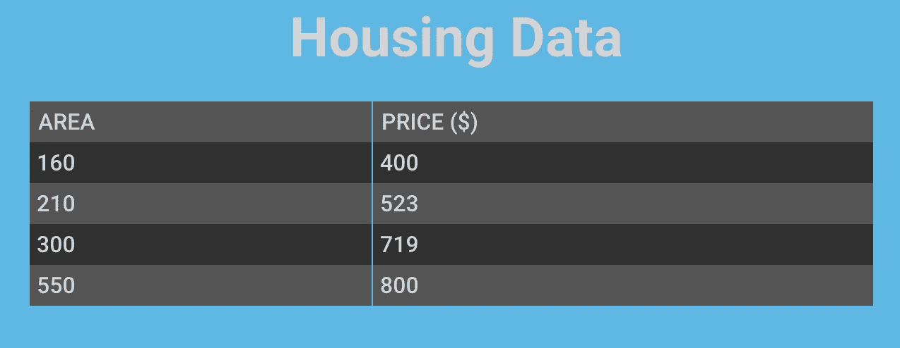
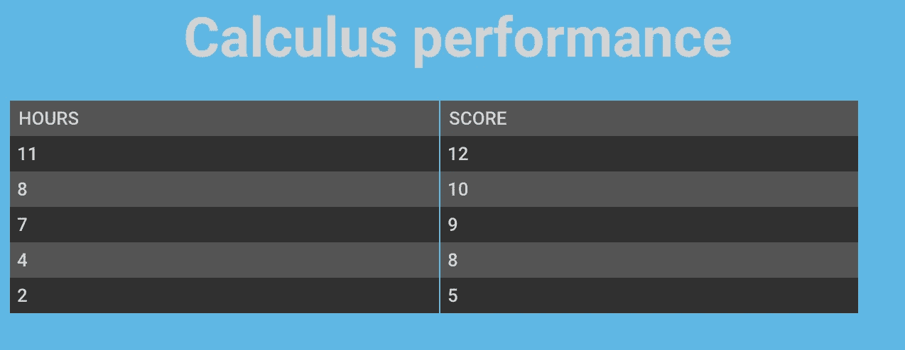
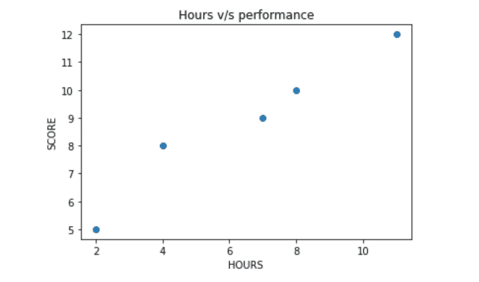
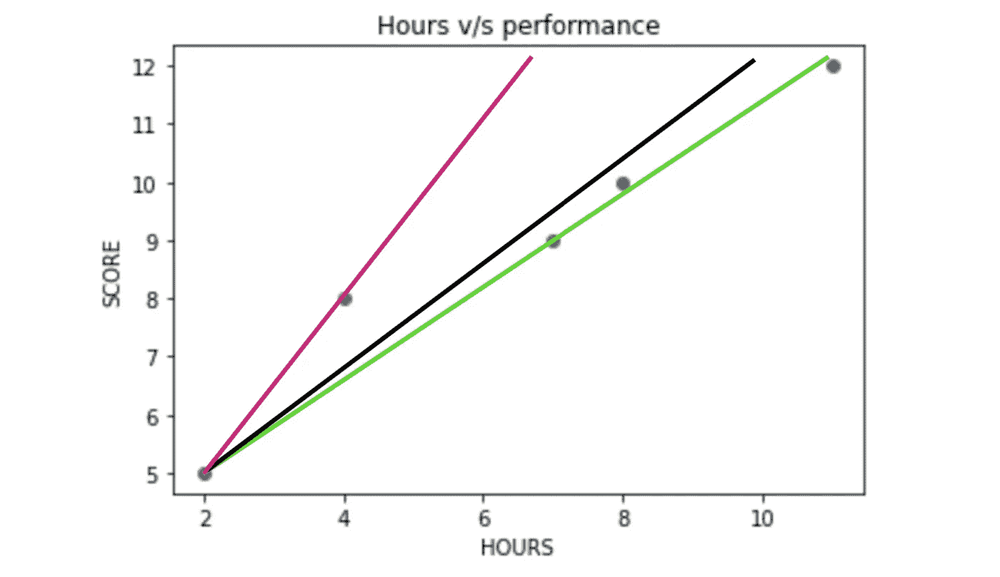
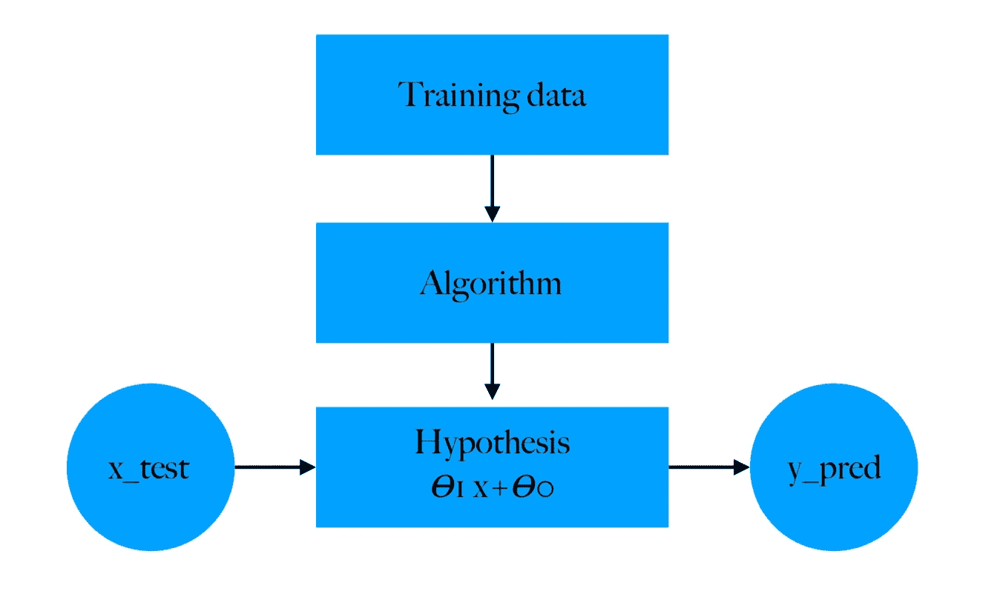

# 线性回归简介—单一特征

> 原文：<https://medium.com/analytics-vidhya/linear-regression-introduction-single-feature-3495366b8aea?source=collection_archive---------17----------------------->

线性回归是一种统计数据分析技术，它通过事先在现有的一些数据集上训练模型来帮助您为自定义数据生成预测。

我们举个例子来分解一下这个。

假设我有给定面积的房子的价格数据。

出于演示目的

现在，如果我想估算一栋面积约为 400 个单元的房子的价格，我该如何预测呢？这就是线性回归的用处。我们将建立一个从现有数据集学习的模型，并预测我们输入的新测试点的数量。

在这里，我们主要考虑房子的一个特征即面积，因此- **单一**特征回归。如果有更多的特性决定了需要预测的数量(这里是价格)，我们将不得不稍微改变我们的策略。对于本文，我们将只关注一个特性。

既然我们已经有了目标感，让我们再举一个例子。我们有一个数据集，其中包含学习微积分所花费的时间以及由此产生的成绩分数。数据看起来像这样-

出于演示目的

让我们用图表来显示数据。

现在，我们希望找出一个花了 9 个小时学习微积分的人的表现。你能通过看图表想出这样做的方法吗？

我们可以画一条线，最适合这些点。这样，如果我们输入一个新的点，我们的模型只需将坐标放入直线的方程中，就可以得到所需的预测。这太棒了！但是我们需要分析什么样的线最适合我们的模型。为此，让我们深入了解一下表征一条线的参数是什么。我们知道直线的方程式是-

# y=mx+c

我们也可以把这个看作-

# y= y= 𝛳1 x+ 𝛳0

现在，我们需要找到𝛳1 和𝛳0 的值，以便它们适合我们的模型。

考虑一下上面的情节。你认为哪条线最适合这些数据点？如果你说“绿色”，你将是正确的，因为它通过大多数点。但是如何在数学上实现它呢？

从逻辑上讲，最佳线是所有数据点损失最小的线。损失是预测值和实际值之间的差异。我们的目的是减少这种差异。

# 误差=σ| y 实际值-y 预测值|

到目前为止，我们的伪代码是-

1.  随机初始化𝛳.的值
2.  以这样一种方式更新𝛳，使我们更接近最佳拟合。
3.  通过减少训练数据的误差来衡量𝛳有多好(合适)。

为了更新𝛳，我们使用另一种叫做**梯度下降的算法。**我们将在接下来的文章中讨论这个问题。

概略地说，我们的模型可以精确地表示为-

在下一篇文章中，我们将更深入地了解梯度下降和线性回归。

感谢阅读😊