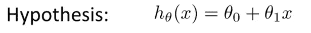
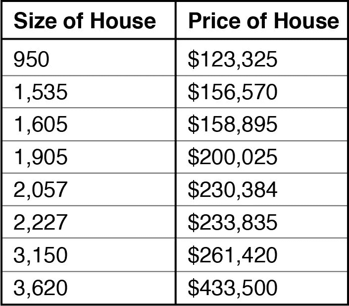

# 不到 5 分钟的线性回归直觉

> 原文：<https://medium.com/analytics-vidhya/linear-regression-intuition-in-less-than-5-minutes-a04ae67cdbd4?source=collection_archive---------33----------------------->

机器学习不需要太复杂！

假设你想预测波士顿的房价，为了做到这一点，你想使用带有机器学习的 ***线性回归。***

基本上，第一个任务是找到一个与价格直接相关的变量，让我们称价格为 ***Y*** ，相关变量为 ***X*** 。

经过一些工作，你发现了 ***英尺尺寸*** 和 ***价格*** 之间的相关性，干得好老弟！

现在，是时候应用 ***线性回归了。***

> 这是一个简单线性回归的经典例子，我们只用一个变量来预测其他变量。我们也有多元线性回归，我们使用多个变量来预测其他变量！

# **应用线性回归**

线性回归公式为:

来源[此处](https://miro.medium.com/max/1400/1*00qJ-5J2OeytNMK6WCW1_g.png)

其中:

*   ***hθ(x):*** 是我们的假设，我们发现价格(Y)的方法。
*   ***θ零和θone:*** 是我们的变量，可以写成 ***b，c，r*** 或者任何你想要的东西！

基本上，我们的 ***机器学习*** ***模型*** 的任务是发现***θ零和θone、*** 的值，乘以***×***(房屋大小)将得到正确的***×Y***。

这是简单的线性回归，很容易对:

> ***记住:*** 简单线性回归是关于预测某件事，基于一个单一的变量，就像我们的例子:基于以英尺为单位的大小预测房子的价格。

让我们看看实践中…

# 实践中的线性回归

显然，如果我在这里一步一步地应用线性回归，这不是一个 5 分钟的解释，所以，让我们在“真实数据”中应用我们的公式，以更好地理解这些是如何工作的。

假设我们有以下数据:

来源[此处](https://www.google.com/url?sa=i&url=https%3A%2F%2Fmoz.com%2Fblog%2Fmachine-learning-revolution&psig=AOvVaw1LuQqss2xPXFgzlvmpL80n&ust=1591103496232000&source=images&cd=vfe&ved=0CAIQjRxqFwoTCPjl88fY4OkCFQAAAAAdAAAAABAI)

将我们的公式应用于第一行大小，结果如下:

## h: θzero + θone*950

我们的 ***机器学习模型*** 将找到***θ零和θone*** 的值，乘以 950 将得到 ***$123，325。***

我们可以把这个公式写成:

## Y: θzero + θone*950

其中 Y 是正确的价格。

很容易对吗？

这是 5 分钟解释的简单线性回归，宝贝！

> ***用一句话解释:*** 一个值加上另一个值再乘以一个***【X】(数据的一个例子)*** 那就会得出一个***【Y】(预测)*** 。

你可以看到一个 ***模型实现的线性回归*** 由我[在本文中介绍。](/analytics-vidhya/linear-regression-demystified-4d285a2a1d00)

我希望你已经理解了简单的线性回归是如何工作的！

目前，这就是全部！

下次见！

***我的社交媒体:***

***领英:****[https://www.linkedin.com/in/gabriel-mayer-779b5a162/](https://www.linkedin.com/in/gabriel-mayer-779b5a162/)*

**GitHub:*[https://github.com/gabrielmayers](https://github.com/gabrielmayers)*

****insta gram:***[https://www.instagram.com/gabrielmayerl/](https://www.instagram.com/gabrielmayerl/)*