# 线性回归:机器学习算法的详细视图

> 原文：<https://medium.com/analytics-vidhya/linear-regression-machine-learning-algorithm-detailed-view-657beac3d2f1?source=collection_archive---------8----------------------->

> 如果你已经开始沉迷于机器学习的世界，线性回归是最受欢迎的算法之一，并且更常用于开始解决任何回归问题。更重要的是，你是否在不知道它实际工作原理的情况下使用它？那么这篇文章就送给你了。我的目标是在这篇文章中涵盖理论的所有方面。在我们开始建立自己的线性回归模型之前，理解它的工作原理是很重要的。经常被认为是最简单的机器学习模型，但是让我们看看它是不是真的！！


来自达尔维斯的 Pexels

这篇文章的主旨是:

*   什么是简单线性回归？以及理解线性回归必须知道的术语。
*   LR 背后算法的数学实现以及代价函数和梯度下降的含义。
*   与此同时，我们将看到如何使用梯度下降法优化直线？
*   最后，看看什么时候停止搜索最佳拟合线的方法。

在继续讨论理论和一些数学方程式之前，让我简单介绍一下我们在这里试图解决的问题，以及它可以应用到哪里？

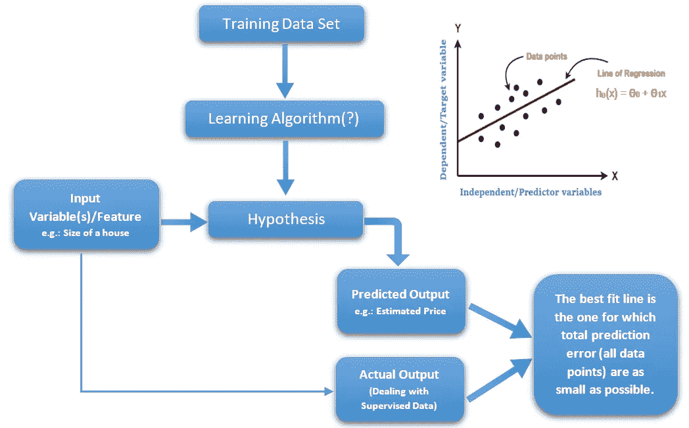

图 1:LR 模型流程图

这里的想法是在训练数据集上找出一个或多个自变量/预测变量 *(x)* 的因变量/目标变量 *(y)* 之间的关系。通过应用学习算法，在我们的情况下是利用线性函数作为假设的线性回归。求解这个假设方程的参数，最小化成本函数(也称为回归问题的平方误差函数)。这些最小化的参数是在梯度下降法的帮助下找到的。上一步得到的最终方程用于未来预测*。*

它的一些应用可以根据价格、季节或其他参数来预测某种商品的销售。它还可以用于时间序列分析，用于预测数据的结果，以预测未来。

## 了解理论

熟悉线性回归的一些术语。线性回归这个词本身有三个派生术语直线、线性和回归。

**线，**是两点间的最短距离。其中 as **线性**是指位于平面上的一条直线上的点的集合，映射连续值。**回归**是预测建模技术的一种形式，它调查因变量和自变量之间的关系或相关性。

**什么是自变量？**

听起来确实如此。这是一个变量，通常被称为目标变量，它是独立的，不会因你试图测量的其他变量而改变。例如，某人的年龄可能是一个独立变量。其他因素(比如他们吃什么，他们上学多长时间，他们看多长时间电视)不会改变一个人的年龄。事实上，当你在寻找变量之间的某种关系时，你是想看看自变量是否会引起其他变量或因变量的某种变化。

什么是因变量？

就像自变量一样，因变量就像它听起来的那样。这取决于其他因素。例如，考试分数可能是一个因变量，因为它可能会根据几个因素而变化，如你学习了多少，考试前一晚你睡了多少觉，甚至考试时你有多饿。通常，当你在寻找两个事物之间的关系时，你试图找出是什么使因变量改变了它的方式。

如果你很难记住哪个是自变量，哪个是因变量。一个简单的记忆方法是以最有意义的方式插入你在这个句子中使用的两个变量的名字。然后你就可以算出哪个是自变量，哪个是因变量了:

(自变量)引起(因变量)的变化，而(因变量)不可能引起(自变量)的变化。

(花在学习上的时间)导致(考试分数)的变化，而(考试分数)不可能导致(花在学习上的时间)的变化。我们看到“花在学习上的时间”必须是自变量，“考试分数”必须是因变量，因为这句话反过来就没有意义了。

## 了解方程式

因为我们可以定义目标变量并给它们贴上标签，所以这些问题属于有监督的领域，其中数据已经被贴上标签。

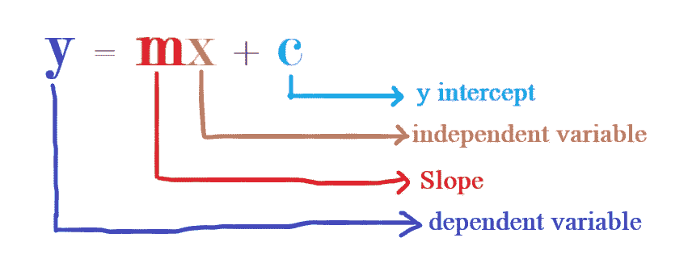

图 2:直线方程

这里，线性回归的关系最好用直线方程来定义，这也是线性回归的假设，我们大多数人在高中数学中都知道，由下式给出:

```
 **y = m*x + c****In machine learning convention you will often see expressions as 
h(x) = w0 + w1*x1 or hθ(x) = θ1*x1 + θ0****Where :
*1\. y* or *h(x)* = the dependent or the target variable
2\. *m* or *w1 or x1*= the gradient or slope
3\. *x or x1*= the dependent or predictor variable
4\. *c* or *w0 or* θ0= the intercept on the y-axis**
```

这个方程将有助于联系一个因变量和一个自变量，也称为简单线性回归，多因变量呢？它可以使用多元线性回归来定义，并总结为:

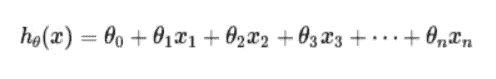

## 什么是线性回归？

我们已经在前面部分看到了回归的定义，它说:

> 它试图确定一个因变量(通常用 Y 表示)和一系列其他独立预测因子之间关系的强度和特征。

简单线性回归是一种统计方法，它允许我们总结和研究两个真实变量之间的关系。简而言之，找一条线来描述最能代表给定数据的线性函数，有时也称为“ ***”最佳拟合线*** ”。

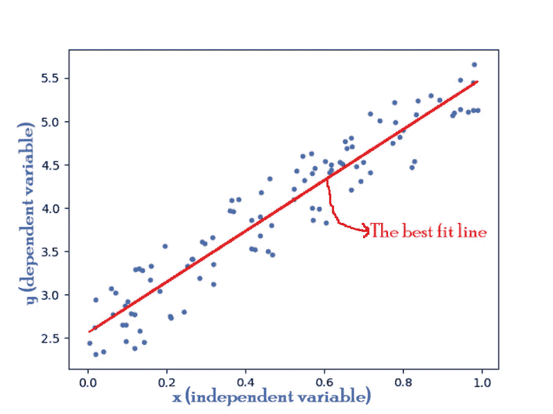

图 3:最佳拟合线的例子

基于给定的数据点，我们试图找到一条线，以最佳方式描述数据。上图中的红线为我们做了这项工作，也被称为最佳拟合线

让我们借助一个等式，从数学上定义上述最佳拟合线:

```
 **hθ(x)*=* θ0+θ1** x 
(Assuming data set have only has one independent variable)***
```

其中θ0 和θ1 是实数，这描述了最佳拟合直线方程。怎么找到这些实数，什么时候能说是最好的。*我们从这些实数的一些假设开始，然后试图得到平均预测和实际数据点之间的误差差。这是通过最小化* ***成本函数*** *来完成的，然后使用* ***梯度下降*** *技术来更新假设的实数，直到我们达到最优解。为了理解它的真正含义，让我们来看看这两个重要的概念。*

## 价值函数

这里，基本思想是减少预测输出和实际输出之间的误差/损失。在最大似然法中，成本函数用于估计模型的表现有多差。简而言之， ***成本函数是衡量模型在估计 X 和 y 之间关系的能力方面有多错误的尺度。***

让我们用一个例子来研究这个问题。在 LR 中，我们采用一个训练集进行研究，根据该区域的大小，我们可以预测房屋的成本:

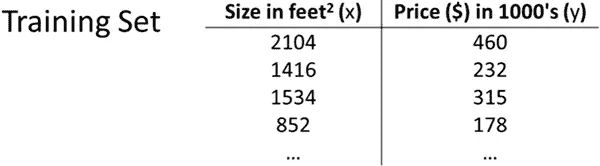

图 4:说明成本函数的虚拟数据

我们用来预测的假设形式是:**hθ(x)*=*θ0*+*θ1** x，*** *这里的* θi 称为模型的参数或权重，我们将看到如何选择这些参数。通过选择不同的θi 参数，我们得到了唯一的假设函数，例如:

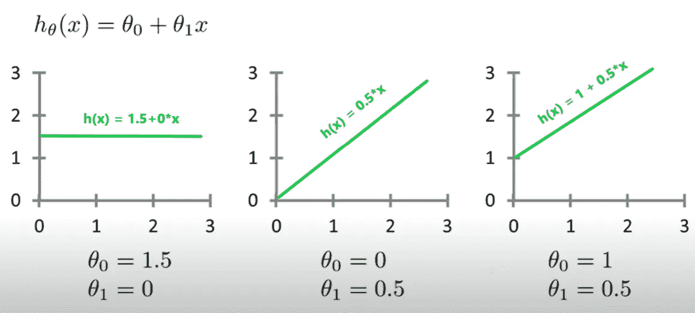

图 5:假设的变化

因此，这里的想法是选择 **θ0，θ1** ，使得对于我们的训练数据集 ***(x，y)*****hθ(x)**接近 **y** 。

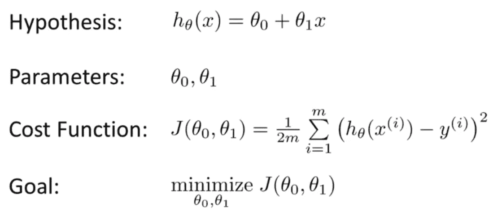

图 6:成本函数直觉

我们将通过在大小为 **m 的数据集上最小化 **hθ(x) - y** 之间的平方差来最小化 **θ0，θ1** 的成本函数。这里的** 1/2m 是为了使计算简单，因为我们在这里处理均值项。这个代价函数也被称为*均方误差(* ***mse*** *)。*

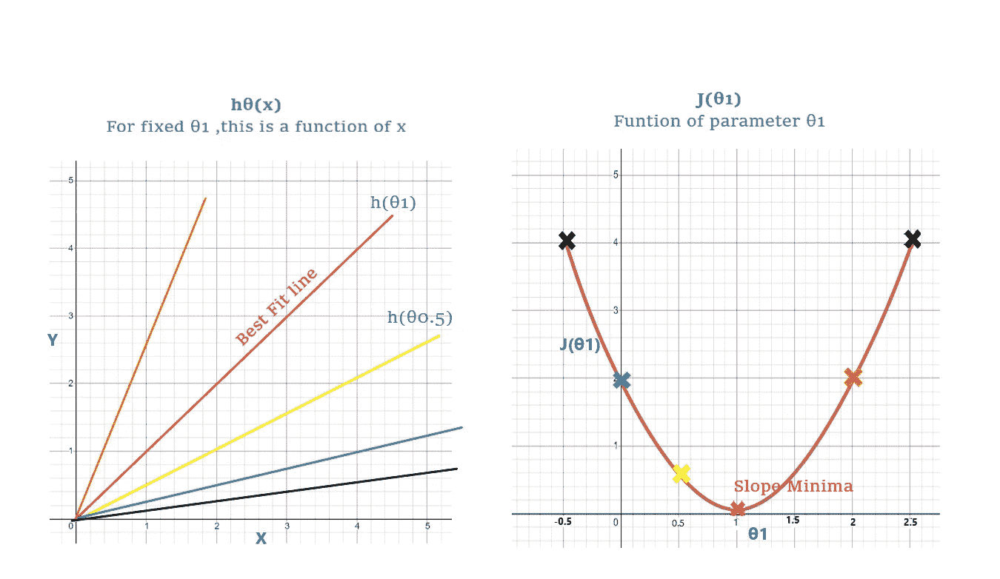

图 7:假设与成本函数图

```
To simplify the cost function assume a more simpler version of hypothesis, where θ0 is zero so the equation now becomes: Hypothesis : hθ(x) = θ1*x
cost function : J(θ1) = (1/2m)Σ(hθ(x(i))-y(i))^2 from i = 1 to mAssuming m = 3, y1 = 1, y2 = 2 and y3 = 3 **Scenario 1:** θ1 = 1 (Red line in Fig 7)
Then for θ1 = 1, hθ(x) = x which in this case points lies on y(i)
- For θ1 = 1, J(θ1) gives (1/(2*3))(0^2 + 0^2 + 0^2) = 0 
  and gives hθ(x(i)) = y(i), the points actual and predicted  
  points lie on each other**Scenario 2:** θ1 = 0.5 (Yellow line in Fig 7)
Then for θ1 = 0.5 then hθ(x) = 0.5x 
- For θ1 = 0.5, 
  J(θ1) = (1/(2*3))((1-0.5)^2 + (1-2)^2 + (1.5-3)^2) = 0.68 

Similarly you can plot for other values of θ1 and arrive at a graph as shown above.
```

上面的例子清楚了成本函数背后的直觉。在这里，我们试图确定θ值，进而计算出最佳*假设*，这将是最接近实际数据的一条线。


图 8:通过 hackernoon 找到最佳拟合线的图示

为了确定一条线的最佳近似，我们现在知道模型需要最小化成本函数。你现在可能很自然地想知道成本函数是如何最小化的——进入被称为梯度下降的技术，我们将在下一节中看到细节。

## 梯度下降

理论上，梯度下降是一种有效的优化算法，它试图找到函数的局部或全局最小值。它使模型能够学习模型应该采用的梯度或*方向*，以减少误差(实际目标变量和预测目标变量之间的差异)。

我们现在知道，对于上一节中的简单线性回归示例，应该调整或改变模型参数θ1 和θ2，以最小化成本函数。 ***最大值和最小值的微分为零的性质帮助我们调整我们的模型参数*** *(下图所示)*。成本函数的导数接近零的时刻意味着我们已经最小化了模型，否则我们继续更新我们的模型参数，直到我们到达最佳点。

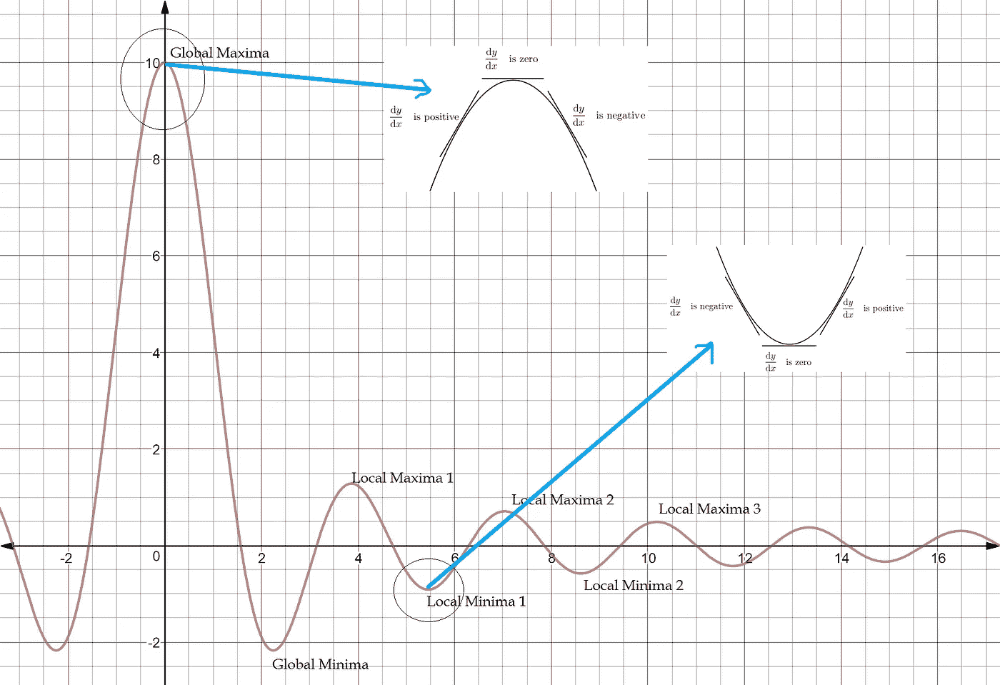

图 9:微分方程属性说明

为了使我们的生活简单一点，我们利用偏导数，因为成本函数涉及多个参数。让我们看看如何用数学方法实现它。

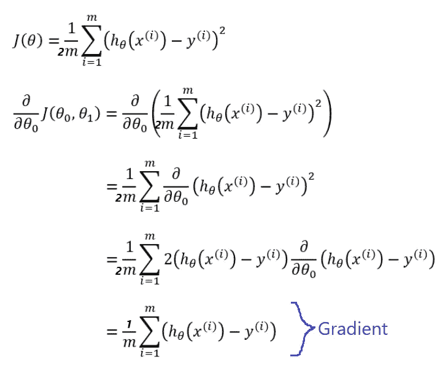

图 10:梯度方程

对θ1 和θ2 的偏导数得出最终方程，称为梯度，由此我们得出最重要的最终方程:

```
 **θ1 = θ1 - α * Gradient
α --> Learning Rate or dampening factor**
```

我知道这是太多的数学双关语，但这是最后一个也是最简单的一个，用来回答上面等式中可能出现的几个问题。

***为什么是负号？从图 9 中，我们看到了最大值和最小值点，但我们感兴趣的是这里的最小值点，它只有在我们沿着斜坡下降时才能达到，因此是负号。***

***学习率的需求是什么？*** 如果没有学习率，斜坡上的点的时刻将是不确定的，如图 11 所示，红线随机跳跃，永远不会达到收敛。为了克服这种情况，我们引入了学习率，也称为阻尼因子，它帮助我们在曲线上从起点迈出小步，导致收敛缓慢。

提示:保持较小的学习速率，这样你就不会错过模型的收敛点或最佳点。如果每个梯度的步长太大，模型可能会错过函数的局部最小值。如果它太小，模型将需要很长时间才能收敛

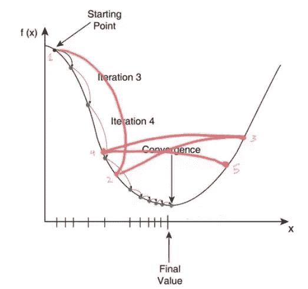

图 11:学习速度的影响

因此， ***，*** 梯度下降使得学习过程能够进行校正更新，以学习使模型朝着参数的最佳组合移动的估计。

总结来说，遵循以下步骤以获得最佳解决方案:

1.  用随机实数初始化假设参数的权重。在我们的例子中，它将是θ0 和θ1。
2.  初始化学习率( **α)** ，小值优先，如 0.01。
3.  定义 n_iterations，就是你要运行更新权重的循环的次数。
4.  选择一个停止点，比如 0.00001。如果我们的模型达到停止条件或 n 次迭代结束，我们将停止更新θ(i)值的过程。
5.  计算成本和梯度，并使用等式更新所有模型参数权重:

```
 **θ(i) = θ(i) — α * Gradient
'i' will be number of weights of the model**
```

5.不断更新权重值，直到达到停止条件(在步骤 3 中提到),这将为我们提供最佳解决方案，从而缩小实际目标和预测目标之间的差距。

6.有时达到最优解需要很长时间，在这种情况下，在步骤 1 中重新初始化权重，并重复所有步骤，直到达到最优解。

一旦我们达到假设的最优解，万岁！我们的机器！它学会了！！我们已经获得了最佳拟合线，我们的模型可以预测。

## **总结**

线性回归算法背后的全部直觉现在我们都知道了。是每个机器学习爱好者都必须知道的算法。通过这次旅行，我希望你能够实现你的第一个线性回归模型，知道它是如何工作的，这也将是非常方便的，当谈到超参数调整。让我们在下一篇文章中再次讨论线性回归的 python 实现。敬请期待！！继续学习！！注意安全。！:)

[](https://nextjournal.com/intelrefinery/simple-linear-regression) [## 简单线性回归

### R (2018)中的简单线性回归[STHDA]简单线性回归预测定量结果变量 y，对…

nextjournal.com](https://nextjournal.com/intelrefinery/simple-linear-regression) [](https://towardsdatascience.com/introduction-to-machine-learning-algorithms-linear-regression-14c4e325882a) [## 机器学习算法简介:线性回归

### 从头开始构建您自己的模型

towardsdatascience.com](https://towardsdatascience.com/introduction-to-machine-learning-algorithms-linear-regression-14c4e325882a) [](https://towardsdatascience.com/linear-regression-detailed-view-ea73175f6e86) [## 线性回归-详细视图

### 线性回归用于寻找目标和一个或多个预测值之间的线性关系。有两个…

towardsdatascience.com](https://towardsdatascience.com/linear-regression-detailed-view-ea73175f6e86) [](https://towardsdatascience.com/machine-learning-fundamentals-via-linear-regression-41a5d11f5220) [## 机器学习基础(一):成本函数和梯度下降

### * *这是机器学习基础系列的第一部分。ML 基础(II):神经网络可以在…

towardsdatascience.com](https://towardsdatascience.com/machine-learning-fundamentals-via-linear-regression-41a5d11f5220)