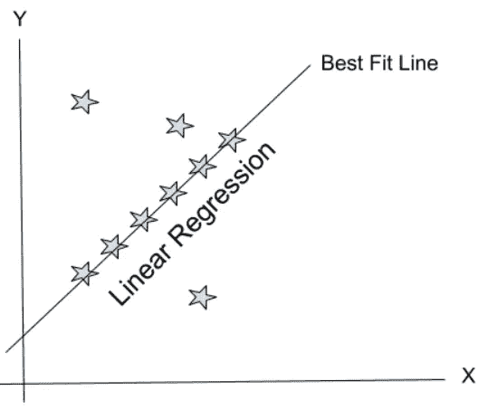
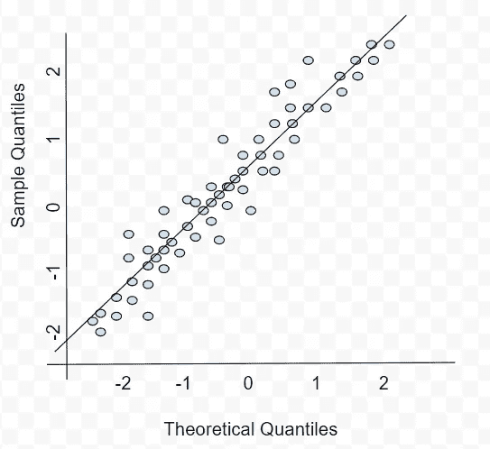
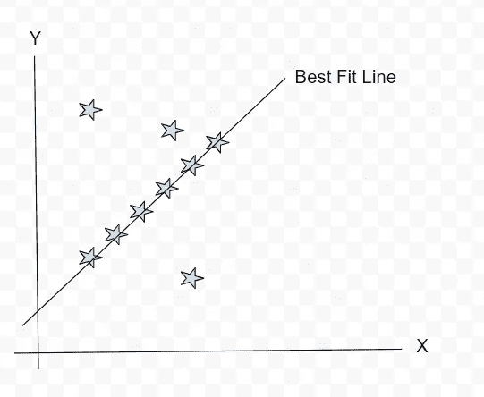
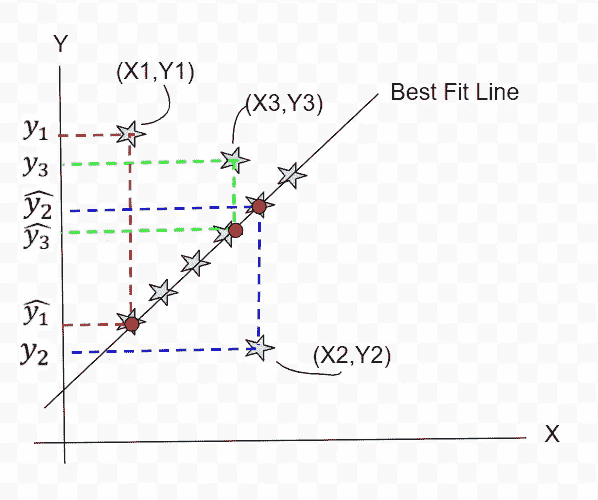
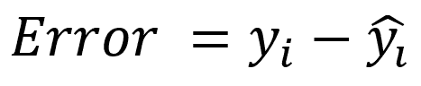
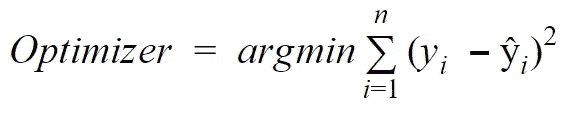
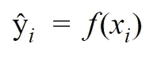
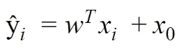
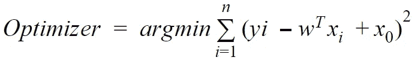
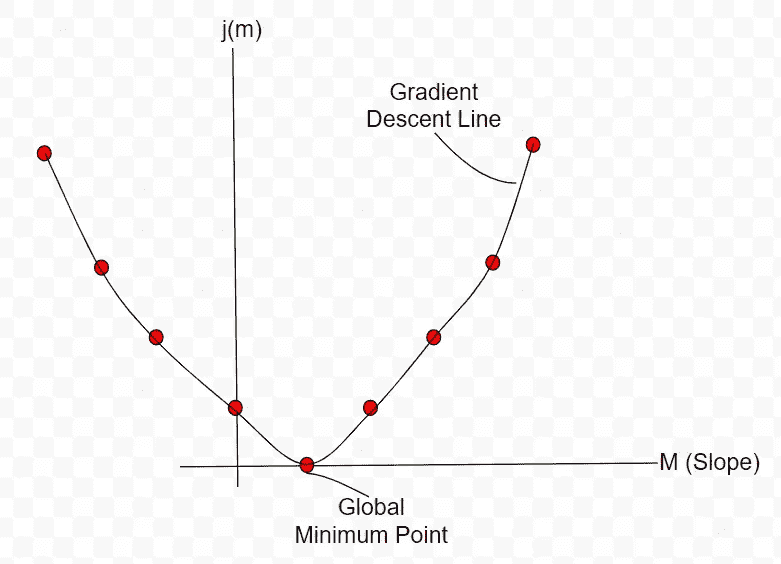

# 线性回归数学和几何直觉

> 原文：<https://medium.com/analytics-vidhya/linear-regression-math-geometrical-intuition-bad9a73cdcaa?source=collection_archive---------10----------------------->

L 线性回归是使用 OLS(普通最小二乘法)统计技术的机器学习中的基本&简单线性模型之一。它试图模拟独立&因变量之间的线性关系。

**线性回归中有哪些假设？**

1.  特征(X)和目标(Y)之间应该存在线性关系。
2.  残差是独立的&残差之间没有相关性。
3.  数据具有同质性特征，在每一级特征上具有恒定的方差。
4.  数据必须呈正态分布。

**在实施线性回归之前，验证数据的最好方法是什么？**

1.  对自变量和因变量进行目视检查。初始化 Q-Q 图以理解假设，使数据呈正态分布。这满足了正态假设。
2.  了解数据点正态性的统计方法。

以下是满足线性回归假设的 Q-Q 图的直观表示:

**数学&线性回归的几何直观。**

**步骤 1:独立&因变量的绘图。画出最佳拟合线(大约。).**

最佳拟合线是基于误差总和最小来确定的。

**第二步:计算个体误差。**

基于实际值和预测值定义误差。下面是计算单个点误差的公式。

在我们的示例中，我们有 3 个点不符合我们的最佳拟合线。所以我们需要计算误差函数。

误差的计算可以推断选择最佳拟合线的状态。

**第三步:计算误差的最小平方和或普通最小二乘法。**

由于我们已经计算了所有点的单个误差，现在我们将求和并考虑最小值，通过使用下面的公式来评估最佳拟合线。

在哪里，

一旦我们在线性模型上有了最佳拟合线，我们就可以自由地根据给定的自变量预测因变量。

**选择最佳拟合线的依据是什么？**

成本函数公式将根据预测和实际变量分别提供误差。但是我们不能根据一些视觉探索直接选择最佳拟合线。

在上面的公式中，我们将独立地将斜率(m)探索成不同的值。基于变化的 m 值，我们将到达梯度下降点，以找到全局最小点，如下图快速参考。

在预测一个目标变量时，我们将知道对应的 X 值(输入函数),在此基础上通过使用全局最小点我们将绘制最佳拟合线。因此，给定的未来独立变量的预测将具有预测的目标变量。

感谢阅读。

**看看我的另一个博客** [逻辑回归数学&几何直觉和例子](/@Shashi.Kiran.AI/logistic-regression-math-geometrical-intuition-with-example-8a0cb8860f8a)

您可以通过以下方式联系到我:

领英:【https://www.linkedin.com/in/shashikiranc/ 