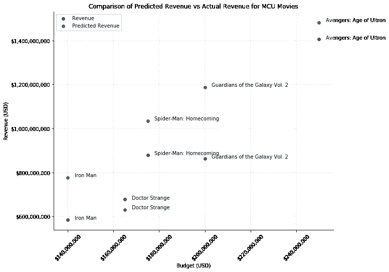
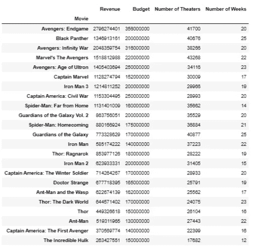
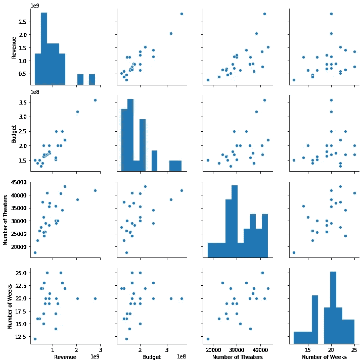
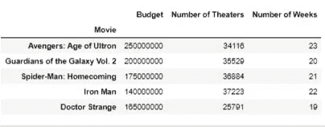
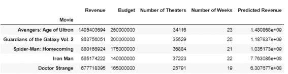
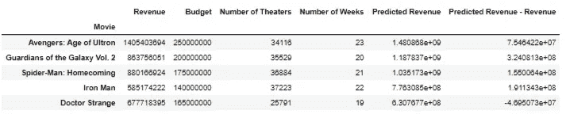

# 预测漫威电影世界(MCU)电影票房的线性回归模型。

> 原文：<https://medium.com/analytics-vidhya/linear-regression-model-predicting-the-grossing-of-movies-from-the-marvel-cinematic-universe-mcu-9d72644563c9?source=collection_archive---------3----------------------->


截至 2019 年，最成功的电影系列漫威电影宇宙(MCU)自 2008 年起飞以来，票房收入高达 220 亿美元。该特许经营权是迪士尼的一大胜利，并将继续成为其商业战略的一部分，即使该公司准备推出其流媒体服务 Disney+。

作为一个如此成功的特许经营，MCU 带来了一个有趣的数据集，值得回顾，有人可能会问，某些因素，如预算，电影粉丝群的规模和发行协议，在多大程度上影响漫威电影的成功。在数据科学中，这是一个可以使用最基本的模型，即线性回归模型来回答的问题。

本文推导了一个线性回归模型，用于估算 5 部漫威电影的收入，分别是: ***《钢铁侠》、《奇异博士》、《蜘蛛侠归来》、《银河守护者》第二卷和《复仇者联盟:奥创时代》*** *。*模型的预测结果如下:



快速突出显示执行线性回归模型所需的步骤如下:

1.  导入必要的库。
2.  加载数据集。
3.  分成训练和测试数据帧
4.  在训练数据框架上运行回归模型
5.  使用模型预测测试数据框架的值
6.  画出差异
7.  比较一下细节上的区别。

## 详细演练？跟我来。

使用来自票房 Mojo 的数据，包括预算、影院数量和电影放映周数；这些因素对收入的影响可以通过在 Python Jupyter 环境中实现线性回归模型来估计，让我们来演练一下。

使用 python 的标准程序，所有需要的库都必须导入到笔记本中，即 numpy、pandas、matplotlib 和 scipy:

```
import numpy as npimport pandas as pdimport matplotlibimport matplotlib.pyplot as pltimport scipy.stats as stats
from sklearn import linear_model
```

然后，我们将数据集作为 pandas 对象类型加载到笔记本中，并浏览一下数据:

```
df = pd.read_csv(‘MCU.csv’, index_col=’Movie’)
df.head()
```



下一个最重要的步骤是可视化每个列之间的关系，因为这使分析师能够发现数据集中可能存在的线性和多项式关系。为了做到这一点，可以使用散点图或配对图，为了简单起见，我使用了配对图。

```
import seaborn as sbsb.pairplot(df)
```

嘣！我们可以看到 ***收入****&****预算*** 有线性关系，以及 ***收入*******&影院数量*** 。 ***收入&周数*** 电影播出的关系是非线性的、分散的。然而，我们可以包括这个变量，因为模型在现实中可能是非线性的:*

**

*接下来，数据集必须分成训练和测试数据帧。测试数据框架用于验证由训练数据框架创建的模型的效率。根据惯例，我们将原始数据集命名为“训练”数据帧，将验证数据集命名为“测试”数据帧。有许多方法可以执行这种拆分，但是为了有利于风格，我们可能会选择一种更优雅的方法:*

```
*train = df.sample(frac=0.8, random_state=200)
train.index
test = df.drop(train.index)*
```

*它使用一个名为 ***sample*** 的函数将原始数据集的 80%提取到一个名为“train”的地址中，并继续从父数据集中删除该数据集的成员，同时将其保存到一个名为“test”的地址中。*

*这分别为训练(18)和测试(5)产生以下数据帧:*

```
*train.indexOutput:**Index(['Avengers: Infinity War', 'Avengers: Endgame', 'Ant-Man',
       'Captain Marvel', 'Thor: Ragnarok', 'Thor: The Dark World',
       'Marvel's The Avengers', 'Captain America: Civil War', 'Black Panther',
       'Spider-Man: Far from Home', 'Thor', 'Iron Man 3',
       'Ant-Man and the Wasp', 'Captain America: The First Avenger',
       'The Incredible Hulk', 'Guardians of the Galaxy', 'Iron Man 2',
       'Captain America: The Winter Soldier'],
      dtype='object', name='Movie'**test.indexOutput:
**Index(['Avengers: Age of Ultron', 'Guardians of the Galaxy Vol. 2',
       'Spider-Man: Homecoming', 'Iron Man', 'Doctor Strange'],
      dtype='object', name='Movie')***
```

*这个练习的目标是**使用其他变量**估算收入。因此，因变量 Y 是 ***收入*** 自变量是其他: ***预算，影院数量&周数*** 。在回归格式中，这将看起来像:*

***收入** = ***预算常数*建议预算+剧院数常数*建议剧院数+周数常数*周数+误差****

*该模型将估计:*

1.  *预算常数*
2.  *剧院数量不变*
3.  *周数常数*

*所有这些，当与建议值( ***预算、影院数量&周数*** )结合起来时，将为分析师产生一个 ***收入*** 估计值。*

*因变量组合使用:*

```
*depd = train[[‘Budget’, ‘Number of Theaters’, ‘Number of Weeks’]]*
```

*然后，线性回归模型，即主酱，被添加到“火车”数据框架中。拟合函数用于估计每个因变量的权重:*

```
*split_mcu_model = linear_model.LinearRegression()
split_mcu_model.fit(X=depd, y=train['Revenue'])*
```

*要检查重量，请在型号名称上运行打印功能，即 split_mcu_model:*

```
*print(‘Intercept: ‘, split_mcu_model.intercept_)
print(‘ ‘)print(‘Co-efficients: ‘, split_mcu_model.coef_)
print(‘ ‘)Output:
**Intercept:  -1204790248.147585

Co-efficients:  [ 7.39799224e+00  3.17134815e+04 -1.06859582e+07]***
```

## *将此解释为我们的线性模型给出:*

****收入= 7.4 *拟定电影预算+31713.4 *拟定影院数+(-10685958.2)*周数+(-1204790248)****

*下一个最重要的问题是，“ ***这个模型在多大程度上解释了数据集*** 中的变异？”。这里，实现了一种称为 R 平方的测量。简而言之，R-squared 将在 100 分的尺度上向分析师显示所创建的模型解释数据集中可观察到的可变性的程度。*

*为了进行测试，我们需要:*

```
*# Check R-squared
split_mcu_model.score(X=depd, y=train[‘Revenue’])Output:
**0.8904921033424646***
```

***这意味着该模型解释了观察到的 89%的可变性，一点也不差**！*

## *然后是验证！*

*为了验证，我们必须再次为测试数据框定义因变量，类似于为**训练**数据框所做的:*

```
*test_df = test[[‘Budget’, ‘Number of Theaters’, ‘Number of Weeks’]]
test_df*
```

*这抛弃了测试数据框架的**收入**列，因此只剩下因变量( *X1:预算，X2:剧院数量& X3:周数*)。见下文:*

**

*接下来，我们使用 test_df 变量运行预测函数:*

```
*predictions = split_mcu_model.predict(X=test_df)print(predictions)Output:
**[1.48086791e+09 1.18783732e+09 1.03517332e+09 7.76308508e+08
 6.30767668e+08]***
```

*为了便于理解，让我们运行一个简单的循环来充分格式化预测的数字:*

```
*for i in predictions:
 print(‘$’ + format(i, ‘,.2f’))Output:**$1,480,867,909.25
$1,187,837,321.06
$1,035,173,324.26
$776,308,507.84
$630,767,667.86***
```

*接下来，我们将预测结果保存到原始测试数据框架中，方法是将其保存到一个名为“预测收入”的新列中:*

```
*test[‘Predicted Revenue’] = predictions
test*
```

**

*既然我们已经完成了。现在是时候在散点图上绘制数据点了，以便确定预测收入和实际收入之间的偏差。为了不离题，代码将与输出一起粘贴。*

```
*import matplotlib.ticker as mtickdef scatterplot(df, x_dim, y_dim, z_dim):
 x= df[x_dim]
 y= df[y_dim]
 z= df[z_dim]

 fig, ax = plt.subplots(figsize=(10,8))

 #define color array
 colors = [‘#2300A8’, ‘#00A658’]

 #customize transparency for each dot in the scatter plot

 #plot each x-y
 ax.scatter(x, y, alpha=0.9, color=colors[0])
 ax.scatter(x, z, alpha=0.9, color=colors[1])

 #add title and axes labels
 ax.set_title(‘Comparison of Predicted Revenue vs Actual Revenue for MCU Movies’)
 ax.set_xlabel(‘Budget (USD)’)
 ax.set_ylabel(‘Revenue (USD)’)

 #remove top and right borders
 ax.spines[‘top’].set_visible(False)
 ax.spines[‘right’].set_visible(False)

 #add major gridlines
 ax.grid(color=’grey’, linestyle=’-’, linewidth=0.25, alpha=0.5)

 #Change y-axis label style and include Currency format
 ax.ticklabel_format(style=’plain’, useOffset=False, axis=’y’)
 fmt = ‘${x:,.0f}’
 tick = mtick.StrMethodFormatter(fmt)
 ax.yaxis.set_major_formatter(tick)

 #Change x-axis label style and include Currency format
 ax.ticklabel_format(style=’plain’, useOffset=False, axis=’x’)
 fmt = ‘${x:,.0f}’
 tick = mtick.StrMethodFormatter(fmt)
 ax.xaxis.set_major_formatter(tick)
 plt.xticks(rotation=45)

 #add Legend
 ax.legend()

 for i in test.index: 
 plt.text(test[‘Budget’][i]+3000000.0, test[‘Predicted Revenue’][i]+3000000.0, i)
 plt.text(test[‘Budget’][i]+3000000.0, test[‘Revenue’][i], i)

 plt.show()

scatterplot(test, ‘Budget’, ‘Revenue’, ‘Predicted Revenue’)*
```

*嘣！*

**

*在这里，我们可以看到复仇者联盟:奥创时代，银河护卫队第二卷，蜘蛛侠:返校节和钢铁侠根据模型表现不佳。*

## *一点个人看法:*

*我个人认为 ***【奥创时代】*******《蜘蛛侠归来》和《银河护卫队》第二卷*** 没有达到他们本应达到的水平，表现不佳，也就是说，它们是漫威最底层的电影。但《钢铁侠》是漫威的第一部电影，之前没有影响力，所以《钢铁侠》的表现低于模特是可以理解的。**

## **预测收入和实际收入在数字上的差异有多大？**

**为此，我们首先找到两列之间的差异，并将其保存到新列中。**

```
**test[‘Predicted Revenue — Revenue’] = test[‘Predicted Revenue’] — test[‘Revenue’]
test**
```

****

**它仍然以科学的格式读取，为了清楚地说明它，我们可以在“预测收入-收入”列中调用每个指数及其等价成员:**

```
**for i in test.index:
 print(‘ ‘)
 print(i)
 print(‘$’ + format(test[‘Predicted Revenue — Revenue’][i], ‘,.2f’))Output:
**Avengers: Age of Ultron
$75,464,215.25

Guardians of the Galaxy Vol. 2
$324,081,270.06

Spider-Man: Homecoming
$155,006,400.26

Iron Man
$191,134,285.84

Doctor Strange
$-46,950,727.14****
```

**开始了。**

**像这样的模型有许多商业应用，可以用来**预测销售**，**你的营销活动的可行性**，**一部尼莱坞电影的总收入**等等。这个例子演示了一个非常简单的应用程序，但有一个重要的警告，即数据可用性。你的业务中有数据吗？您可以用它做更多的事情…**

**在 twitter @the_horoatio 上关注我，我也写关于地缘政治、经济和现在的数据科学的博客。非常感谢你的阅读！**