# 线性回归&使用 python 的多元线性回归，带有非常基本的例子

> 原文：<https://medium.com/analytics-vidhya/linear-regression-multiple-linear-regression-using-python-with-very-basic-examples-4d8b1500301d?source=collection_archive---------20----------------------->

爱德华·豪厄尔在 [Unsplash](https://unsplash.com?utm_source=medium&utm_medium=referral) 上拍摄的照片

线性回归是一种统计方法，用于根据数值变量之间的关系进行量化和预测。

这里我们讨论两种常见的回归类型。

## 1.简单线性回归

简单线性回归是指有 1 个预测因子(自变量)和 1 个预测因子(因变量)的情况

例子-考虑一个你的“学习时间”和“成绩”之间的图表。在这里，学习时间将是独立变量或预测值，分数将是从属变量或预测值，因为它随学习时间而变化。

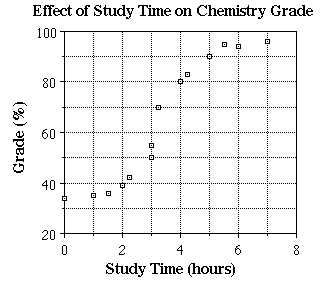

线性回归的例子。

具有一个因变量和一个自变量的回归方程的最简单形式由公式 y =mx +b 定义，其中 y =估计的因变量得分，m=估计的系数，b =截距，x =自变量得分。

## 2.多元线性回归

多元线性回归是指有一个以上的预测因子和一个预测值的情况。这里需要注意的是，所用的预测值必须是相互独立的。

举例来说，房子的售价可能取决于位置的可取性、卧室的数量、浴室的数量、房子建造的年份、地段的平方英尺以及许多其他因素。这里价格是预测值，其他因素是预测值

***现在让我们进入 python 编码部分，进行简单的线性回归。我将使用 jupyter 笔记本进行编码演示。***

我使用的所有代码都在 Github 链接中，你可以在本文末尾找到。

我们走吧！！！！！

# 简单线性回归

首先，我们将导入库。

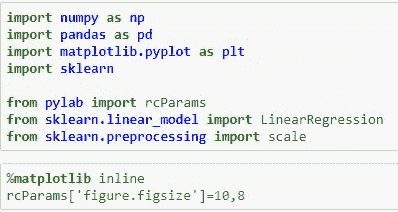

导入线性回归所需的所有库

## 让我们创建一些合成数据，以便进行线性回归。让我们创建一个名为“房间”的变量，我们将房间设置为一组随机数的两倍+ 3。

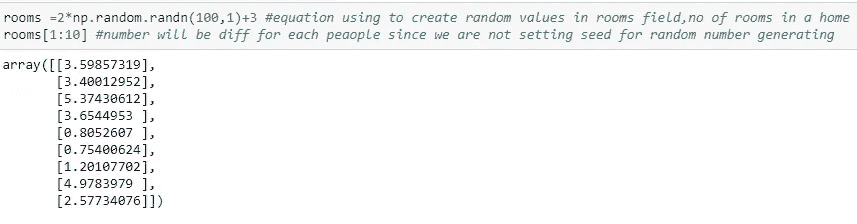

这里我得到房间的随机值。在你们的系统中会有所不同，因为我们没有设定种子。

## 我将为变量“价格”设置一个等式，作为价格= 265 + 6*房间数+abs(np.random.randn(100，1)) abs 代表绝对值。

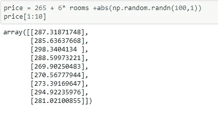

我们得到价格的随机值，我们打印 10 个值

现在让我们创建一个散点图，看看房间和价格之间的关系

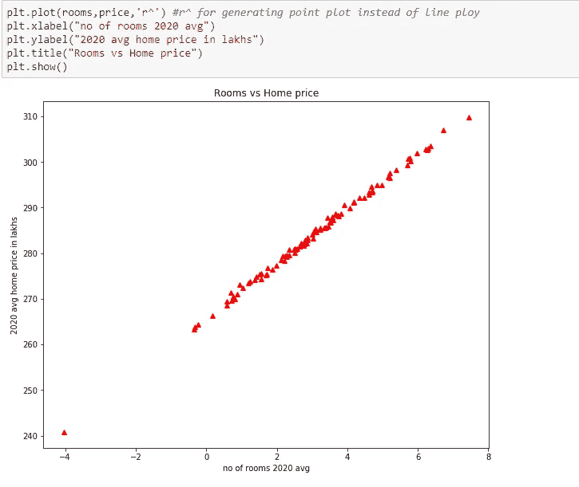

房间散点图作为预测值(独立变量),价格以 10 万卢比为预测值(因变量)

## 通过分析该图，房价随着房间数量的增加而增加。

## 让我们使用线性回归，房间作为预测，X =房间。我们要预测价格，所以 Y =价格

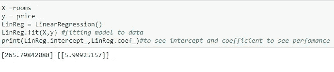

这里我们得到截距为 265.79842088，系数为 5.9925157

***简单代数***

***y= mx +b，其中 b 为 y 截距，m 为系数或斜率，这里 b = 265.79842088，m =5.99925157。这就像我们知道房间的数量(x ),就可以得到一个等式来计算价格。***

## 让我们看看我们的模型表现如何。我们调用 print fun 并生成线性回归模型的分数。score 函数将返回 Rsquare 值。

print(LinReg.score(X，y))

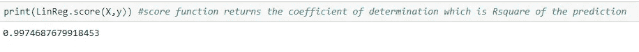

我们得到的分数或决定系数为. 9974687

## Rsquare 值越接近 1，线性回归越多。我们的线性模型表现很好，因为 Rsquare 值接近 1。

# 多元线性回归

让我们看看多元线性回归的编码演示。让我们导入库。除了线性回归之外，我想在这里添加的唯一一件事是 seaborn，我们将 seaborn 作为 sb 导入，我们还需要为 seaborn 设置样式，所以我们将说 sb.set_style，我们只说我们想要白色网格。最后，我们需要从集合中导入计数器，所以我们说从集合导入计数器

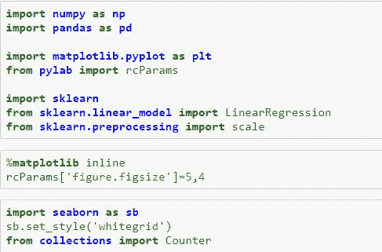

多元线性回归所需的库

不。我将使用 pd.read_csv 函数读取一个数据帧，并将列命名为 year、roll、unem、hgrad 和 inc。然后，我将使用 enroll.head()查看数据的前五个详细信息

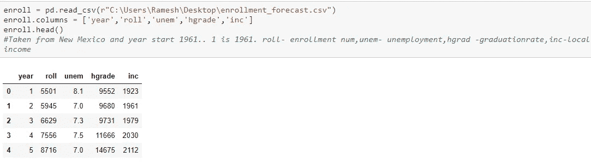

这个数据取自新墨西哥州，从 1961 年开始。所以第一年实际上是 1961 年。名册表示入学人数，失业表示当年当地的失业人数，然后 hgrad 是毕业率，然后收入是当年该地区的当地收入。

我们的变量需要是连续的数字变量。我们还需要确保预测值和被预测值之间存在线性关系。所以让我们检查一下相关性。为此，我们将使用 seaborn，我们会说 seaborn.pairplot，并传入我们的注册数据，然后运行它，让我们看看这里的一些变量之间的关系。

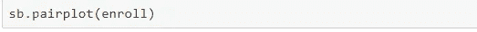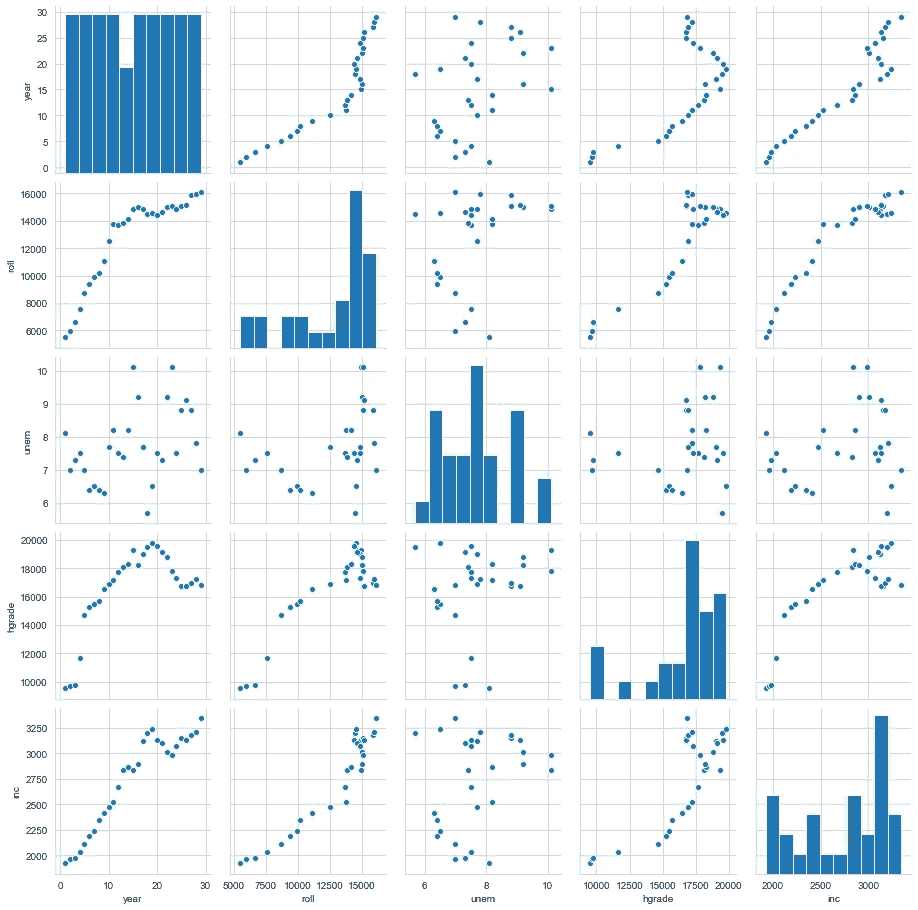

我们先来看看失业和入学之间的关系。你可以说，这里可能存在某种线性关系，但它可能更强。但是我们称之为足够好，然后看看失业率作为一个预测指标是如何表现的。现在让我们来看看 hgrad 和 enrollment 线性对。这是 hgrad，这是注册人数，实际上，看起来相当不错。肯定有线性关系。

现在让我们使用 print(enroll.corr())检查这个注册数据的相关性

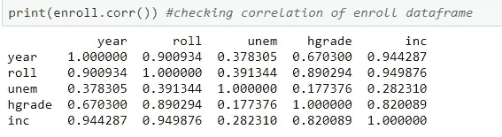

我们只是想确定我们的预测者不是完全相互依赖的。这对线性回归来说肯定不好。让我们看看 hgrad 和失业率的相关性，它是 0.177376，比 1 小得多。所以 hgrad 变量和失业率绝对不是线性相关的。

所以让我们把分数和失业率作为预测值，把滚动作为预测值。首先，我们必须创建**注册数据**的子集，并从注册数据集中选择“unem”和“hgrade”。所以 **enroll_data 将是预测值(X)** 。然后为 predictand 创建另一个数据集 **enroll_target** ，并从注册数据集中选择“滚动”。所以 **enroll_target 将是 predictand(y)。**

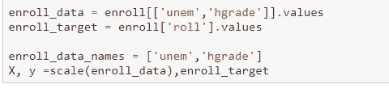

我们的预测器是 X 数据，然后我们的目标是 y 数据。我们希望在我们的 enroll_data 和 enroll_target 上调用 scale 函数。

## 现在我们必须检查是否有任何丢失的值。让我们在这里创建一个名为 missing_values 的变量，我们将它设置为等于 X，这里 X 等于不是一个数字，所以我们说它等于等于 np.NAN，这不是 NumPy 库中的一个数字，然后我们就把它们过滤掉。

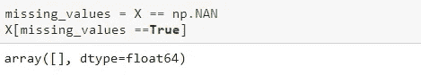

打印出 missing_values，其中 missing_values 等于 True。我们将运行这个，我们得到一个空数组，这意味着我们没有丢失值。

## 我们需要做的下一件事是实例化一个线性回归对象。所以我们称它为 LinReg，我们说 LinReg 等于线性回归，然后我们说 normalize 等于 True。这告诉 LinearRegression 模型在回归之前归一化我们的变量，然后让我们将这个模型拟合到我们的数据，为此，我们将调用它的 fit 方法。我们会说 LinReg.fit，我们会传入我们的数据，所以 X 和 y，然后让我们打印出我们的模型表现的分数。

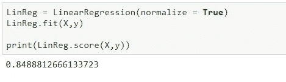

我们的回报率是 84%，实际上，将会是 85%。

## 这里打印出来的分数是预测的 R 平方。这是一种衡量模型预测的回归线实际上与大学入学人数的真实值匹配程度的方法。基本上，它告诉我们这个模型在预测大学入学人数方面表现得有多好。好的最高分是 0.99，最低分是 0.01

# 这就是线性和多元线性回归的总结！！！这里是我使用的所有代码和数据的 Github 链接。

 [## iamrahullamesh/Linear-Regression-Multiple-Linear-Regression-using-python-with-very-basic-example

### 此时您不能执行该操作。您已使用另一个标签页或窗口登录。您已在另一个选项卡中注销，或者…

github.com](https://github.com/iamrahulramesh/Linear-Regression-Multiple-Linear-Regression-using-python-with-very-basic-example.git) 

## 快乐学习！！！:)