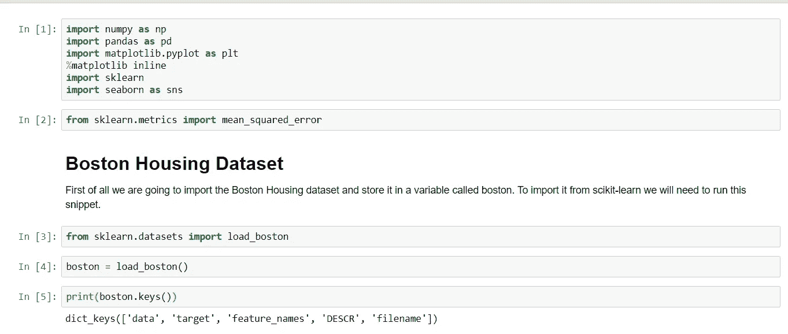
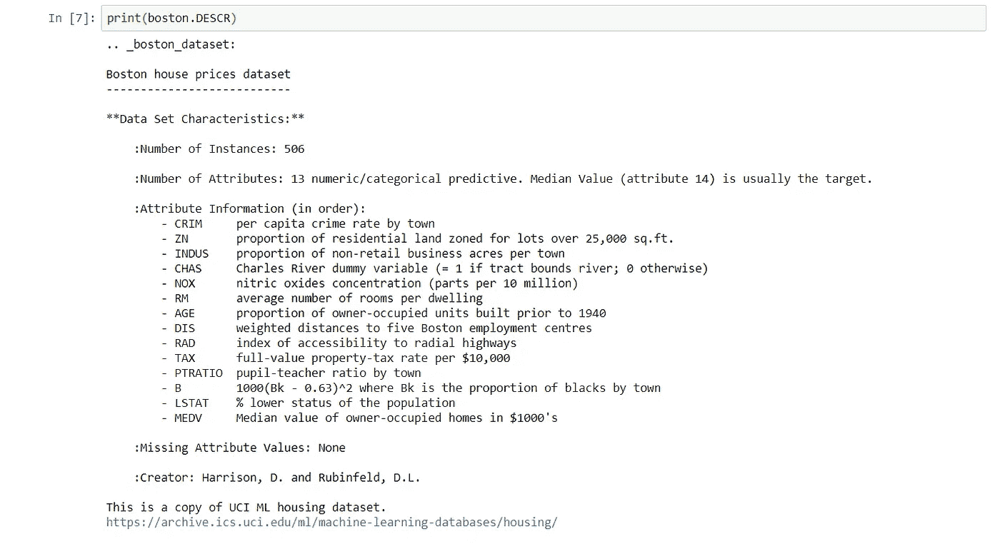
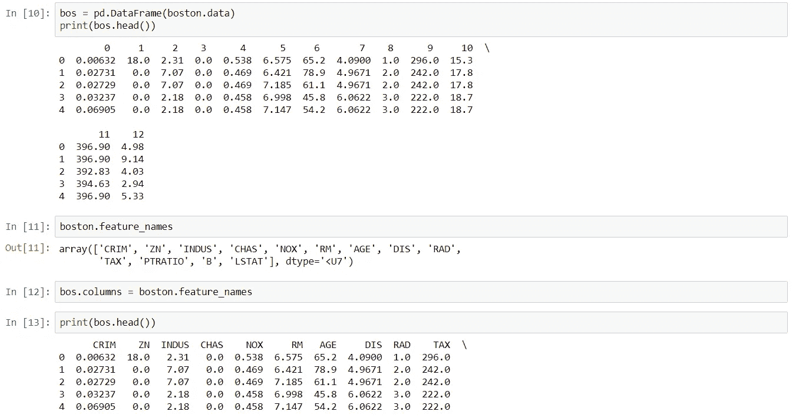
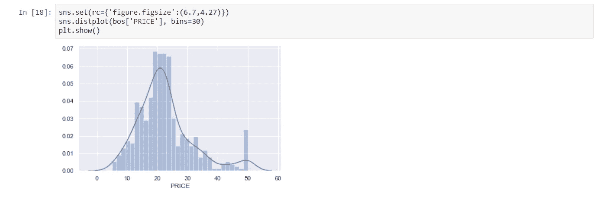
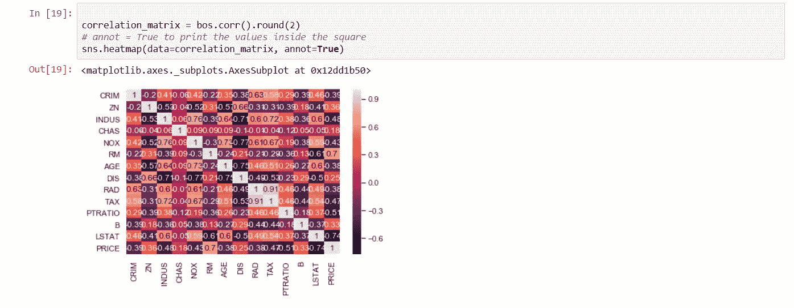
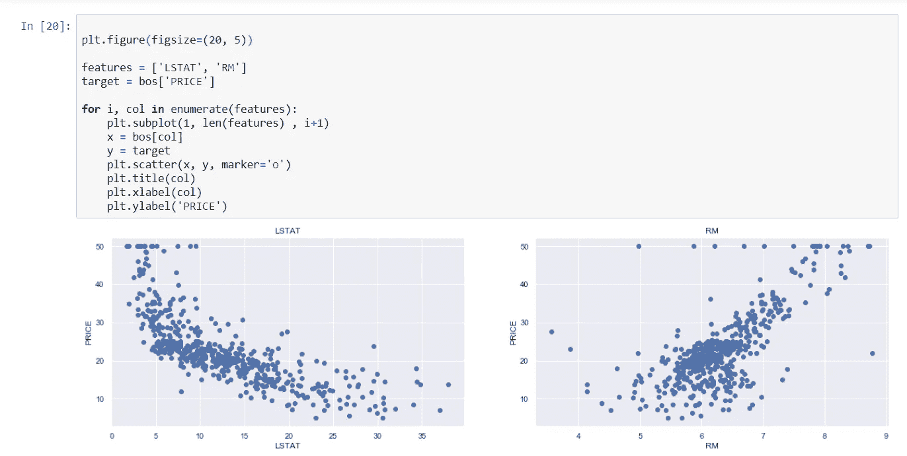
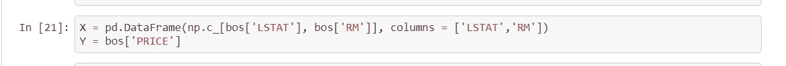
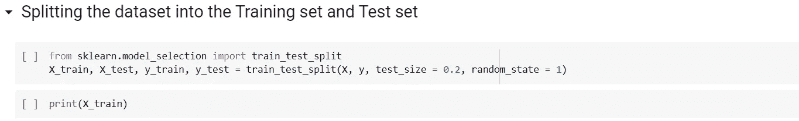
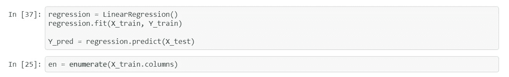
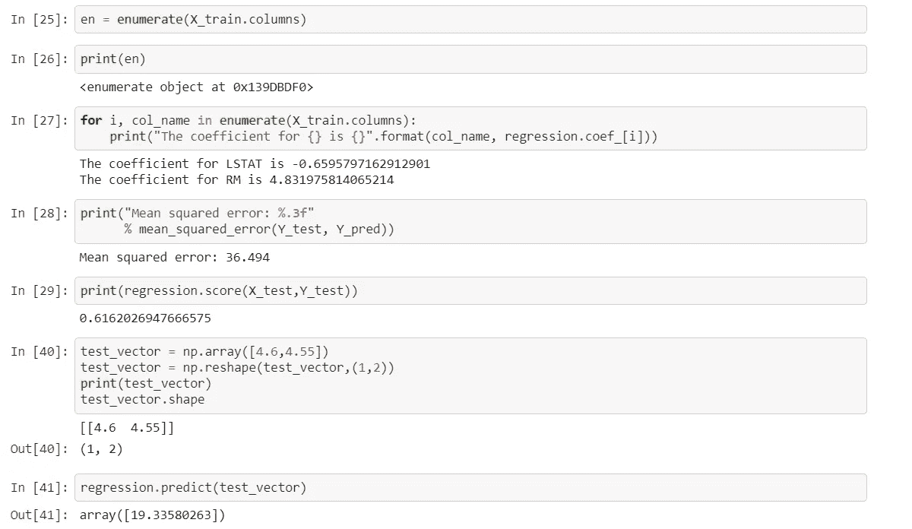

# 波士顿住房数据的线性回归

> 原文：<https://medium.com/analytics-vidhya/linear-regression-on-boston-housing-dataset-d7b20c94d65c?source=collection_archive---------13----------------------->

在我之前的博客中，我介绍了线性回归和梯度下降的基础知识。

今天，我们将对一个著名的住房数据集实施线性回归，该数据集包含波士顿不同房屋的信息。我们将对波士顿住房数据集执行线性回归，该数据集存在于 **scikit learn** 包中。

([https://rajivsworklife . files . WordPress . com/2018/02/Boston . jpg？w=675 & h=448](https://rajivsworklife.files.wordpress.com/2018/02/boston.jpg?w=675&h=448)

我们将对波士顿住房数据集执行线性回归，该数据集存在于 **scikit learn** 包中。

首先，我们必须导入我们将使用的所有必要的库，包括 NumPy、Pandas、Matplotlib、Seaborn 和 scikit-learn。然后，我们从 scikit-learn 加载住房数据集。 **load_boston** 方法用于加载数据集。

导入数据集后，我们使用 **keys()** 函数打印数据集的字段名称。

这里， **data** 包含不同房屋的信息或数据， **target** 包含房屋的价格， **feature_names** 包含数据的特征或列的名称， **DESCR** 描述数据集。

现在让我们把它转换成熊猫吧！很简单，打电话给警察。DataFrame()方法并传递 boston.data .我们可以用 bos.head()检查前 5 个数据。

为了理解目标变量和特性之间的关系，我们将绘制目标变量价格的分布图。我们将使用 seaborn 库中的 **displot 函数**，然后我们将创建一个**相关矩阵**。我们将使用 seaborn 库使用**堆函数**来绘制它。

*相关系数范围从-1 到 1。如果该值接近 1，则意味着这两个变量之间有很强的正相关性。当它接近-1 时，变量具有很强的负相关性。*

最强的正相关显示为蓝色，而最强的负相关显示为奶油色。这些是我们希望在模型中使用的特性。

现在，我们可以很容易地观察到，RM 和 LSTAT 与目标的相关性最强。所以我们将使用 RM 和 LSTAT 作为我们的特征并绘制它们。

# 准备用于训练模型的数据

我们使用 numpy 库提供的 np.c_ 来连接 LSTATand 和 RM 列。

# 将数据分成训练集和测试集

# 训练和测试模型

我们使用 scikit-learn 的`LinearRegression`在训练集和测试集上训练我们的模型。

# 模型评估

这就是线性回归的全部实现。敬请关注更多博客。

*谢谢*

波士顿住房数据集上线性回归的实现

[https://github . com/internity foundation/machine learning _ navu 4/blob/master/Day % 207% 20:% 20 Linear % 20 regression % 20 implementation/Linear % 20 regression % 20 on % 20 Boston % 20 dataset . ipynb](https://github.com/InternityFoundation/MachineLearning_Navu4/blob/master/Day%207%20:%20Linear%20Regression%20Implementation/Linear%20Regression%20On%20Boston%20Dataset.ipynb)