# 波士顿房价的线性回归

> 原文：<https://medium.com/analytics-vidhya/linear-regression-on-boston-housing-prices-2c007371857e?source=collection_archive---------12----------------------->

什么是线性回归？

> 在统计学中，线性回归是一种对标量响应和一个或多个解释变量之间的关系进行建模的线性方法。只有一个解释变量的情况称为简单线性回归。
> 
> *对于一个以上的解释变量，这个过程称为多元线性回归。*
> 
> *来源:维基百科*

基本上形成一条线。那条线叫做 Ypred。

> ***Y pred = b1x + b0***

波士顿数据集:

> *该数据集取自 StatLib 图书馆，由卡内基梅隆大学维护。该数据集涉及波士顿住房城市的房价。所提供的数据集有 13 个特征的 506 个实例。*

事不宜迟，让我们直入主题:

我使用以下代码从 sklearn 数据集加载数据集:

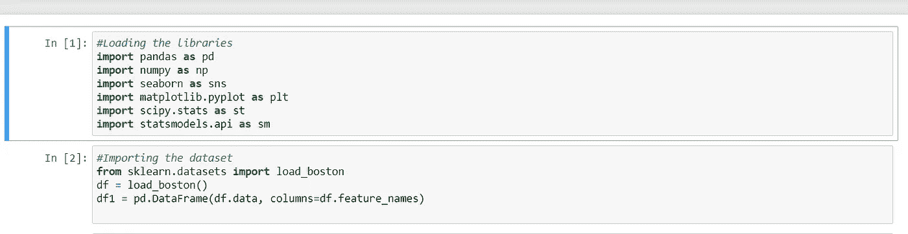

加载了库并导入了数据集

通过使用 df.head()函数来看看数据的样子:

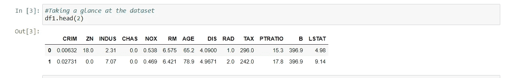

波士顿数据集中存在的要素

现在，我们需要目标列，它是通过使用。指标函数

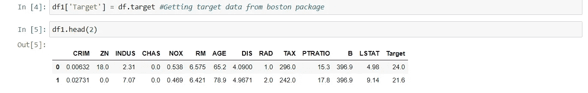

添加目标列后

在此之后，我们需要在跳转到 df.describe()之前找到哪些列可以是分类的，哪些列可以是数值的。为此，我们使用 df.info，看看这些列最初是什么样子的。

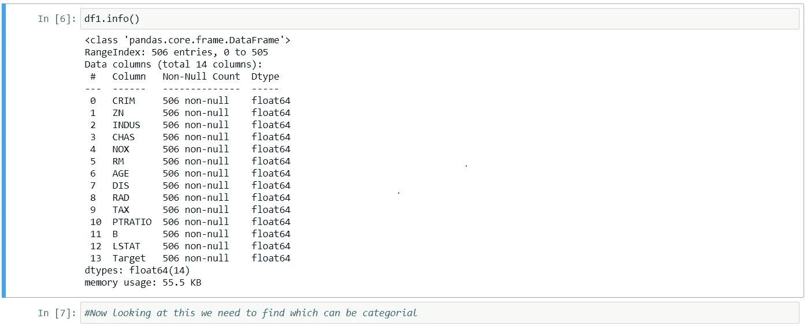

这些列是浮动的。

现在，我们要通过查看数据帧来找到哪些可以被转换成分类(对象),并对其进行转换。在我看来，查斯和拉德可以是绝对的。这就是为什么我把两者都转换成对象。

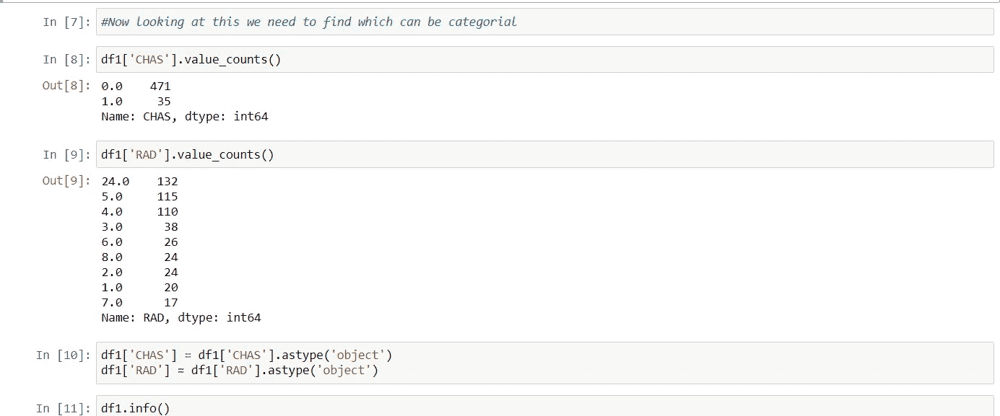

使用了一个类型来更改数据类型

这样做之后，我们现在可以开始寻找数据帧的五点摘要。

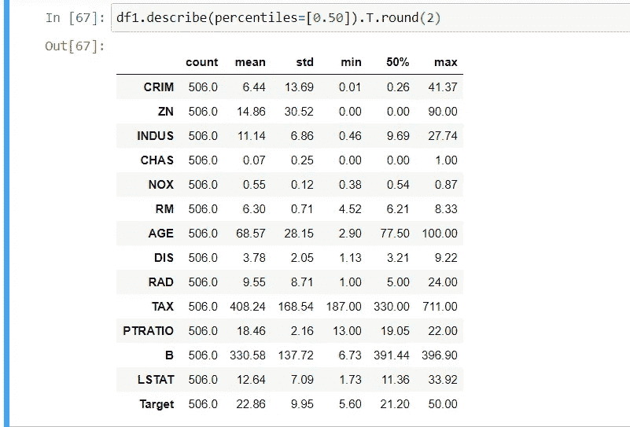

我得到了第 50 百分位的描述

是我们进入 EDA 部分的时候了。正如我之前提到的，我附上我关于如何做 EDA 的文章。

我们通过检查空值开始 EDA，发现数据集中没有空值。使用 isnull()函数检查空值

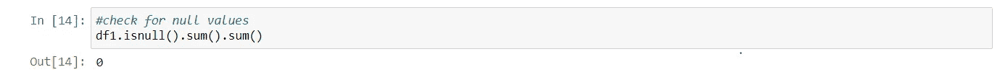

我用过。再次求和得到总数

因为我们没有任何空值，所以我们可以进行异常值处理。为了检查异常值，我们使用箱线图，并找出异常值在该数据集中的情况。

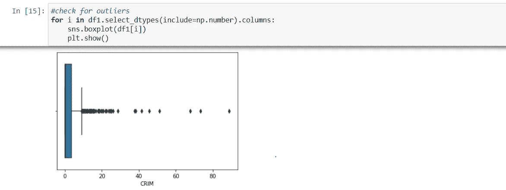

有离群值，我只附上一个专栏，以确保这篇文章不会变大

异常值处理:我用 iqr 处理代替了异常值，唯一的区别是我用 0.99%和 0.01%代替了异常值。

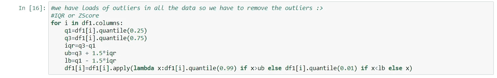

使用 lambda 函数替换了该值

现在再次检查图表:

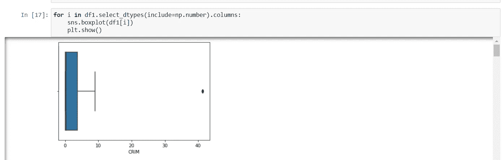

我们在更大程度上减少了异常值。

现在，我们要检查相关性，这是结对图和热图时间。！！！

所以 sns.pairplot 给出了以下内容:

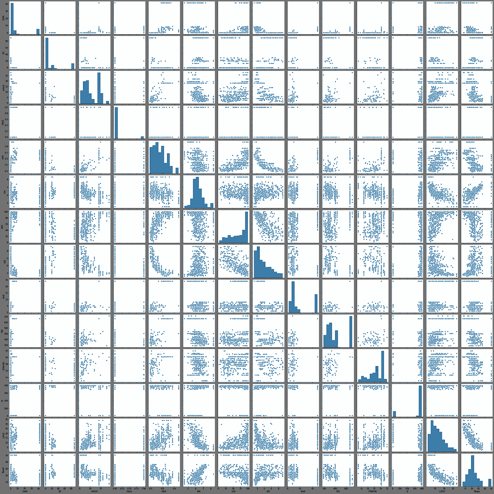

我们还将获取关联的热图:

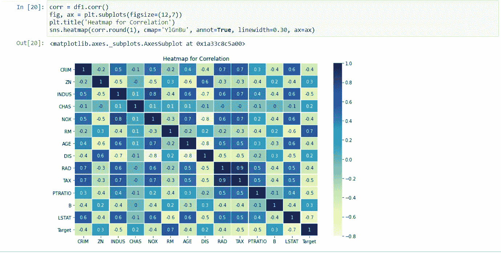

我们可以看到，目标和 RM 之间的正相关性很高，而 LSTAT 之间的正相关性较低。现在我们首先要开始构建我们的基础模型。

训练测试拆分:我们必须将数据拆分为训练数据和测试数据，以确保我们的数据经过训练和测试。我们必须给出输入和输出变量，以确保正确地进行分割。

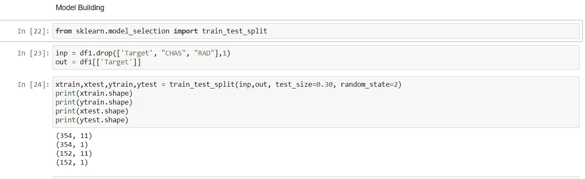

我把输出作为目标，输入减少了 3 样东西，因为它们是绝对的。我只是继续做数字方面的事情

向 xtrain 中添加常数。现在我们要添加一个常数，因为模型总是需要一个常数。

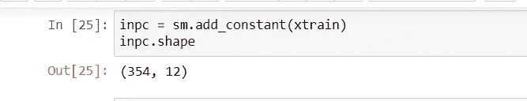

xtrain 形状实际上是 11 列，加上常量列后变成了 12 列

现在，建立我们的 OLS 模型。

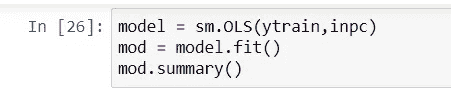

这里我们犯的错误是，省略了顺序，也省略了 fit()

此后，将显示一个摘要列。

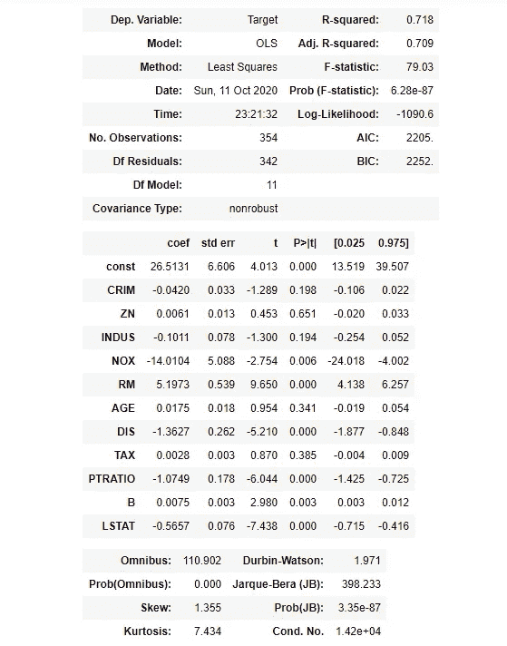

注意 Rsquare 值

现在，我们知道 rsquare 是 71%,我们需要确保我们正在改进这个模型。我们还会看看线性回归的方法。

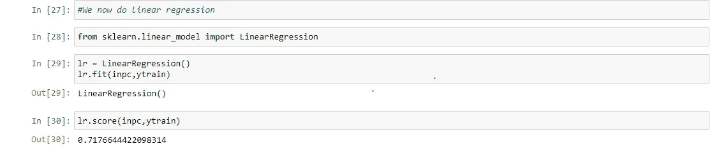

这就是我们不使用 OLS 的方法。这是线性回归的方法

改进模型:现在，这让我想到了。我真的想通过使用标准缩放器，然后得到假人，然后使用 RFECV 进行特征工程来确保我的模型质量大大提高。

RFECV 的使用:

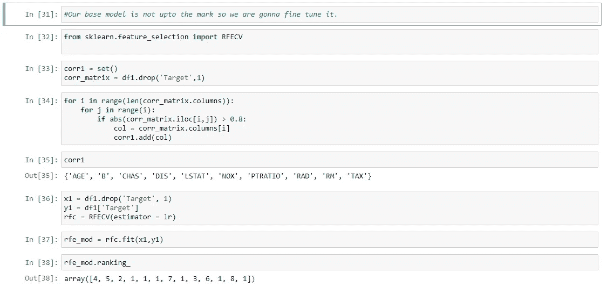

这给出了对建模有用的列的等级。数组中的 1 表示我们需要它们。所以我们需要看看这些列是什么，所以我们要把它变成一个数据帧，然后对它进行处理。

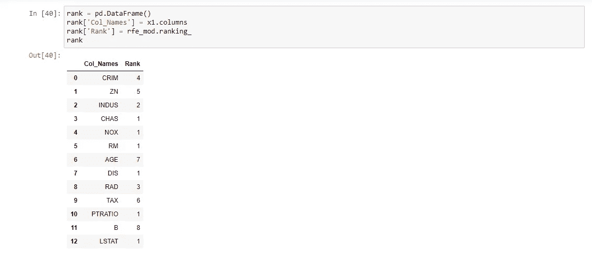

我们已经检查了 1，现在我们将屏蔽它，然后使它成为一个单独的数据帧。

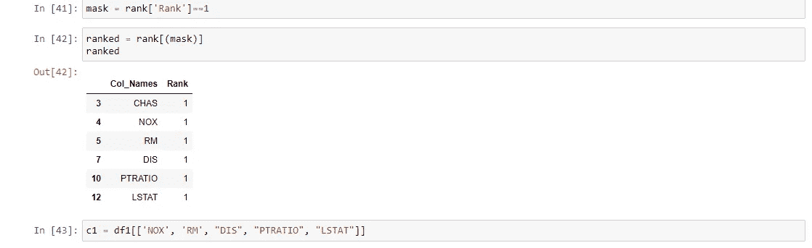

我已经利用了有用的列，现在要用分类来得到虚拟的

在 chas 上使用 get dummies:我们将获取 CHAS，然后为列获取 dummies，然后我们将连接 c1 和 c2，以便它们构成一个完美的数据帧。

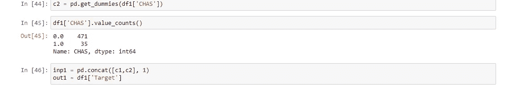

使用 Concat，我们将两列连接起来

然后，稍后我们将把它分成列车测试部分，然后我们进行模型构建。

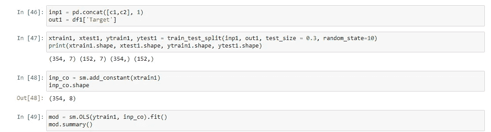

但是再一次，这个模型并没有改善多少，它给出了同样的 71 %。所以我想使用标准缩放器来缩放数据，以获得更好的性能结果。

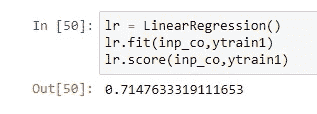

缩放数据:通过使用标准缩放方法，我正在进行缩放，然后我们将基于缩放后的数据构建一个模型。

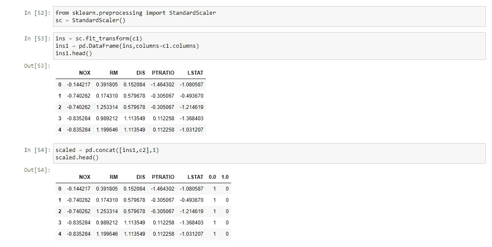

我们可以看到缩放后的数据，现在我们将使用 scipy.stats 中的 boxcox 来确保数据正常化。之后，我会用缩放后的数据再次构建模型。

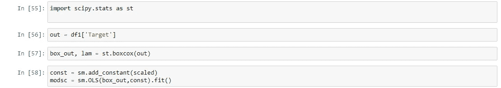

模型性能有所提高，在数据缩放后变为 75%:

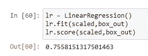

这些数据将通过使用特性改进技术得到进一步的改进，然后我将写一篇关于这方面的单独文章。

全部内容的 github 链接发布在[https://github.com/navinniish/Linear-Regression](https://github.com/navinniish/Linear-Regression)

感谢阅读。