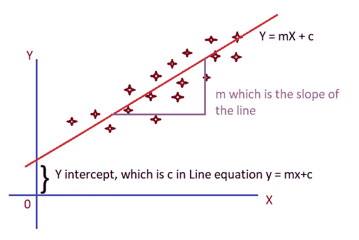

# 线性回归—第一部分

> 原文：<https://medium.com/analytics-vidhya/linear-regression-part-i-47eae9d45ee3?source=collection_archive---------18----------------------->

**线性回归**是一种线性方法，通过拟合直线(即线性)来模拟两个或多个变量之间的关系，从而预测给定输入数据的输出。

来源:【https://unsplash.com/】的[作者:](https://unsplash.com/)[的](https://unsplash.com/@pavelanoshin/portfolio)

要执行线性回归，数据应满足以下约束条件:

1.  数据应该是连续的。
2.  自变量和因变量之间应该存在相关性和因果关系。

要更深入地研究为什么对连续和相关数据进行回归，请查看[什么是 ML 意义上的回归？](https://devskrol.com/2020/07/16/what-is-regression-in-terms-of-ml/)。

如果对一个独立变量进行线性回归，数据的绘制将类似于下面的散点图。

线性回归

X —独立变量，即输入训练数据

Y —因变量，即输出数据

用数学的方法，每条线都有一个方程。Y = mX + c

对于直线，m & c 值将是常数，X 是一组值。

斜率= m =上升/下降= dy/dx，即 Y 的变化/X 的变化

例如，如果(m，c)是(2，1 ),则等式变为 Y = 2X + 1

在上面的线性回归模型示例中，由于数据具有良好的相关性，因此可以绘制一条线，使得图中所有点最有可能靠近该线，该线被称为最佳拟合的**线。因此，我们可以确定，对于任何新的 X 值，Y 值是从 X 点开始的垂线与直线的交点。**

设ŷi 是当 x = xi 时由回归线预测的 y 值。

那么对于每个点，在预测值和实际值之间存在误差/差异，其可以被定义为 ei = yi-ŷi.

作为总体误差，我们需要找出所有现有输入数据的差异，并对其平方求和(SSE)，我们将在本文中看到(成本函数部分)。

现在的问题是，对于什么样的 m & c 值，这个 SSE 值将是最可能的最小值？

要找到线性回归模型的 m & c 值，有许多方法可用。

但是最广为人知的方法是，

1.  普通最小二乘法。—非迭代法。使用公式从给定的数据中找出 m & c。
2.  梯度下降。—随机取 m $ c，并通过迭代减少误差。
3.  最大似然估计。

在这篇文章中，我们将学习普通最小二乘法来寻找最佳拟合线。

由于梯度下降需要更清楚的理解，我将把它作为一个单独的文章。

**最小二乘法:**

为了找到我们的数据的最佳拟合线，最小二乘法是一种数学方法来寻找斜率和 y 截距。

也就是说，我们需要找到一个映射函数/模式，其中 Y 值根据 X 值而变化。对于线性回归，它是一条直线。

映射函数为 Y = mX + c。

为了找到 m-斜率和 c-截距，

斜率和截距

如果我们在 MS. Excel 中做，就很容易理解这个概念。

在上表中，我们已经找到了斜率公式的分子和分母。

让我们找到斜率，

斜率 m = 615/4206 = 0.146

现在我们可以通过上面提到的公式找到 C。

c = 10-(0.146 * 74)=-0.818

因此，斜率为 0.146，y 轴截距为-0.818 的直线是我们数据的最佳拟合直线。

**成本函数:**

即使找到的线是最佳拟合线，也不是所有的点都在最佳拟合线上。不是吗？

那我们怎么能称这种差异/错误呢？

如何知道最佳拟合线的误差度量？

在上图中，你可以看到 y 和 y 之间的距离——预测误差。

当我们收集所有误差并对其平方求和时，该值就成为最佳拟合线的成本函数。

由于这是斜率为 0.146 的直线，y 截距为-0.818 的直线是最佳拟合直线，因此计算出的成本在本例中是最小的。

就数学而言，成本函数的公式是，

对于上面给出的例子，上证综指是 30.075。

误差平方和

# **结论:**

我们已经学习了如何使用普通最小二乘法进行线性回归，以及什么是成本函数。

恭喜你迈出了机器学习的第一步。

请继续阅读 [**线性回归—第二部分—梯度下降**](https://devskrol.com/2020/07/19/linear-regression-part-ii-gradient-descent/) 了解最小化 SSE 的梯度下降法。

到那时再见&祝编程愉快。

# 您还希望:

1.  [**线性回归**](https://devskrol.com/category/machine-learning/linear-regression/)
2.  [**逻辑回归**](https://devskrol.com/category/machine-learning/logistic-regression/)
3.  [**决策树**](https://devskrol.com/2020/07/25/decision-tree/)
4.  [**随机森林是如何运作的？—为什么我们需要随机森林？**](https://devskrol.com/2020/07/26/random-forest-how-random-forest-works/)
5.  [**欠发—广义—过发**](https://devskrol.com/2020/07/19/underfitted-generalized-overfitted/)
6.  [**过拟合—偏差—方差—正则化**](https://devskrol.com/2020/07/19/overfitting-bias-variance-regularization/)