# 线性回归第二部分梯度下降

> 原文：<https://medium.com/analytics-vidhya/linear-regression-part-ii-gradient-descent-4ddd205da2ca?source=collection_archive---------21----------------------->

班格班格，西澳大利亚。来源:https://www.kimberleyspirit.com/east-kimberley

> **梯度下降**是一种优化算法，用于**最小化由模型参数化的成本函数**(即误差)。

我们知道梯度意味着一个面或一条线的斜率。这种算法涉及斜率计算。

为了理解梯度下降，我们必须知道什么是成本函数。

> **线性回归**的代价函数**(J)**是预测 y 值(predicted)与真实 y 值(y)之间的均方根误差(RMSE)。

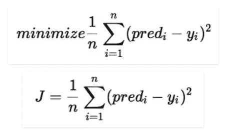

来源:[https://www.geeksforgeeks.org/ml-linear-regression/](https://www.geeksforgeeks.org/ml-linear-regression/)

对于线性回归模型，我们的最终目标是得到一个代价函数的最小值。

要熟悉线性回归，请阅读本文。

首先让我们想象一下梯度下降是什么样子，以便更好地理解。

由于梯度下降是一种迭代算法，我们将拟合各种线，以找到最佳拟合线迭代。

每次我们得到一个错误值(SSE)。

如果我们把所有的误差值拟合在一个图形里，它就会变成一条抛物线。

W **斜率、截距和 SSE 是什么关系？为什么梯度下降是抛物线？**

要回答这两个问题，让我们看看下面的例子。

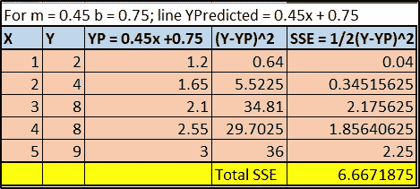

Excel 女士制作。

你可以注意到我取了随机值 m = 0.45 & c = 0.75。

对于这个斜率和截距，我们为回归线提出了一个新的 Y 预测值。

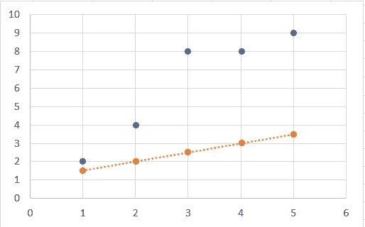

在 MS. Excel 中制作

在上图中，蓝色点是原始 Y 值，橙色点是我们刚刚发现的 m = 0.45 & c = 0.75 的 Y 预测值。我们可以明确地说，这条线不是该数据的最佳拟合线。

这个迭代的总 SSE 大约是 6.66。

然后，让我们通过随机减小 m & c 值来进行迭代，结果如下所示:

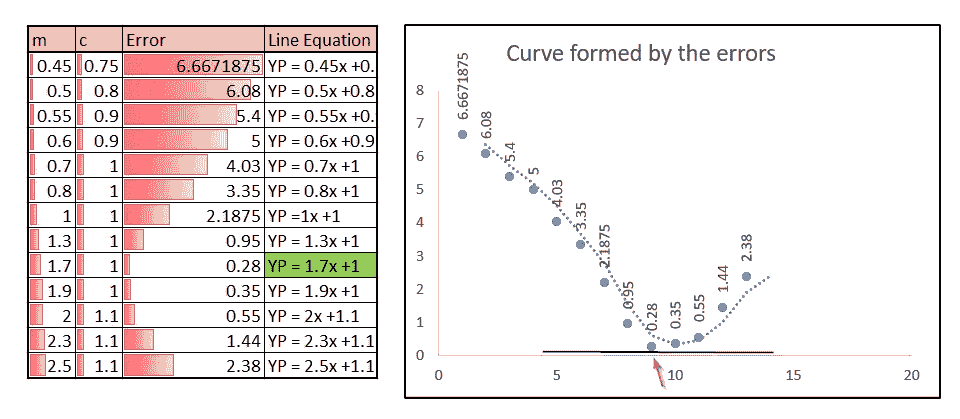

在上表中，我们可以看到，对于不同的 m & c 值，误差值逐渐减小，并从某一点开始再次增大。

如果我们单独为所有的误差值绘制一个图表，那么它将看起来像一条曲线，如右侧所示。

现在，我们将绘制原始图表中由上述 m & c 值形成的所有线条(列:线条方程):

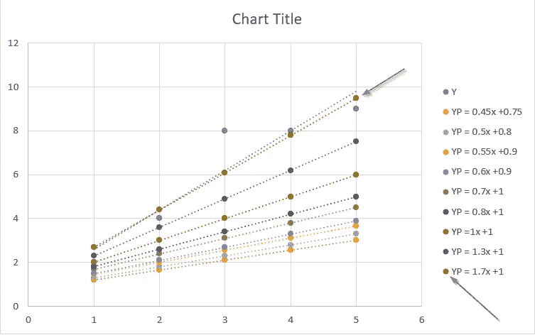

您可以看到，粉色标记线是由 m = 1.7 和 c = 1 组成的，这产生了 m，c & Error 表中所有其他 m & c 值的最小误差。蓝色线是 excel 本身产生的最佳拟合线。我们的线 **YP = 1.7x +1** 最接近最佳拟合线。

如果我们在 m/c 值变化最小的情况下认真地进行迭代，我们将达到最佳拟合线。

在抛物线图中，我们可以确定误差 0.28 是最小值，它是由直线方程 **YP = 1.7x +1** 产生的。

M **矿比 1 自变量:**

在只有一个独立变量 X 的情况下，线性回归图将是二维的，最佳拟合将是直线。

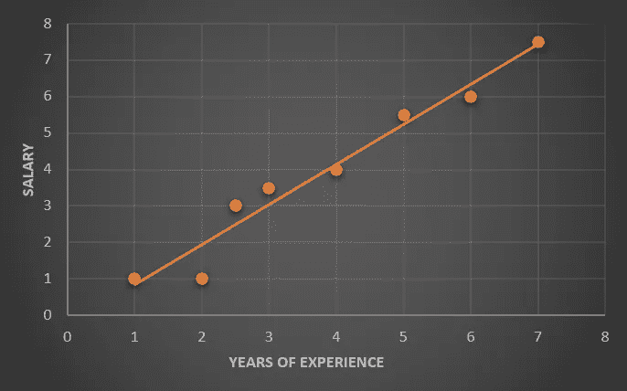

当有两个独立变量时，二维区域变成三维的表面/空间，最佳拟合变成平面。

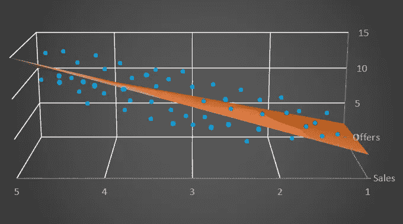

当存在 n 个变量(n>2)时，则 n 维区域变成 n 维空间，最佳拟合变成超平面。实际上绘制 n 维图要复杂得多。

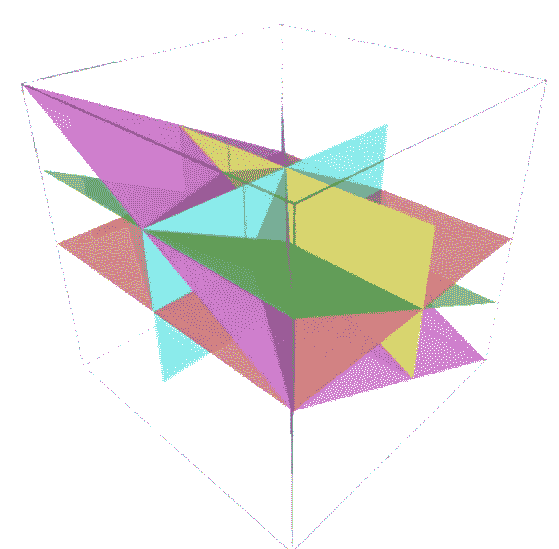

来源:[https://en.wikipedia.org/wiki/Arrangement_of_hyperplanes](https://en.wikipedia.org/wiki/Arrangement_of_hyperplanes)

当线性回归为二维时，梯度下降误差图将形成抛物线。

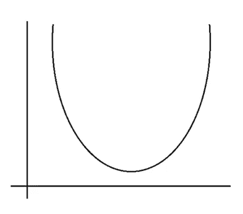

当线性回归是三维时，梯度下降将变成椭圆抛物面。

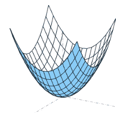

来源:[https://en.wikipedia.org/wiki/Paraboloid](https://en.wikipedia.org/wiki/Paraboloid)

如何求最小成本？

我们发现所有可能的误差值形成一个抛物线(或三维抛物面),最大的最小值位于曲线的最深处。

步骤#1:为 m & c 取一个随机值。对于 m & c 的任何随机值，误差值不一定是最小的。假设它在抛物线的某处。

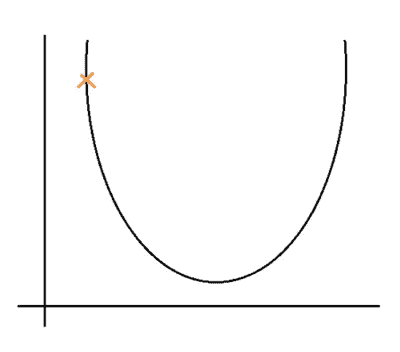

第二步:现在我们需要找到，斜率在哪个方向减少，这样我们就可以达到抛物线的深度。

这就是偏导数发挥作用的时候了。

我们可以比较从抛物线/抛物面的顶部下降，我们必须降低曲线的斜率才能到达底部。

让我解释清楚。如果你在 u 取为随机值的点上画一条切线，它就是曲线在该点上的斜率。减小直线的斜率会使曲线下移。

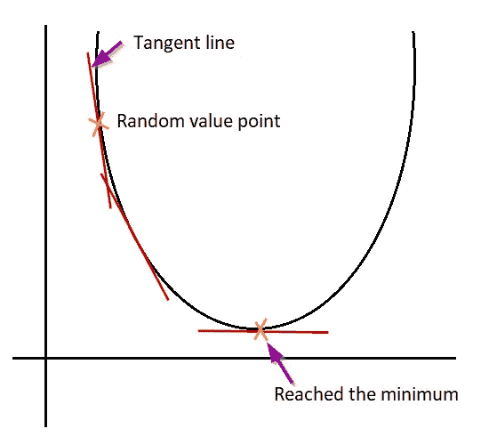

我们减小的速率值就是减小直线的斜率。

基本上，为了降低斜率，我们可以使用一阶偏导数来获得降低的斜率。下面是使用偏导数的 m & c 的更新规则。

**更新规则:**

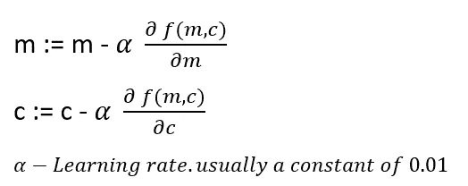

步骤#3:我们需要使用更新规则改变 m & c 值，并知道新的 SSE 值。重复这个过程，直到我们达到全局最小值。

T **要记住的事情:**

1.m & c 应该同步更新。我们不应该先更新 m，然后应用新 m 的值来更新 c。

2.学习率通常为 0.01，但不一定对所有模型都是 0.01。最高的学习率将迅速降低 m & c 值，并且它可能跳过全局最小值(一个有趣的词来提及抛物线中的最深点)。

3.即使对于固定值的学习率，一旦你接近全局最小值，你的步长会自动变小。你不需要经常降低学习速度。

C **结束语:**

1.  梯度下降是一种迭代方法，与最小二乘法不同，我们将为最佳拟合线的斜率 m 和截距 c 取一个随机值。
2.  最终的 SSE 值(J 或成本)可能不是最小值。
3.  确定最负斜率的方向，并朝着那个方向前进。这就是偏导数发挥作用的地方。
4.  然后，我们会以一个学习率迭代地这样做，直到我们得到所有误差的最小值。
5.  对于最终最小 SSE，使用的 m & c 值是最终结果。具有最终 m & c 的线集合是最佳拟合线。

好吧！我们到达了文章的结尾。

是啊！我能听到你说“嘿！没有程序，你怎么能到达终点”。

在本文的下一部分，我们将研究误差指标([线性回归—第三部分— R 的平方](/@aasha01/linear-regression-part-iii-r-squared-45be92750ffb))，然后我们将使用 python 进行编程。

我将很快发布那篇文章并链接到这个页面。

到那时再见&编程愉快！

**感谢:**

coursera:[https://www . coursera . org/learn/machine-learning/home/welcome](https://www.coursera.org/learn/machine-learning/home/welcome)