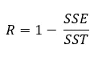
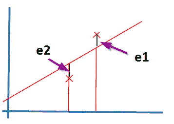
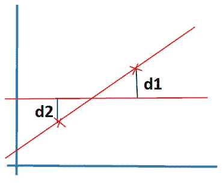

# 线性回归第三部分 R 平方

> 原文：<https://medium.com/analytics-vidhya/linear-regression-part-iii-r-squared-45be92750ffb?source=collection_archive---------22----------------------->

雪莉·胡利在 [Unsplash](https://unsplash.com/s/photos/accuracy?utm_source=unsplash&utm_medium=referral&utm_content=creditCopyText) 上的照片

r 平方是我们可以用来发现我们创建的模型的准确性的指标之一。

只有当**回归模型**是**线性时，r 平方度量才起作用。**

r 平方

SSE —残差(误差)的平方和

> SSR 是原始值和预测值之间所有差异的总和。

同ＳＯＵＴＨ-ＳＯＵＴＨ-ＥＡＳＴ

这里 SSR = e1 + e2 + …。+ en

SST——总和的平方和

> SST 是 Y 预测值和 Y 平均值之间所有距离的总和。

超音速运输机

SST = d1 + d2 + …。+ dn

现在你可以看到 SSR 是分子，SST 是分母。

如果 SSR 值小于 SST，那么 SSR/SST 值将小于 1。

因此，随着 SSR 值的降低，SSR/SST 值也将向 0 靠拢。

由于 R2 为 1-(SSR/SST)，R2 值(精确度)将会很高，SSR/SST 值也会很低。

即如果我们总结一下，残差(SSR)越少，精度就越高。

# **结论:**

r 平方是线性回归模型的误差度量，它是模型准确性的度量。

残差越低，精度越高。

要了解更多关于线性回归的信息，请查看以下帖子:

[**线性回归—第一部分**](https://devskrol.com/2020/07/18/linear-regression-part-i/)

[**线性回归—第二部分—梯度下降**](https://devskrol.com/2020/07/19/linear-regression-part-ii-gradient-descent/)

[**线性回归—第四部分—录取机会预测**](https://devskrol.com/2020/07/19/linear-regression-part-iv-chance-of-admission-prediction/)

请在评论中留下您对误差指标的想法。对我和所有读者都会有用！

谢谢大家！

喜欢支持？只需点击一下拍手图标。

快乐编程。

# 您还希望:

1.  [**逻辑回归**](https://devskrol.com/category/machine-learning/logistic-regression/)
2.  [**决策树**](https://devskrol.com/2020/07/25/decision-tree/)
3.  [**随机森林是如何工作的？—为什么我们需要随机森林？**](https://devskrol.com/2020/07/26/random-forest-how-random-forest-works/)
4.  [**欠拟合—广义—过拟合**](https://devskrol.com/2020/07/19/underfitted-generalized-overfitted/)
5.  [**过拟合—偏差—方差—正则化**](https://devskrol.com/2020/07/19/overfitting-bias-variance-regularization/)