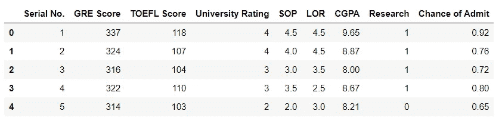
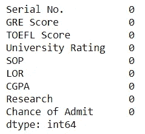
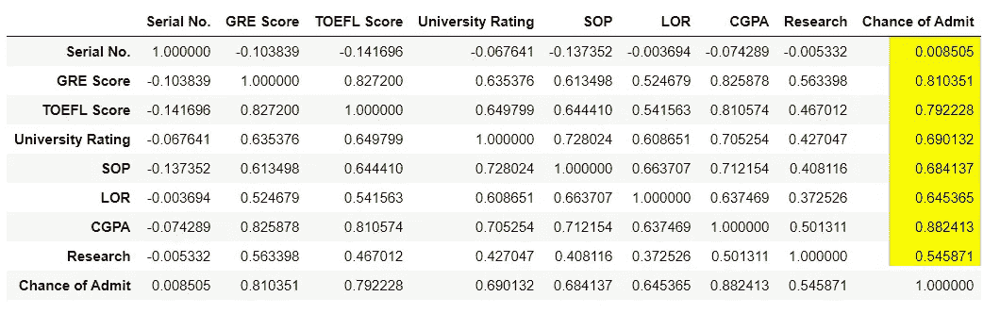
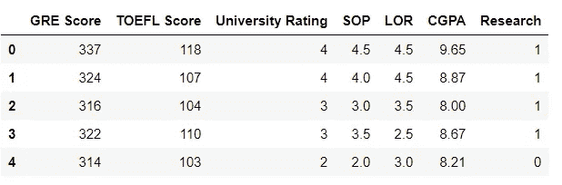
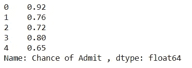

# 线性回归——第四部分——录取机会预测

> 原文：<https://medium.com/analytics-vidhya/linear-regression-part-iv-chance-of-admission-prediction-978540555c29?source=collection_archive---------17----------------------->


照片由[阿尔莫斯·贝托尔德](https://unsplash.com/@almosbech?utm_source=unsplash&utm_medium=referral&utm_content=creditCopyText)在 [Unsplash](https://unsplash.com/s/photos/magic?utm_source=unsplash&utm_medium=referral&utm_content=creditCopyText) 上拍摄

有没有想过变魔术或者预测未来？这是指南！

lol！在本文中，让我们使用 sklearn 软件包进行编程，探索线性回归并学习如何使用线性回归进行预测。

在本系列之前的帖子中，我们已经看到了足够多的关于线性回归的理论。如果你想看一看，下面是详细内容。

1.  [**线性回归—第一部分**](https://devskrol.com/2020/07/18/linear-regression-part-i/)
2.  [**线性回归—第二部分—梯度下降**](https://devskrol.com/2020/07/19/linear-regression-part-ii-gradient-descent/)
3.  [**线性回归—第三部分— R 平方**](https://devskrol.com/2020/07/19/linear-regression-part-iii-r-squared/)
4.  [**什么是 ML 方面的回归？**](https://devskrol.com/2020/07/16/what-is-regression-in-terms-of-ml/)

导入必要的库来读取数据。

```
**import** **pandas** **as** **pd**
```

我已经从 Kaggle 下载了数据。多亏了 Kaggle，他们为初学者提供了大量的数据来尝试和学习。[链接到 Kaggle 获取数据进行线性回归。](https://www.kaggle.com/search?q=tag%3A%22linear+regression%22+in%3Adatasets)

[我](https://www.kaggle.com/search?q=tag%3A%22linear+regression%22+in%3Adatasets)取了一个录取预测数据集。让我们探索数据:

```
df = pd.read_csv("Admission_Predict_Ver1_1.csv")
df.head()
```



我们的下一步是预处理数据，以获得更准确的结果。

```
df.isnull().sum()
```



但幸运的是，由于这是一个主要面向初学者的数据集，它没有空值，数据也很干净。所有值都是连续值，而不是分类值。

我们将在稍后的新帖中看到如何使用分类值。

让我们检查独立值和从属值之间的相关性。

```
df.corr()
```



相互关系

```
df.columnsIndex(['Serial No.', 'GRE Score', 'TOEFL Score', 'University Rating', 'SOP',
       'LOR ', 'CGPA', 'Research', 'Chance of Admit '],
      dtype='object')
```

在所有栏目中，S.No 与录取机会无关。所以我们可以移除它。要预测的值是“录取机会”。将这一列放在 X 中没有意义，因为这一列的变化与 Y 中的变化完全相等，Y 是我们要预测值的同一列。

如果你还想知道，那就试一试吧，最终你会有 100%的准确率。即 r 值将是 1。很高兴看到但已经没用了。

开心一分钟，让我们回到现实吧！

以后如果你马上得到 100%的准确率，首先检查你是否在 X 中加了 Y！lol！我已经做了足够多的次数来记住这个！

这里我去掉了‘连载’。X 没有录取机会，y 只有录取机会。

```
X = df.drop(['Serial No.','Chance of Admit '],axis = 1)
y = df['Chance of Admit ']
```

将整个数据框分割成 X 和 Y 参数。基本上，X 参数是自变量，Y 参数是我们需要预测的因变量。让我们看看 X 和 Y 变量。

```
X.head()
```



```
y.head()
```



现在我们需要将数据分成训练集和测试集。我们用训练集训练模型，用测试集验证模型。

通常训练集应该高于测试集，这样我们可以得到更多的数据来学习。不同的分割精度也不同。

例如 60-40，80-20，甚至 73-27。

您可以只提及测试大小，这样训练集将自动成为剩余的。但是如何选择要测试的行呢？

这种分割应该随机进行。

sklearn 有一个包 train_test_split，它允许我们以随机的方式将数据分成训练和测试。您也可以使用参数 **random_state** 来控制随机性。

如果你和我对这个参数使用相同的 int 值，那么我们都将拥有相同数据集的相同测试和训练数据集。

**test_size** 参数取值< = 1 即 0.33，0.4 表示测试集数据的百分比。

导入必要的包。需要的时候我会一一解释。

```
**from** **sklearn.model_selection** **import** train_test_split 
**from** **sklearn.linear_model** **import** LinearRegression
**from** **sklearn.metrics** **import** r2_scoreX_train, X_test, y_train, y_test = train_test_split(X, y, test_size=0.4, random_state=101)
```

让我们看看训练和测试数据集有多少行:

```
X_train.shape
```

输出:(300，7)

```
X_test.shape
```

输出:(200，7)

现在我们已经玩完了数据。让我们进入真正的游戏！让我们建立一个线性回归模型来预测一个新生的录取机会。

sklearn 为各种算法提供了大量的包。这里我们使用 LinearRegression()为这个算法创建一个新对象。有了这个对象，我们可以拟合我们的数据，并使用这个对象来获得我们的模型的参数。

```
lr = LinearRegression()  *#Object Created*
lr.fit(X_train, y_train) *#Data given into the LinearReg. object*
```

## 搞定了。恭喜你，你已经创建了你的第一个模型。

是啊！简单不是吗？让我们看看我们能从这个模型中得到什么！

```
lr.coef_
```

输出:

```
array([0.00145221, 0.00302388, 0.00809642, 0.00672185, 0.01318406,
       0.12002891, 0.02477235])
```

*   这些是 X 变量的系数(斜率)——GRE 分数、TOEFL 分数、大学评级、SOP、LOR、CGPA、研究。
*   所以 0.00174541*GRE+0.00280216*托福+ 0.00675831 *大学+0.0061299*SOP+0.01492133*LOR+0.11902878*CGPA+0.01943883 *研

```
lr.intercept_
```

输出:

```
-1.200250569689947
```

这个值就是 Y 轴截距。所以我们的 Y 线方程变成了，

chanceofadminit =-1.2567425309612157+0.00174541*GRE+0.00280216*托福+ 0.00675831 *大学+0.0061299*SOP+0.01492133*LOR+0.111902878*CGPA+0.00

接下来呢？让我们测试我们的模型。

使用 ***lr*** 对象的 predict 方法，通过发送 x_test 值，我们可以预测 y_test 值。因为我们已经有了原始的 y_test 值，我们现在可以验证我们的模型。

```
predicted = lr.predict(X_test)r2_score(y_test, predicted)
```

输出:

```
0.8251757711467193
```

我们已经预测了测试集的 Y 值，并使用 sklearn.metrics 包中的 r1_score 函数将其与真实值进行了比较。我们的模型的精确度为 0.8257111467193 这意味着我们的预测将有 82%正确。

*   让我们检查一下！

```
y_test.head(10)
```

输出:

```
18     0.63
361    0.93
104    0.74
4      0.65
156    0.70
350    0.74
32     0.91
205    0.57
81     0.96
414    0.72
Name: Chance of Admit , dtype: float64
```

获取前 10 行的预测。

```
print(predicted[0:10])
```

输出:

```
[0.74116361 0.91082451 0.81024774 0.62183042 0.64643854 0.69311918
 0.91233928 0.51828756 0.95333009 0.73419915]
```

在这里，我们预测了现有的测试数据。

现在你可以看到我们大部分的预测都非常接近。

让我们预测新的数据。

```
new_y = lr.predict([[347, 120, 4.5, 4.7, 4.7, 9.8, 1]])
print(new_y)
```

输出:

```
[0.99758071]
```

另一个测试:

```
new_y = lr.predict([[250, 90, 2, 2.5, 4.7, 7, 1]])
print(new_y)
```

输出:

```
[0.39488945]
```

现在你有了你的模型，你可以预测任何分数的录取机会。

我们已经完成了线性回归模型的训练和测试，并预测了录取的机会。

# 您还希望:

1.  [**逻辑回归**](https://devskrol.com/category/machine-learning/logistic-regression/)
2.  [**决策树**](https://devskrol.com/2020/07/25/decision-tree/)
3.  [**随机森林是如何运作的？—为什么我们需要随机森林？**](https://devskrol.com/2020/07/26/random-forest-how-random-forest-works/)
4.  [**欠配—广义—过配**](https://devskrol.com/2020/07/19/underfitted-generalized-overfitted/)
5.  [**过拟合—偏差—方差—正则化**](https://devskrol.com/2020/07/19/overfitting-bias-variance-regularization/)

# **结论:**

在这篇文章中我们学习了如何做线性回归模型和如何预测值。

我会在机器学习方面提出更多的研究和一些更有趣的事实，并在我的下一篇文章中看到你！

特别感谢 Kaggle 提供的数据集！

请用各种数据探索这个算法，用 python 试试。不要忘记在评论中留下你的想法。对我和所有读者都会有用！

谢谢大家！

喜欢支持？只要点击拍手图标就可以了。

编程快乐！