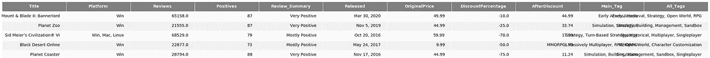

# 线性回归:预测蒸汽折扣的大小

> 原文：<https://medium.com/analytics-vidhya/linear-regression-predicting-the-magnitude-of-steam-discount-1cd77591fcaa?source=collection_archive---------12----------------------->

出于好奇而产生的项目。

你有没有想过为什么有些游戏比其他游戏折扣更大？我知道我有，如果你和我一样好奇，请和我一起读下去。

(你可以在 [**我的 git 资源库**](https://github.com/opophehu/LR_Steam) **上找到这个项目)。)**

截图来自 Steam—2020 年 4 月 19 日

# 首要目标

在这个项目中，我将试图找出**在**策略流派**中对 Steam** 视频游戏折扣百分比的影响，并**建立一个模型**使用 ***线性回归*** 预测折扣百分比。

# 数据

这个项目中的数据会直接从 [Steam 官网](https://store.steampowered.com/tags/en/Strategy/)刮来。

抓取算法是用 Python 编写的**，使用的库包括:**

1.  "***re****"—*代表“regex”，用于模式查找。
2.  ***CSV****——*用于将抓取的数据写入。熊猫可以阅读的 csv 文件。
3.  ****请求****——*向 Steam 网站请求任何动态元素。*
4.  ****beautiful soup****——*流行的网页抓取库，寻找 html 元素/标签。*

*你可以在 [**我的 git 库**](https://github.com/opophehu/LR_Steam) **中找到刮刀。***

***加载**到*熊猫*时刮出的数据是这样的:*

**

*重叠的列在 Jupyter 笔记本环境中不会成为问题，抱歉看起来很乱。*

*对于所有将来的引用，我想在数据集中预测的**目标**将是'***discount percentage***'。*

# ***数据清理***

*收集的原始数据包含许多我们不需要的东西:*

*一、**没有价格的免费游戏**，包括*试玩*和*即将发布。**

*二。**未发售的游戏**。*

*但是我们还没有完成，因为我们正在做一个**线性回归**模型，重要的是我们没有包括*

*三。 **非数值**条目。*

*这意味着我们将删除一些基于字符串的列，在这样做的同时，为什么不试着通过**特性工程**从这些列中 ***提取一些信息*** ？*

*我将在后面的章节中介绍我在建模和测试时所做的所有**特性工程**，但是对于*基线模型*请参见下文:*

*我们还可以添加一个“**赛季**”列来查看一个游戏在哪一个赛季发布:*

*完成上述过程后，我们现在可以安全地**从数据帧中删除**所有基于**字符串的列**:*

*这个过程也将**收缩**我们的观察从**14，806****12****特征到***370****7****特征。*不幸的是，这意味着由于**较小的样本量**，该模型将**倾向于不准确**。***

****

**清理后的基线数据框如下所示。**

# **数据分析**

**该项目的分析部分包括*使用 **Sickit Learn** 的三个*步骤:**

1.  ****E** 探索 **D** 数据 **A** 分析(EDA)**
2.  ****F** 特征 **E** 工程(FE)**
3.  **建模**

**而且这三个步骤都是**每次有变化就重复**。**

**该项目的一般**工作流程**如下:**

1.  ****EDA** 寻找突出的**特征-目标关系**(通过配对图/热图、套索系数等)**
2.  **基于可用信息，进行**特征工程**(数学转换、宁滨、获取虚拟条目等)**
3.  ****建模**和**评分**使用 *R* 和/或其他指标( *RMSE* 、 *MAE* 等。)**
4.  **冲洗和重复，直到所有潜在的 FE 想法都被尝试和用尽或达到可接受的 R 分数。**

**上述循环总共进行了 7 轮，下面我将总结并分享每一轮的代码:**

**。corr()是熊猫的内置函数。**

****

**显示功能-目标关系的热图示例。分数越高，关系越密切。**

**线性回归建模的编译函数。归功于我之前所有的聪明人。**

*****第一轮*:基准模型****

***更改:*删除评论少于 30 条的游戏**

***最佳模特:* **拉索** 得分: **0.419** +- 0.073**

*****第 2 轮*:数学变换****

***所做的更改:*
由于偏差配对图结果，日志转换为“审查”&“原始价格”。**

***最佳模特:* **套索** *得分:* **0.437** +- 0.104**

*****第 3 轮*:将 Main_Tag 作为虚拟体合并到模型中****

***变更:* 将从“Main_Tag”列生成的虚拟数据添加到数据帧中。**

****

**从原始数据框中的“Main_Tag”列创建的虚拟对象。**

**“df3”是原始数据帧的直接副本，其中添加了“Main_Tag”列。**

***最佳模特:* **套索** *评分:* **0.330** +- 0.073**

*****第 4 轮*:用 All_Tags 做假人试试，看看有没有改进****

***所做的更改:* 根据使用的 csv 添加虚拟列，在这种情况下，“**前 5 个标签**”(抓取的游戏通常有 10 到 20 个标签)。**

****

**“All_Tags”中的值是用逗号分隔的，我们需要做一些额外的工作，才能将其转换为空值。**

***最佳型号:* **套索** *得分:* **0.359** +- 0.080**

*****第五轮*:数学变换& All_Tags dummies****

***所做的更改:* Log transformed "*Reviews*"+*top 5 tags*。**

***最佳模特:* **套索** *评分:* **0.359** +- 0.080
(注:与第 4 轮评分完全相同，表示“点评”对 DiscountPercentage 绝对没有影响。如果需要，可以安全地删除该功能。)**

*****第六轮*:宁滨特征在*三个*支架****

***变更:* 将“*评审*”和“*天 _ 自 _ 发布*”分隔成*三个*括号。**

****

**我们将运行 df6.describe()来决定什么是宁滨阈值，在这种情况下，我将查看 25%和 75%。**

**这两列被分成 3 个括号。**

***最佳模式:* **山脊** *得分:* **0.273** +- 0.044**

*****第 7 轮*:宁滨特点在*两个*支架+增加地板门槛****

***变更:* 将“*评论*”和“*天 _ 自 _ 发布*”分成*两个*括号，并删除少于 *30* 评论的观察。**

****

**同样，我们来看括号的阈值，对于 2 个框，这次我将选择 50%。**

***最佳模特:* **套索** *得分:* **0.313** +- 0.098**

# **结论**

**让我们从**数据清理**产生的一些统计数据开始:**

****

**从数据清理中生成的一些统计数据。**

**请注意，在任何**销售季**中，这是**而不是**，这很有趣，因为这将意味着**销售季**可能**而不是** **提供**作为**的大范围折扣**，正如我之前想象的那样。**

**现在，让我们来看看 ***的前 2 位*的特点**对**的影响**对**的折扣%** :**

****

**‘天 _ 自 _ 释’的套索系数为 **11.3** ，它对**的影响最大**。**

****

**简单来说，游戏审核越差，折扣就越多。**

**但是什么不影响折扣率呢？让我们来看看 ***Top 2* 有什么特点****不影响****:****

********

****尽管一些独立游戏售价为 2 美元，一些 AAA 游戏售价为 60 美元，但原始价格几乎完全不会影响 disount %。****

********

****根据[这篇文章](https://www.gamasutra.com/blogs/JakeBirkett/20180504/317366/Using_Steam_reviews_to_estimate_sales.php)，评论数量与售出数量高度相关。换句话说，**一款游戏的销售情况并不影响折扣率。这可能是我从这个项目中得到的最大惊喜。******

****而**最佳** **模式** l 实际上是**基线模式**带 l **东误差余量**。虽然精度在中下支架。****

********

****这是预测模型的低 R 值。****

****0.42 的 **R 没什么好吹嘘的，我觉得跟 **Steam** 怎么处理折扣有很大关系——******

> ****只有发行商/开发商有权出售他们的游戏。****

****这意味着折扣率将在很大程度上取决于每个出版商/开发商的市场策略和财务状况。虽然我希望将来情况会有所改善，但目前我还没有能力收集这些数据。****

# ****用例****

****除了受好奇心的驱使，另一个驱使我做这样一个项目的重要因素是因为它也有实际意义——它对在线视频游戏转售商特别有用。****

********

****一个简单的图表显示了它们是如何工作的。****

****如上图所示，我的预测**模型**可以**帮助**他们预测**下一个大折扣**，因此他们可以更好地分配他们的**资源**，并有可能增加他们的**利润率**。****

********

****感谢您的阅读，我希望这将为您的工作带来有益的见解。****