# 线性回归—简单/单一—多重

> 原文：<https://medium.com/analytics-vidhya/linear-regression-simple-single-multiple-fb8a1a678168?source=collection_archive---------28----------------------->

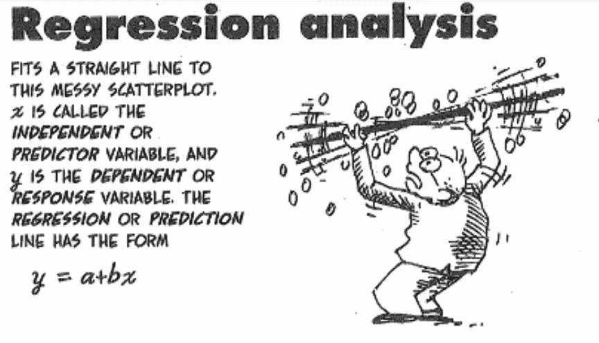

回归！

当你开始学习机器学习时，你绝对会从线性回归算法开始，没有人会逃避或期待这一点，因为这一算法将是监督学习方法的第一个孩子。因为在这种情况下，数据集被标记，并且其中算法将明确地识别特征，并且通过找到最佳拟合或线从给定的数据集导出预测。

> 让我们了解一下线性回归图的组成部分

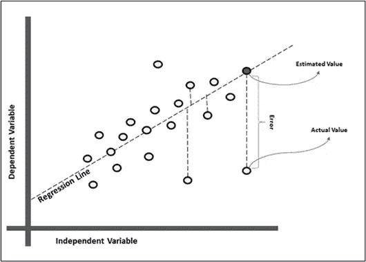

线性回归—组件

## 让我们从数学的角度来讨论线性回归。之前，如何使用机器学习模型。

用简单的关系去类比**距离-速度-时间**

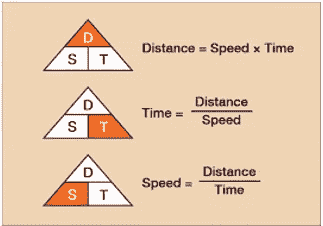

时间、速度和距离的关系

希望你能从下面的图片中很容易理解，什么是速度和距离之间的**正关系**和**负关系**

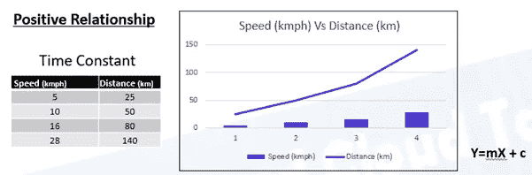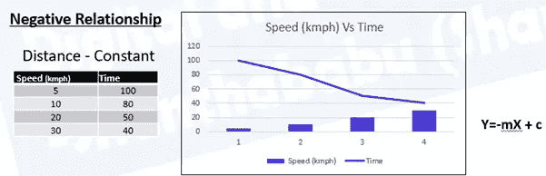

让我们来解决这个问题

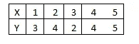

已知资料

找到斜率，然后截取？还记得你大学时代的数学*(工科数学 3)*

什么是从给定问题中得到的(**斜率**和 c ( **截距)**

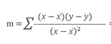

斜率公式(米)

经过长时间的计算，我越来越不值钱了。

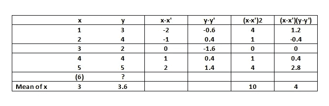

计算

如果将您的值应用到斜率(m)的公式中。你会得到 m=0.4。因为我们已经应用了 m，x，Y 的值，那么我们可以计算出 c( **截距)**

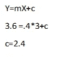

现在，我们从上面的计算中知道了 m ( **斜率**)和 c ( **截距)**，接着我们得到了下面的方程，对于给定的 x 求解任意 Y

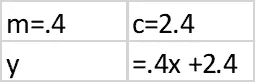

实际上，我们已经预测了值(Yp)

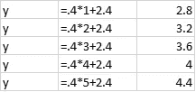

y 预测值:通过应用导出值

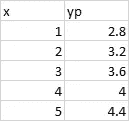

让我们比较实际值和预测值

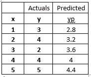

如果你画这个图，你会得到下面的结果。

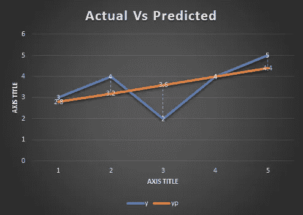

实际值与预测值

下一个什么！😊。

理解机器学习模型中线性回归的方法。

线性回归是一种使用直线解释因变量(观察值或 Y 变量)和一个或多个解释变量(自变量或 Y 变量)之间关系的方法。

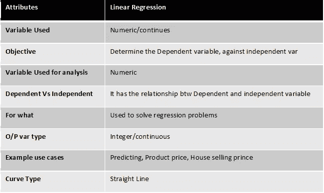

同样，在线性回归下，我们有两种类型。

> 1.单一/简单线性方程
> 
> 2.多元线性回归

永远记住 ***多元线性回归*** 模型在数据科学和加工学习空间中比简单模型更有发言权，因为预测分析总是依赖于多个因素。会讨论更多…..

> 让我们了解线性回归中的几个组成部分——图表

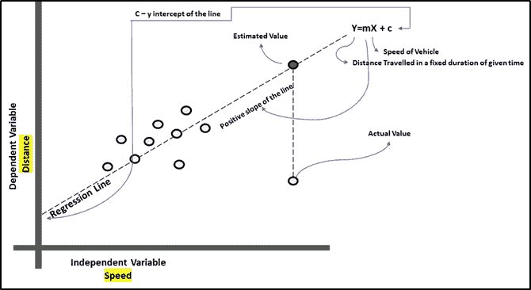

**让我们从一元线性回归开始**

> **1。** **单/一元线性方程**
> 
> a.最常见的回归是简单/单一 LR，其中两个变量之间的线性关系
> 
> *因此称为 ***预测变量*** 和 ***响应变量。****
> 
> ****c.*** 更进一步我们可以说两个变量之间的 ***相关性。****
> 
> *d.涉及两(2)个变量，从属和独立范围各一个*
> 
> *e.LR 模型是对因变量进行预测的最有价值和最常用的方法。*
> 
> *f.其中一个因变量被标记为 Y，另一个自变量被标记为 x，那么我们可以得到下面的方程，正如我们在学校和大学数学中所学的…*
> 
> ***Y= mx + b(一元/简单线性方程)***

*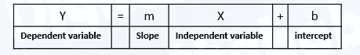*

*样本代码*

*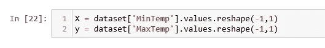*

> *不浪费我们的时间…让我们跳到 ***多元线性回归****

**

****多元线性回归****

*其中因变量被标记为 Y，而另一组自变量被标记为 x1，x2…*

***y =β0+β1x1+β2 x2+βkxk+误差噪声***

*如前所述，在现实世界的场景中，回归模型分析中有两个以上的变量。这就是所谓的**、【多元线性回归】、**或**多元线性回归。***

*区别是独立变量(x1，x2…)对预测变量(Y)的最高影响的评估。*

*参考…葡萄酒质量数据集*

*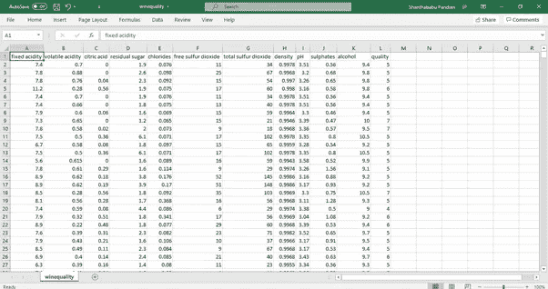*

*葡萄酒质量. csv*

*从给定数据集中选择特征*

*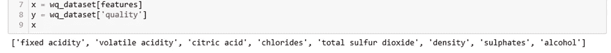*

*特征选择*

*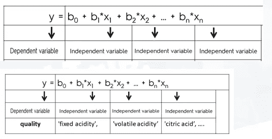*

*方程中的因变量和自变量是什么样的。*

*现在模型可以理解给定数据集中的 Y 和 X 引用是什么了。*

*因为 Y=mX+C 或者是单个或者是多个自变量。*

*Rest 是测试和训练分割，并在给定的微调数据集上应用算法。*

*记住一件事。以上计算由 Python 库负责。所以你不用担心！酷！:).但是在申请之前理解这些概念，对你解释和处理任何情况都会有很大的帮助。*

*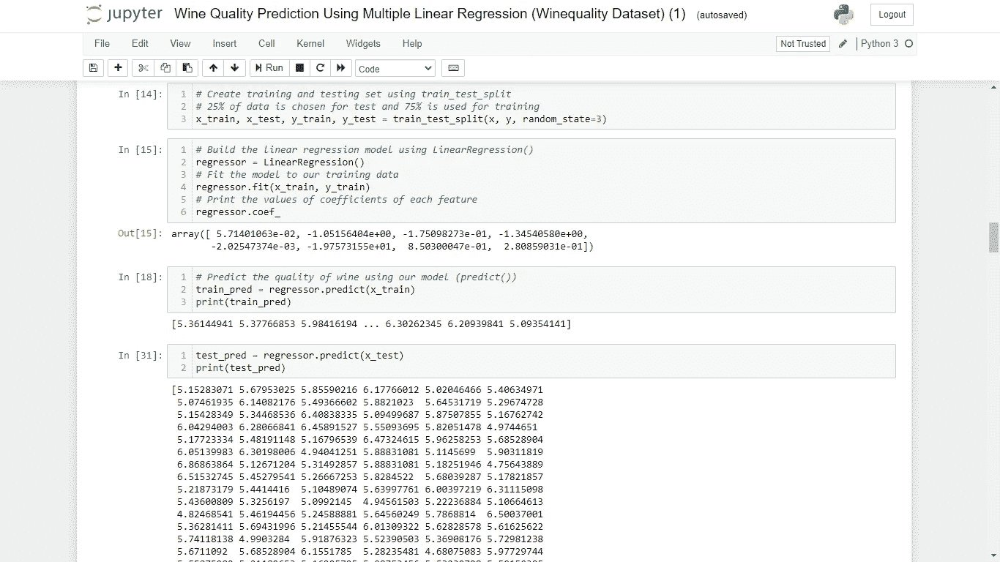*

**将很快讨论更多关于因变量和自变量以及什么是*均方根误差*！**

**后会有期！感谢阅读。**