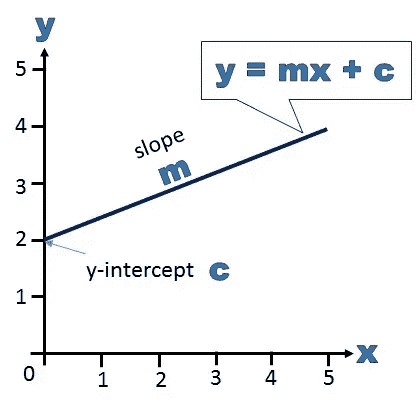
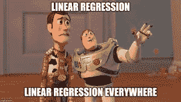
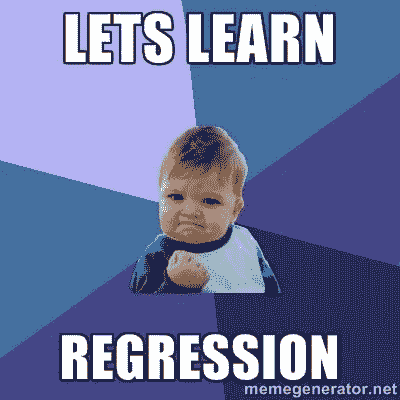
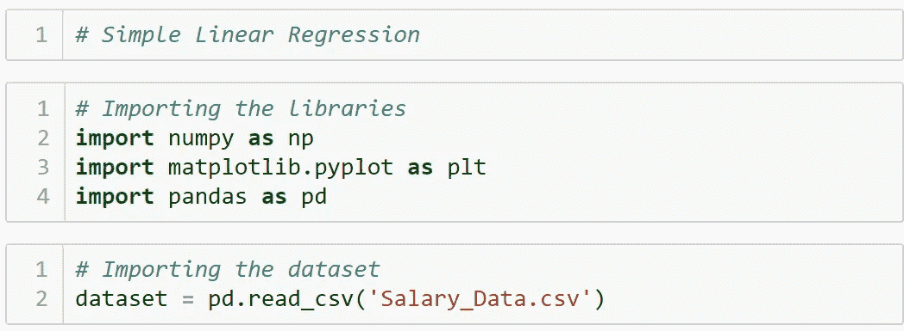
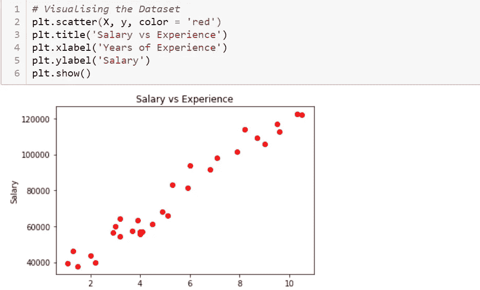
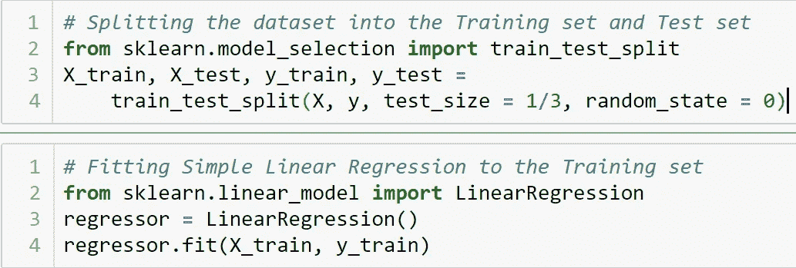
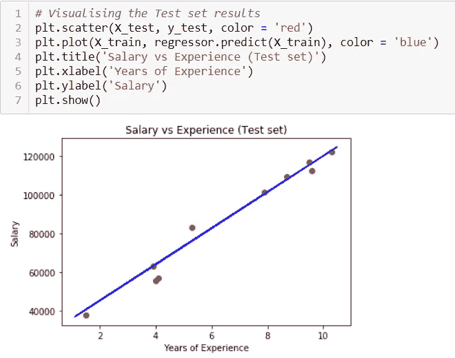

# 线性回归最简单的***方式。

> 原文：<https://medium.com/analytics-vidhya/linear-regression-the-simplest-way-a5955c21dee2?source=collection_archive---------32----------------------->

# 这到底是什么线性回归？

> 线性回归是一种建模标量响应(或因变量)和一个或多个解释变量(或自变量)之间关系的线性方法。

## 我知道这很粗鲁！

# 让它变得更简单！

> 线性回归就是寻找回归线，回归线是一条直线，它的工作是预测两点之间的**关系**** ，也称为最佳拟合线。

# 让我们让它变得更加简单！

*   ** **关系**是特性(自变量)对因变量的行为。
*   **y = mx + c，**我们在高中课堂上都学过，这里的‘x’是**自变量**，而‘y’是**因变量**，因为它取决于‘x’的给定值。
*   这里‘m’是直线的斜率，而‘c’是同一直线的截距。

> 听起来很公平？

# 为什么是线性回归？

*线性回归的目的是衡量两个变量之间线性关系的程度。特别是，线性回归的目的是基于一个或多个自变量的值来“预测”因变量的值。*

# 终于到了。如何实现线性回归？

## 首先要做的事

导入必要的机器学习库
然后加载数据集。

## 可视化我们的数据

现在通过绘制数据集来获得关于数据集的一些见解，这要感谢我们之前导入的 Matplotlib 库。

可视化清楚地显示了数据的线性性质，这意味着对其实施线性回归将是一件明智的事情。

## (I)将数据集进一步分成两组(训练和测试)

现在将数据集分成训练集和测试集，这是机器学习的一个必要步骤，是它的核心。

在这里，我将数据集分为两组，“测试集”包含 1/3 的行(实例)，其余的在“训练集”中。在“训练集”上应用模型后，我将在“测试集”上检查其性能。

## (ii)通过简单地从 sexy 的“scikit-learn”科学库导入模型，使其适合训练集

linear_model 类。
使用 **LinearRegression()** 类创建一个**回归器**对象。
然后在训练数据上拟合模型。

## 结论！

祝贺你走到这一步，看起来我们的模型工作得非常好，蓝线完全吻合，现在使用它的“斜率”和“截距”,我们可以很容易地预测给定年数经验的工资。

# ***谢了！！！***

本文的完整代码可以在我的 github 页面上找到。看看这个。https://github.com/proffdeep/Linear-Regression.git
T2