# 线性回归理论概述

> 原文：<https://medium.com/analytics-vidhya/linear-regression-theory-1736093dfd35?source=collection_archive---------36----------------------->

# 问题陈述:

为了更好地理解线性回归，让我们看一个简单的例子，当我们只有一个因变量和一个自变量时

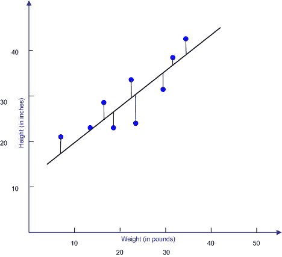

实际 Y 值和线性线之间的距离最小

为了能够根据 X 值预测 Y 值，我们希望找到一条与所有点足够接近的最佳直线，以此作为可能的最佳直线。

由于我们寻找的是线性关系，拟合线将是直的，因此该线可以由以下函数定义:

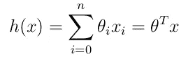

因为在我们的例子中只有一个独立变量，那么函数将是:

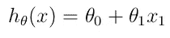

表达最佳拟合线和实际 Y 值之间差异的一种方式是**最小二乘成本函数**，定义如下:

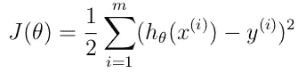

当使用这个特定的成本函数时，那么我们我们正在求解一个**普通最小二乘回归模型。**

现在我们的目标是**找到使这个函数 J(θ)(差值)**最小的最佳参数(θ)

# **解决方案(寻找最佳拟合线):**

1.  **批量梯度下降:**

最小化该函数并找到最佳θ的一种方法是使用**梯度下降**

梯度下降是一种迭代算法，随着时间的推移，它将越来越接近最佳参数。

首先:我们开始一些随机的初始θ

**第二:**我们重复执行这个迭代:

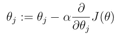

**注释:**

*   a := b 表示将 b 的值赋给 a
*   α是学习率(后面会有更多解释)
*   ∂是偏导数符号

**第三:**让我们为更清晰迭代计算偏导数:

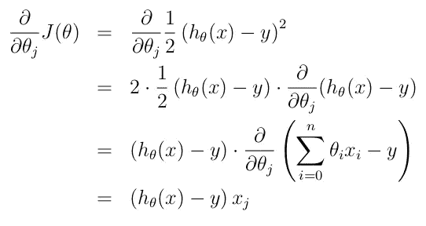

因此，对于单个训练示例，我们得到规则:

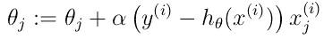

这条规则被称为 **LMS(最小均方)**或 **Widrow-Hoff** 学习规则，因为更新的幅度与误差项(y(I)-hθ(x(I))成比例

因此，例如，如果我们遇到一个训练示例，在该示例中，我们的预测几乎与 y (i)的实际值相匹配，那么我们发现几乎不需要改变参数；相反，如果我们的预测 h θ (x(i))具有大的误差(即，如果它离 y(i)非常远)，则将对参数进行较大的改变。

**第四:**当有多个单个训练示例时，规则将是:

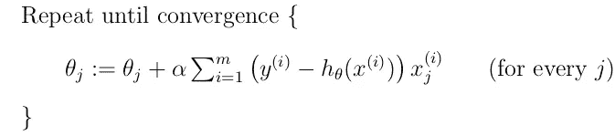

所以，这只是原始成本函数 j 的梯度下降。

**标注提醒:**

*   θj 中的小 j 从 1 到 n，表示哪个参数
*   I 是数据样本行

这种方法在每一步上查看整个训练集中的每个示例，称为批量梯度下降。

注意，虽然梯度下降通常易受局部极小值的影响，但是我们在这里为线性回归提出的优化问题只有一个全局最优值，而没有其他局部最优值；因此梯度下降总是收敛(假设学习率α不太大)到全局最小值。的确，J 是一个凸二次函数。
这是一个梯度下降的例子，它被运行以最小化二次函数
:

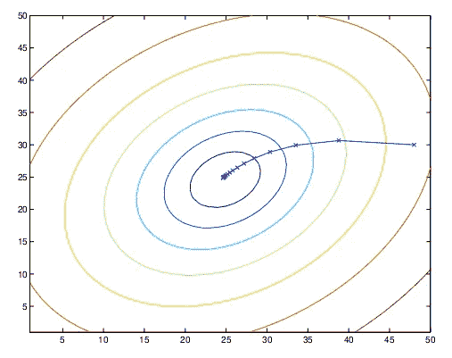

上面显示的椭圆是二次函数的轮廓。另外
显示的是梯度下降的轨迹，在
(48，30)初始化。图中的 x(用直线连接)标记了梯度下降经过的θ的连续
值。

**2。随机梯度下降:**

批处理梯度下降在采取单个步骤之前必须扫描整个训练集-如果 m 很大，这是一个昂贵的操作-**随机梯度下降**将数据分成小块，在每个步骤中，它只在特定的块上训练数据，同时循环这些步骤，因此它可以立即开始取得进展，并继续在它查看的每个示例中取得进展。

通常，随机梯度下降比批量梯度下降更快地使θ“接近”最小值。

但是注意，它可能永远不会“收敛”到最小值，参数θ会一直在 J(θ)的最小值附近振荡；但是在实践中，接近最小值的大多数值将是真正最小值的相当好的近似值。

由于这些原因，特别是当训练集很大时，随机梯度下降通常优于批量梯度下降。

**随机梯度下降**算法是:

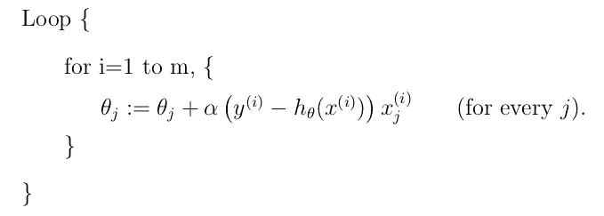

**3。正规方程:**

计算使成本函数最小的θ的另一种方法是使用一种分析方法，我们找到使成本函数的**导数等于零的θ。**

其中，使成本函数最小的θ可通过下式获得:

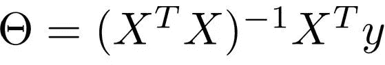

其中:

*   x 是一个(m，n)矩阵，其中 m 是行数，n 是列数
*   y 是因变量的向量(我们想要预测的变量)

不要忘记在第一列中添加一个带有[1]xm 的列来表示 X0

这种方法的缺点是，当 n(要素数)很大(大于 10K)时，速度很慢。

参考资料:

*   安德鲁·吴(斯坦福大学)ML 笔记。