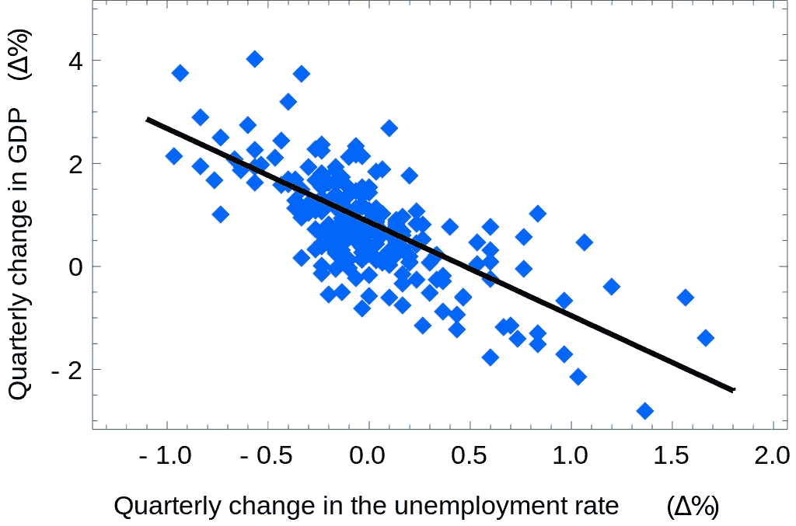

# 线性回归的类型和实现！

> 原文：<https://medium.com/analytics-vidhya/linear-regression-types-and-implementation-1797dbc76c08?source=collection_archive---------25----------------------->

在本文中，我们将了解线性回归的类型以及如何使用 ***scikitlearn*** 库来实现它。我们还将了解被称为**多项式回归的特殊类型的线性回归。**

线性回归是任何人在开始学习机器学习时都会实施的第一个模型。线性回归是一个非常有用的模型。它有很多好的特性，通过实现它可以实现很多事情。

## 什么时候用线性回归？线性回归有哪些不同的类型？

线性回归是一种监督模型，用于回归(预测连续值)。它不能用于分类问题。线性回归是一个简单的模型，很容易理解和实现。线性回归是一种非常简单的方法，但已被证明在许多情况下非常有用。

不同类型的线性回归:

*   **简单线性回归**
*   **多元线性回归**
*   **多项式回归**

**简单线性回归:**



**简单线性回归** PC:维基百科

在简单线性回归中，得到两个**连续变量之间的关系。一个变量是因变量，另一个变量是自变量。因变量依赖于自变量。因变量用“y”表示，自变量用*“x”表示。*线性回归线是一条直线。**

简单线性回归表示为:

> **y = b0 + b1*x**

这里， **y** 是因变量。 **x** 为自变量。 **b1** 是自变量的系数。 **b0** 是截距

如果系数为负，那么自变量和因变量之间的关系是成反比或负相关的(即如果一个增加，另一个减少，反之亦然)。

简单线性回归的实现:

```
***#Importing the Libraries***import pandas as pd
import numpy as np
import matplotlib.pyplot as plt ***#Importing the Data***data = pd.read_csv('Salary_Data.csv') ***#Separating the target and data values*** X = data.iloc[:, :-1].values
y = data.iloc[:, -1].values ***#Splitting the Dataset*** from sklearn.model_selection import train_test_split
X_train , X_test , y_train , y_test = train_test_split(X, y, test_size = 0.2 , random_state = 3) ***#Training the data*** from sklearn.linear_model import LinearRegression
regressor = LinearRegression()
regressor.fit(X_train,y_train) ***#Predicting the values*** y_pred = regressor.predict(X_test) ***#Checking the efficiency of the model*** from sklearn import metrics
print(metrics.mean_squared_error(y_test, y_pred))
print(metrics.r2_score(y_test , y_pred))
print(metrics.mean_absolute_error(y_test , y_pred))
print(np.sqrt(metrics.mean_squared_error(y_test, y_pred)))***#Getting the Coefficient and intercept of the Regression Line*** print(regressor.coef_)
print(regressor.intercept_)
```

*注:根据数据集*中的数据类型，实施步骤可能会有所不同

**多元线性回归:**

在多元线性回归中，自变量不止一个。多元线性回归表示为:

> **y = b0 + b1*x1 + b2*x2 + …..+ bn*xn**

*   y-因变量
*   x1，x2，…，xn —独立变量
*   b0，b1，…..，bn —系数


多元线性回归

自变量和因变量之间的关系可以是正的，也可以是负的。 *For Ex* : x1，x2，x3 可以是正相关，而其他自变量可以是负相关。

多元线性回归的实现:

```
***#Importing the Libraries***import pandas as pd
import numpy as np
import matplotlib.pyplot as plt ***#Importing the Data***data = pd.read_csv('Startups.csv') ***#Separating the target and data values*** X = data.iloc[:, :-1].values
y = data.iloc[:, -1].values ***#Encoding the Categorical Data***
from sklearn.compose import ColumnTransformer
from sklearn.preprocessing import OneHotEncoder
ct = ColumnTransformer(transformers = [('encoder', OneHotEncoder(), [3])], remainder='passthrough')
X = np.array(ct.fit_transform(X)) ***#Splitting the Dataset*** from sklearn.model_selection import train_test_split
X_train , X_test , y_train , y_test = train_test_split(X, y, test_size = 0.2 , random_state = 3) ***#Training the data*** from sklearn.linear_model import LinearRegression
regressor = LinearRegression()
regressor.fit(X_train,y_train) ***#Predicting the values*** y_pred = regressor.predict(X_test) ***#Printing the predicted and actual*** valuesprint(np.concatenate((y_pred.reshape(len(y_pred),1), y_test.reshape(len(y_test),1)),1)) ***#Checking the efficiency of the model***
from sklearn import metrics
print(metrics.mean_squared_error(y_test, y_pred))
print(metrics.r2_score(y_test , y_pred))
print(metrics.mean_absolute_error(y_test , y_pred))
print(np.sqrt(metrics.mean_squared_error(y_test, y_pred)))
```

在实现部分，有一个额外的编码步骤。之所以这样做，是因为数据集中有一列包含使用 **OneHotEncoding** 技术编码的分类变量。否则，简单线性回归和多元线性回归的实现是一样的！

**多项式回归:**

多项式回归是一种特殊类型的线性回归。因变量和自变量之间的关系不是线性的。

它表示为:

> **y = B0+B1 **x1*+B2 * x1+⋯+b*n * xn*ⁿ**

多项式回归的应用包括估计疫情或流行病期间的感染/死亡率，预测板球比赛的比分等..它也广泛用于化学领域。

## 为什么多项式回归被称为多项式‘线性’回归？

多项式回归被称为多项式线性回归，因为自变量的系数仍然是“线性的”。只有自变量不是线性的。通过建立一个模型，我们试图找到一个系数项的值，如 b1，b2，…，bn，但我们并不试图找到自变量本身的值。这就是为什么多项式回归仍然被称为多项式线性回归。

多项式回归的实现:

```
***#Importing the Libraries*** import pandas as pd
import numpy as np
import matplotlib.pyplot as plt ***#Importing the Data*** data = pd.read_csv('Position_Salaries.csv') ***#Separating the target and data values*** X = data.iloc[:, 1:-1].values
y = data.iloc[:, -1].values ***#Training the data***
from sklearn.preprocessing import PolynomialFeatures
from sklearn.model_selection import LinearRegression
poly_reg = PolynomialFeatures(degree = 2)
X_poly = poly_reg.fit_transform(X)
lin_reg_2 = LinearRegression()
lin_reg_2.fit(X_poly, y) ***#Visualizing the Polynomial Regression Plot*** plt.scatter(X, y, color = 'red')
plt.plot(X, lin_reg_2.predict(poly_reg.fit_transform(X)), color = 'blue')
plt.show() ***# Predicting a new result with Polynomial Regression*** lin_reg_2.predict(poly_reg.fit_transform([[6.5]])) ***#Getting the Coefficient and intercept of the Regression Line*** print(lin_reg_2.coef_)
print(lin_reg_2.intercept_)
```

注意:将阶数更改为较高的数字可能会导致模型过度拟合。


使用多项式回归的过度拟合示例

万岁…结束了！..在本文中，我们已经了解了不同类型的线性回归以及如何使用 sklearn 实现它！

> 感谢您阅读这篇文章。如果你喜欢这篇文章，请留下一些掌声以示感谢。关注我更多类似的文章*。*如果您对本文有任何疑问/疑问或反馈，欢迎在评论区联系我。祝您愉快:)！