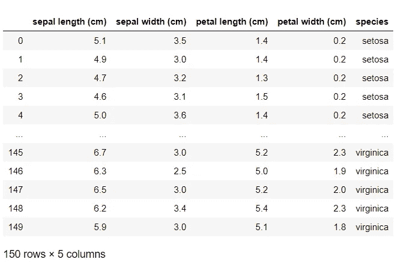
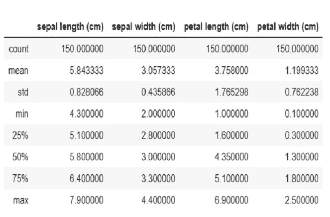
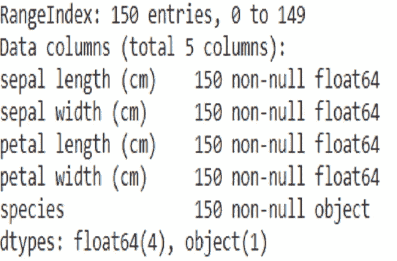
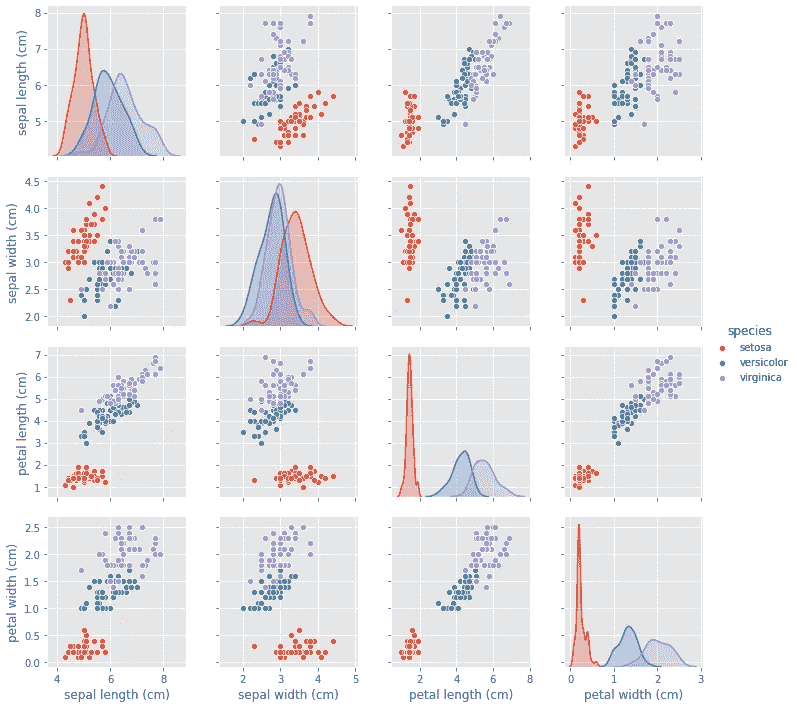
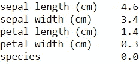
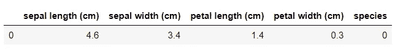
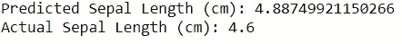

# 使用虹膜数据集的线性回归——“你好，世界！”机器学习

> 原文：<https://medium.com/analytics-vidhya/linear-regression-using-iris-dataset-hello-world-of-machine-learning-b0feecac9cc1?source=collection_archive---------0----------------------->


一幅鸢尾([https://commons.wikimedia.org/wiki/File:Iris_setosa_var.)的画 _setosa_(2595031014)。jpg](https://commons.wikimedia.org/wiki/File:Iris_setosa_var._setosa_(2595031014).jpg)

# 议程

1.  线性回归模型的基本介绍。
2.  虹膜数据的基本介绍。
3.  使用线性回归模型进行预测的代码。

# 序文

回归模型用于预测*连续数据点*，而分类模型用于预测*离散数据点*。

它们是什么意思？

1.  *连续数据点*是可以在连续范围内占据任何值的数据点，并且本质上始终是数字。在两个连续的数据点之间，可能有无限数量的其他数据点。为了简单比较，我将这称为“灰色区域”。
2.  *离散数据点*是只能取特定值的数据点，它可以是数字的，也可以是分类的。对于离散的数据点，没有“灰色区域”。

# 什么是线性回归模型？

线性回归是一种回归模型，也是机器学习中的监督学习算法。它是每个机器学习爱好者都应该知道的基本机器学习模型之一。线性回归是一种线性方法，用于模拟标量响应(y-因变量)和一个或多个解释变量(X-自变量)之间的关系。

我将举例说明使用线性回归来预测一种叫做鸢尾的花的萼片长度(cm)。

# 在我们开始之前…

首先，您需要安装 Python 和您选择的集成开发环境(IDE)(这完全由您决定，您可能想也可能不想使用 IDE)。我使用 Jupyter 笔记本，因为在我看来，这是迄今为止最好的数据可视化/操作和机器学习集成开发环境。

其次，你还需要安装**熊猫**、 **NumPy** 、 **scikit-learn (sklearn)** 、 **matplotlib** ，最后是 **seaborn** 。在命令行上运行 pip/pip3/conda install 来安装这些软件包。

```
pip/pip3/conda install pandas
pip/pip3/conda install numpy
pip/pip3/conda install scikit-learn
pip/pip3/conda install sklearn
pip/pip3/conda install matplotlib
pip/pip3/conda install seaborn
```

根据您的 pip 安装程序的版本和/或如果您使用的是 anaconda 软件包管理系统，运行该命令。

最后，要检查您是否已经成功下载了库，您可以键入

```
pip/pip3 freeze **in the command line**
```

或者检查 Anaconda Navigator 环境。

# 虹膜数据集

鸢尾属有 3 种，即刚毛鸢尾、杂色鸢尾和海滨鸢尾，每种鸢尾花有 50 行数据。列名代表被研究和记录的花的特征。

这就是我如何准备从 sklearn.datasets 加载的虹膜数据集。或者，你可以从 UCI 机器学习资源库下载 CSV 文件形式的数据集。

```
# Import Dataset from sklearn
from sklearn.datasets import load_iris# Load Iris Data
iris = load_iris()# Creating pd DataFrames
iris_df = pd.DataFrame(data= iris.data, columns= iris.feature_names)
target_df = pd.DataFrame(data= iris.target, columns= ['species'])def converter(specie):
    if specie == 0:
        return 'setosa'
    elif specie == 1:
        return 'versicolor'
    else:
        return 'virginica'target_df['species'] = target_df['species'].apply(converter)# Concatenate the DataFrames
iris_df = pd.concat([iris_df, target_df], axis= 1)
```



数据集概述:

```
iris_df.describe()
```

。describe()生成描述性统计数据，这些统计数据总结了数据集分布的集中趋势、离散度和形状，不包括`NaN`值。



```
iris_df.info()
```

。info()打印数据帧的简明摘要。



```
sns.pairplot(iris_df, hue= 'species')
```



# 问题陈述:预测鸢尾花的萼片长度(厘米)

编码部分来了！

```
# Converting Objects to Numerical dtype
iris_df.drop('species', axis= 1, inplace= True)
target_df = pd.DataFrame(columns= ['species'], data= iris.target)
iris_df = pd.concat([iris_df, target_df], axis= 1)# Variables
X= iris_df.drop(labels= 'sepal length (cm)', axis= 1)
y= iris_df['sepal length (cm)']

# Splitting the Dataset 
X_train, X_test, y_train, y_test = train_test_split(X, y, test_size= 0.33, random_state= 101)

# Instantiating LinearRegression() Model
lr = LinearRegression()

# Training/Fitting the Model
lr.fit(X_train, y_train)

# Making Predictions
lr.predict(X_test)
pred = lr.predict(X_test)

# Evaluating Model's Performance
print('Mean Absolute Error:', mean_absolute_error(y_test, pred))
print('Mean Squared Error:', mean_squared_error(y_test, pred))
print('Mean Root Squared Error:', np.sqrt(mean_squared_error(y_test, pred)))
```

模型拟合结果！

```
Mean Absolute Error: 0.26498350887555133
Mean Squared Error: 0.10652500975036944
Mean Root Squared Error: 0.3263816933444176
```

现在来测试一下…

```
iris_df.loc[6]
```



```
d = {'sepal length (cm)' : [4.6],
    'sepal width (cm)' : [3.4],
    'petal length (cm)' : [1.4],
    'petal width (cm)' : [0.3],
    'species' : 0}
test_df = pd.DataFrame(data= d)
test_df
```



```
pred = lr.predict(X_test)print('Predicted Sepal Length (cm):', pred[0])
print('Actual Sepal Length (cm):', 4.6)
```



如您所见，预测值和实际值之间存在差异，差异约为 0.283 cm (3 S.F .)，略高于平均绝对误差。

# **结论**

我希望通过这篇介绍性文章，你对什么是线性回归模型(以及代码)和 Iris 数据有一个基本的理解和看法，“你好，世界！”机器学习数据集。

源代码:[https://github . com/peanutsee/Basic-Linear-Regression-Using-Iris-Dataset](https://github.com/peanutsee/Basic-Linear-Regression-Using-Iris-Dataset/tree/master)