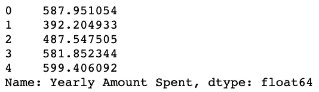

# 使用 Pandas & Numpy 的线性回归—适用于数据科学初学者

> 原文：<https://medium.com/analytics-vidhya/linear-regression-using-pandas-numpy-for-beginners-in-data-science-fe57157ed93d?source=collection_archive---------3----------------------->

**问题陈述**纽约一家在线销售服装的电子商务公司也有店内风格和服装建议会议。顾客来到店里，与私人造型师进行会谈/会面，然后他们可以回家，在手机应用程序或网站上订购他们想要的衣服。

该公司正试图决定是将精力集中在他们的移动应用程序体验还是他们的网站上。让我们弄清楚。

#导入所需的包

*导入熊猫为 pd
导入 numpy 为 np
导入 matplotlib.pyplot 为 py
导入 seaborn 为 sns
%matplotlib inline*

#读取文件

*customers = pd.read_csv("电子商务客户")*

#让我们检查数据-

*customers.head()*


*customers.describe()*


# 探索性数据分析

#处理数据的第一步是分析数据，探索存在哪些关系以及这些关系是如何相互关联的。


#创建了一个 jointplot(使用 seaborn)来比较网站上的时间和每年花费的金额列。这是为了检验相关性是否有意义？

*sns.jointplot(x= '在网站上的时间'，y= '每年花费的金额'，数据=客户)*


#应用程序数据也是如此

*sns.jointplot(x= '应用上的时间'，y= '每年花费的金额'，数据=客户)*


#创建了一个十六进制类型的 jointplot，用于显示花在应用程序上的时间与会员资格的长度

*SNS . joint plot(x = ' App 上的时间'，y= '会员时长'，data =客户，kind='hex')*

#我们可以创建一个 pairplot 来研究整个数据集的关系类型。注意年度消费金额和会员资格之间的线性正相关。

*sns.pairplot(数据=客户)*


#因此，我们通过绘制年度消费金额与会员资格期限的线性图(使用 seaborn 的 lmplot ),深入研究了这种关系


*sns.lmplot(x= '会员时间'，y= '每年消费金额'，数据=客户)*

# 培训和测试数据

现在我们已经对数据进行了一些探索，让我们继续将数据分成训练集和测试集。设置一个与客户数字特征相等的**变量 X** 和一个与“每年花费金额”栏相等的**变量 Y** 。


X =客户[['平均。会话长度'，'应用时间'，'网站时间'，'会员时间']]
X.head()



*Y =客户['每年花费金额']
Y.head()*

**使用 sklearn 中的 model _ selection . train _ test _ split 将数据拆分为训练集和测试集。设置测试大小=0.3，随机状态=101**

*从 sklearn.model_selection 导入 train_test_split*

*X_train，X_test，Y_train，Y_test = train_test_split(X，Y，test_size=0.3，random_state=101)*

# 训练模型

现在是时候根据我们的训练数据来训练我们的模型了！

*从 sklearn.linear_model 导入线性回归*

*lm = LinearRegression()* #创建 LinearRegression 模型的实例

*lm.fit(X_train，Y_train) #* Train/fit 在训练数据上，这将给出-

```
LinearRegression(copy_X=True, fit_intercept=True, n_jobs=1, normalize=False)
```

#模型的系数/斜率-

*打印(lm.coef_)*

```
[25.98154972 38.59015875  0.19040528 61.27909654]
```

# 预测测试数据

现在我们已经拟合了我们的模型，让我们通过预测测试值来评估它的性能！

*预测= lm.predict(X_test)*


#让我们创建一个真实测试值与预测值的散点图，以检查我们模型的性能

py.scatter(Y_test，预测)

# 评估模型

让我们通过计算残差平方和以及解释方差得分(R)来评估我们的模型性能

*从 sklearn 导入度量
print('MAE= '，metrics . mean _ absolute _ error(Y _ test，prediction) )
print('MSE= '，metrics . mean _ squared _ error(Y _ test，prediction))
print('RMSE:'，NP . sqrt(metrics . mean _ squared _ error(Y _ test，prediction)))*

```
MAE=  7.228148653430853
MSE=  79.81305165097487
RMSE: 8.933815066978656
```

# 残差

让我们快速研究一下残差，以确保我们的数据一切正常


#绘制残差直方图，并使用 plt.hist()确保它看起来呈正态分布。

*py.hist(预测-Y _ 测试，bin = 50)*

# 结论

我们还是想弄清楚原问题的答案，我们是把精力放在手机 App 还是网站开发上？或者这根本不重要，会员时间才是真正重要的。让我们解释一下这些系数来了解一下


*一氧化碳=钯。DataFrame(lm.coef_，X.columns)
co.columns = ['系数']
co*

解释系数:

*   保持所有其他功能不变，**平均值增加 1 个单位。会话长度**与总花费增加 25.98 美元**相关联。**
*   在所有其他功能不变的情况下，App 上的**时间每增加 1 个单位，总花费**就会增加**38.59 美元。**
*   在所有其他功能不变的情况下，网站上的**时间每增加 1 个单位，总花费**就会增加**0.19 美元。**
*   保持所有其他特征不变，会员资格**长度**每增加 1 个单位，总花费**就会增加 61.27 美元**。

**最终结论—**

有两种方法可以思考这个问题:1。开发网站以赶上移动应用程序的性能，或者 2。开发更多的应用程序，因为这是什么工作得更好。

作为一名数据人员，我们可以用数字向公司提供两种选择，并帮助他们做出决定。