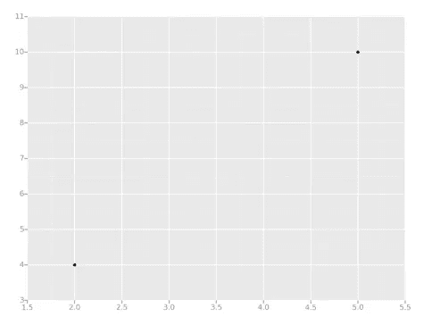
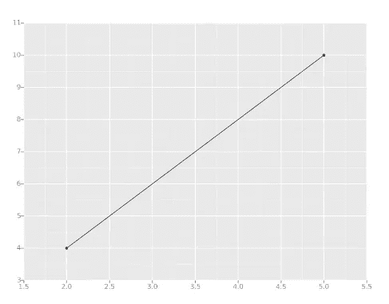
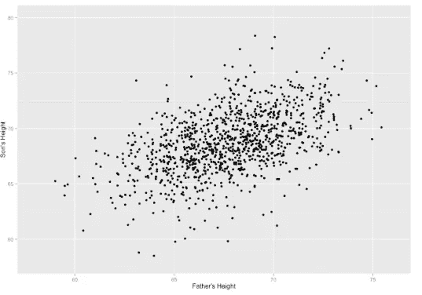
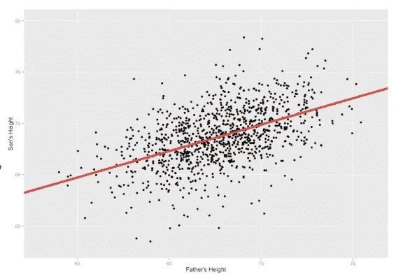
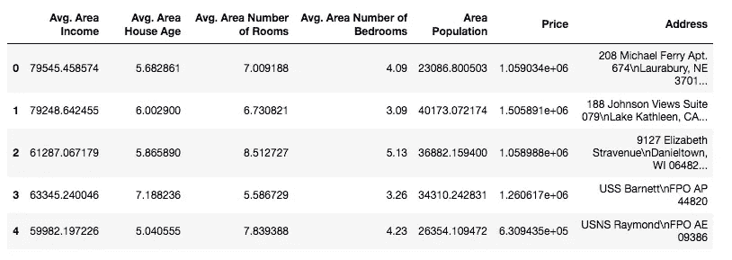
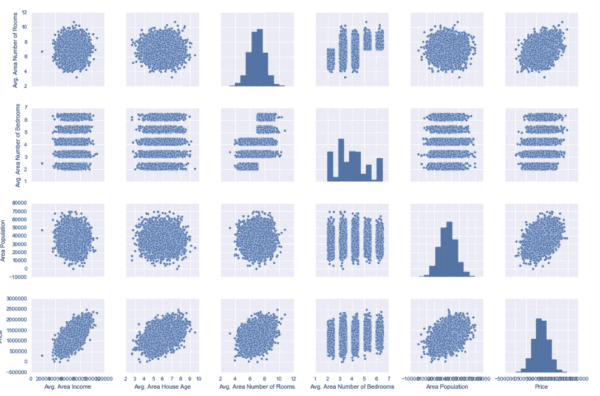
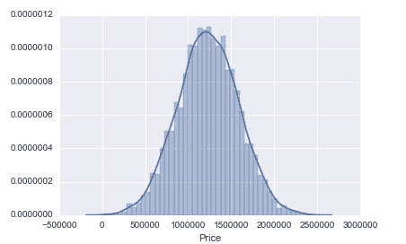
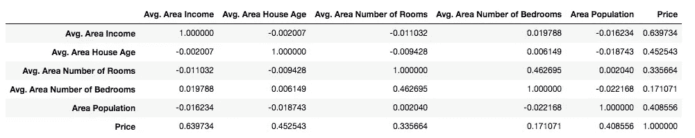
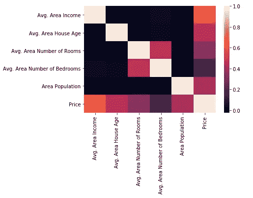
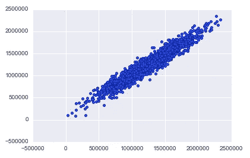

# 使用 Python 进行线性回归

> 原文：<https://medium.com/analytics-vidhya/linear-regression-using-python-ce21aa90ade6?source=collection_archive---------0----------------------->


# 回归的意义

回归试图预测一个因变量(通常用 Y 表示)和一系列其他变化的变量(称为自变量，通常用 X 表示)。

# 线性回归

线性回归是一种根据单个预测变量 X 预测响应 Y 的方法。假设 X 和 Y 之间近似呈线性关系。从数学上讲，我们可以将这种关系表示为:

y≈ɒ+x+ℇ

其中，ɒ和是两个未知常数，代表线性模型中的截距和斜率项，ℇ是估计中的误差。

## 例子

让我们举一个最简单的例子。仅用两个数据点计算回归。



这里我们有两个数据点，用两个黑点表示。当我们计算回归线时，我们要做的就是画一条尽可能接近每一点的线。



这里，我们有一条完美拟合的线，因为我们只有两个点。现在，我们必须考虑有 2 个以上数据点的情况。



通过应用线性回归，我们可以获得多个 X 值，并预测相应的 Y 值。如下图所示:



我们线性回归的目标是最小化所有数据点和我们的直线之间的垂直距离。

现在我想，你已经对线性回归的目标有了一个基本的概念。

# Python 代码

首先，让我们导入库:

```
import pandas as pd
import numpy as np
import matplotlib.pyplot as plt   #Data visualisation libraries 
import seaborn as sns
%matplotlib inline
```

下一步是导入和检出数据。

```
USAhousing = pd.read_csv('USA_Housing.csv')
USAhousing.head()
USAhousing.info()
USAhousing.describe()
USAhousing.columns
```

这里，我使用 USA_Housing.csv 作为示例数据集。探索数据集总是一个好的做法。尝试使用您自己的文件并运行上面的代码来获取关于数据集的所有可能的信息。



我的数据集的前五条记录的快照

在这里，我认为价格是因变量，其余的是自变量。这意味着我必须预测给定独立变量的价格。

现在是处理数据和创建一些可视化的时候了。

```
sns.pairplot(USAhousing)
```



pairs 图基于两个基本图形，直方图和散点图。对角线上的直方图允许我们看到单个变量的分布，而上下三角形上的散点图显示了两个变量之间的关系(或缺乏关系)。

```
sns.distplot(USAhousing['Price'])
```



开始研究单个变量的一个很好的方法是使用直方图。直方图将变量划分为多个区间，对每个区间中的数据点进行计数，并在 x 轴上显示区间，在 y 轴上显示计数。

## 相互关系

相关系数，或简称为相关性，是一个范围从-1 到 1 的指数。当值接近零时，不存在线性关系。随着相关性越来越接近正负 1，这种关系就越来越强。值为 1(或负 1)表示两个变量之间存在完美的线性关系。

让我们找出数据集中变量之间的相关性。

```
USAhousing.corr()
```



现在，让我们使用热图来绘制相关性:



黑色代表两个变量之间没有线性关系。较浅的阴影表示变量之间的关系更加线性。

# 决定系数

决定系数R2 是可由预测变量 x 解释的响应变量 Y 变化的分数(百分比)。其范围在 0(不可预测性)到 1(或 100%)之间，表示完全可预测性。高 R2 表明能够以较小的误差预测响应变量。

# 训练线性回归模型

让我们现在开始训练回归模型！我们需要首先将数据分成一个 X 数组和一个 y 数组，X 数组包含要训练的特性，y 数组包含目标变量，在本例中是 Price 列。我们将丢弃地址列，因为它只有线性回归模型无法使用的文本信息。

```
X = USAhousing[['Avg. Area Income', 'Avg. Area House Age', 'Avg. Area Number of Rooms',
               'Avg. Area Number of Bedrooms', 'Area Population']]
y = USAhousing['Price']
```

# 列车测试分离

我们的目标是创建一个能很好地概括新数据的模型。我们的测试集充当新数据的代理。训练数据是我们应用线性回归算法的数据。最后，我们在测试数据上测试该算法。拆分的代码如下:

```
X_train, X_test, y_train, y_test = train_test_split(X, y, test_size=0.4, random_state=101)
```

从上面的代码片段中，我们可以推断出 40%的数据进入了测试数据，其余的保留在训练集中。

# 创建和训练模型

```
from sklearn.linear_model import LinearRegression
lm = LinearRegression()
lm.fit(X_train,y_train)
```

上面的代码符合训练数据的线性回归模型。

# 我们模型的预测

让我们从测试集中抓取预测，看看它做得有多好！

```
predictions = lm.predict(X_test)
```

让我们想象一下这个预测

```
plt.scatter(y_test,predictions)
```



一个相当好的工作已经完成，一个线性模型已经获得！