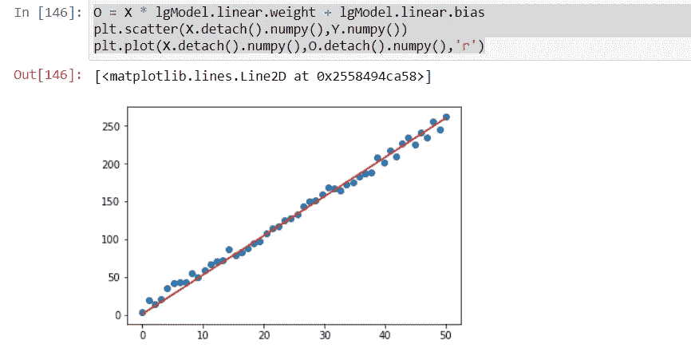

# 使用 PyTorch 进行线性回归

> 原文：<https://medium.com/analytics-vidhya/linear-regression-using-pytorch-b12d694732ae?source=collection_archive---------23----------------------->

一个变量的数学线性方程可以定义如下。

```
y = mx+c
```

为了将它与现实世界的例子联系起来，让我们假设一家小公司想要根据一个月的平均温度来预测该月所需的 25 升饮用水瓶的数量。他们想要建立瓶子数量和月平均温度之间的模式[为了简单起见，我们假设员工数量是固定的]。该公司希望使用他们的历史数据来建立模型，以帮助他们实现这一目标。

数据集的例子。

```
Month's Avg Temperature   Number of Bottles consumed in month
35                                  4
37                                  8
```

让我们试着把它和方程式联系起来。

```
Temperature is x  and y is bottles now we have to find m and c. so that when we put x in below equation it should help with prediction of number of bottlesy = mx+c
```

在本文中，我将重点介绍使用 Pytorch 的实现。数学细节请参考我以前的帖子。[https://www . LinkedIn . com/feed/update/urn:李:activity:66486111139209003008/](https://www.linkedin.com/pulse/linear-regression-from-scratch-java-nirmal-singh/)或[https://medium . com/@ nirmal 1067/linear-regression-从零开始-in-java-dc7aead2ba04](/@nirmal1067/linear-regression-from-scratch-in-java-dc7aead2ba04)

**先决条件:PyTorch 环境设置必须存在。**

使用下面的代码片段创建输入张量 X，实际输出 Y。这里 E 代表使输出非线性的误差

```
X = torch.linspace(0,50,50).reshape(-1,1)
torch.manual_seed(50)
E = torch.randint(-8,9,(50,1),dtype=torch.float)
Y = 5*X + 8 + E
```

下面是线性回归的代码。复制代码时缩进变得混乱。

```
class LinearRegressionModel(nn.Module):

    #optimizer

    def __init__(self,in_Feature=1,out_Feature=1,learningRate=0.001):
        super().__init__()
        self.linear= nn.Linear(in_Feature,out_Feature)
        self.optimizer = torch.optim.SGD(self.parameters(), lr = 0.001)
        self.criterion = nn.MSELoss()

    def predict(self,inputs):
        predict = self.linear(inputs)
        return predict

    def printClassValues(self):
        for name, param in self.named_parameters():
            print(name, '\t', param.item())

    def trainModel(self,X,y,epochs=50):
        #epochs = 100
        losses = []for i in range(epochs):
            i+=1
            y_pred = self.predict(X)
            loss = self.criterion(y_pred, y)
            losses.append(loss)
            print(f'epoch: {i:2}  loss: {loss.item():10.8f}  weight: {self.linear.weight.item():10.8f}  \
            bias: {self.linear.bias.item():10.8f}') 
            self.optimizer.zero_grad()
            loss.backward()
            self.optimizer.step()
```

为了测试下面的代码使用。这将用默认的偏差和权重初始化你的模型。

LG model = LinearRegressionModel(1，1)
lgModel.printClassValues()

下面一行代码将训练你的模型。

lgModel.trainModel(X，Y)

训练时，你要留意体重和偏见是如何变化的。以下是我的模型的训练日志。

```
epoch:  1  loss: 24908.03906250  weight: -0.24355280              bias: 0.74757409
epoch:  2  loss: 11715.38183594  weight: 8.90680599              bias: 1.02333665
epoch:  3  loss: 5522.17285156  weight: 2.63715982              bias: 0.84102964
epoch:  4  loss: 2614.80932617  weight: 6.93266582              bias: 0.97256958
epoch:  5  loss: 1249.96154785  weight: 3.98936534              bias: 0.88907117
epoch:  6  loss: 609.23602295  weight: 6.00579691              bias: 0.95290476
epoch:  7  loss: 308.44332886  weight: 4.62402439              bias: 0.91578913
epoch:  8  loss: 167.23051453  weight: 5.57056141              bias: 0.94783634
epoch:  9  loss: 100.93089294  weight: 4.92183685              bias: 0.93249261
epoch: 10  loss: 69.79891968  weight: 5.36611938              bias: 0.94961578
epoch: 11  loss: 55.17618179  weight: 5.06151915              bias: 0.94449055
epoch: 12  loss: 48.30352783  weight: 5.27002287              bias: 0.95460564
epoch: 13  loss: 45.06904221  weight: 5.12696838              bias: 0.95427531
epoch: 14  loss: 43.54253006  weight: 5.22478771              bias: 0.96109837
epoch: 15  loss: 42.81778717  weight: 5.15756941              bias: 0.96301681
epoch: 16  loss: 42.46943665  weight: 5.20342922              bias: 0.96829230
epoch: 17  loss: 42.29781723  weight: 5.17181253              bias: 0.97126424
epoch: 18  loss: 42.20915604  weight: 5.19327927              bias: 0.97581106
epoch: 19  loss: 42.15945053  weight: 5.17837572              bias: 0.97927547
epoch: 20  loss: 42.12804413  weight: 5.18839121              bias: 0.98347813
epoch: 21  loss: 42.10523224  weight: 5.18133450              bias: 0.98717159
epoch: 22  loss: 42.08646393  weight: 5.18597412              bias: 0.99121052
epoch: 23  loss: 42.06961060  weight: 5.18260002              bias: 0.99500942
epoch: 24  loss: 42.05364609  weight: 5.18471670              bias: 0.99896938
epoch: 25  loss: 42.03814316  weight: 5.18307209              bias: 1.00281560
epoch: 26  loss: 42.02280426  weight: 5.18400383              bias: 1.00673640
epoch: 27  loss: 42.00761795  weight: 5.18317080              bias: 1.01060271
epoch: 28  loss: 41.99245834  weight: 5.18354702              bias: 1.01450300
epoch: 29  loss: 41.97735596  weight: 5.18309498              bias: 1.01837671
epoch: 30  loss: 41.96227264  weight: 5.18321037              bias: 1.02226520
epoch: 31  loss: 41.94721603  weight: 5.18293667              bias: 1.02614009
epoch: 32  loss: 41.93214798  weight: 5.18293047              bias: 1.03002095
epoch: 33  loss: 41.91712952  weight: 5.18274069              bias: 1.03389442
epoch: 34  loss: 41.90211487  weight: 5.18267632              bias: 1.03776956
epoch: 35  loss: 41.88711548  weight: 5.18252659              bias: 1.04164016
epoch: 36  loss: 41.87213898  weight: 5.18243551              bias: 1.04551053
epoch: 37  loss: 41.85715485  weight: 5.18230391              bias: 1.04937768
epoch: 38  loss: 41.84220123  weight: 5.18220091              bias: 1.05324376
epoch: 39  loss: 41.82727432  weight: 5.18207836              bias: 1.05710721
epoch: 40  loss: 41.81235123  weight: 5.18196821              bias: 1.06096911
epoch: 41  loss: 41.79744339  weight: 5.18185043              bias: 1.06482875
epoch: 42  loss: 41.78254318  weight: 5.18173838              bias: 1.06868660
epoch: 43  loss: 41.76766968  weight: 5.18162251              bias: 1.07254231
epoch: 44  loss: 41.75281525  weight: 5.18150854              bias: 1.07639611
epoch: 45  loss: 41.73797607  weight: 5.18139362              bias: 1.08024788
epoch: 46  loss: 41.72313309  weight: 5.18127966              bias: 1.08409774
epoch: 47  loss: 41.70832825  weight: 5.18116522              bias: 1.08794558
epoch: 48  loss: 41.69353104  weight: 5.18105078              bias: 1.09179139
epoch: 49  loss: 41.67874527  weight: 5.18093681              bias: 1.09563529
epoch: 50  loss: 41.66396332  weight: 5.18082237              bias: 1.09947717
```

一旦模型被训练，使用下面代码片段生成输出预测输出“O ”,并使用 matplotlib 进行图形比较

o = X * LG model . linear . weight+LG model . linear . bias
PLT . scatter(X . detach()。numpy()，y . numpy())
PLT . plot(x . detach()。numpy()，O.detach()。numpy()，' r ')

下面是我的模型的图表。

