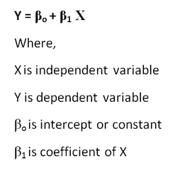
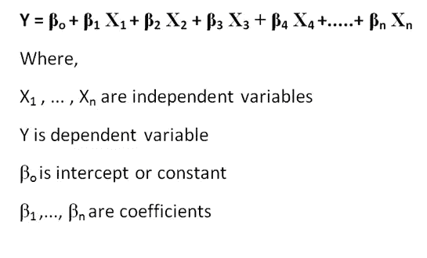
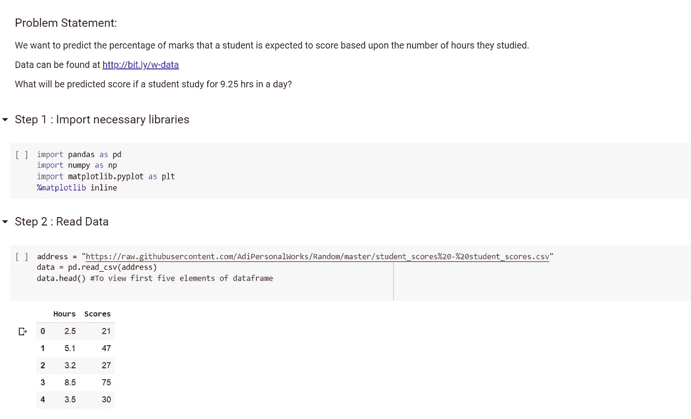
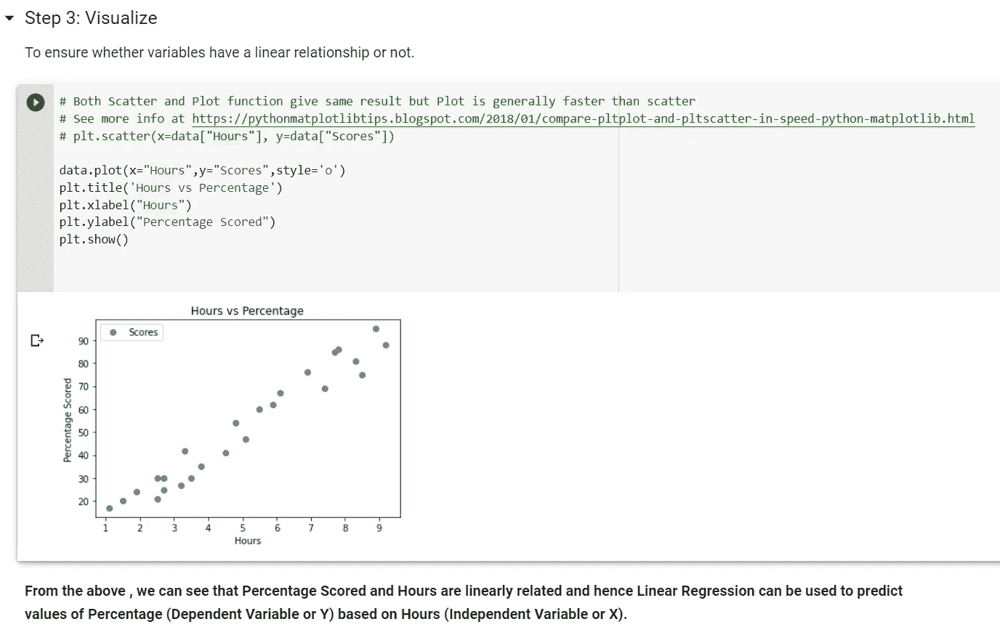
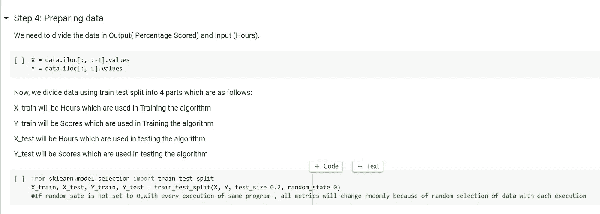
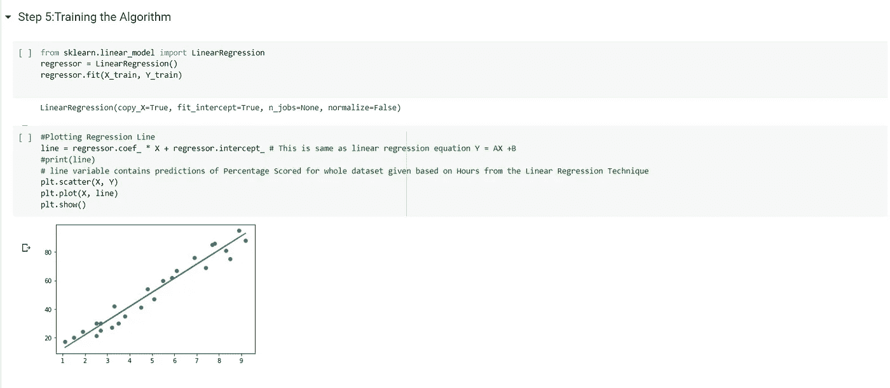
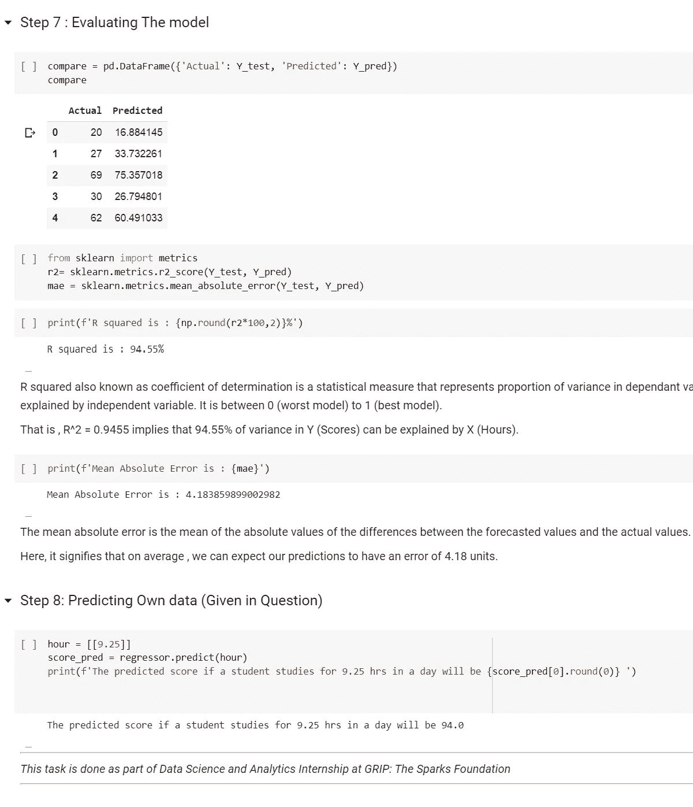

# 使用 Python 中的 Scikit Learn 进行线性回归

> 原文：<https://medium.com/analytics-vidhya/linear-regression-using-scikit-learn-in-python-5703be8e4f38?source=collection_archive---------27----------------------->

在开始线性回归之前，我们先讨论一下算法的类型。主要有三种类型的算法，即:监督，无监督和强化。

有监督的机器学习意味着首先在标记的数据集(训练数据)上训练算法，以形成模型。在此之后，向机器提供一组新的数据(测试数据)来预测结果。例如，当我们都是婴儿时，我们的父母告诉我们什么是牛、兔子、蛇、松鼠等等..(训练了我们)。在那之后，每当我们看到一种动物(测试数据)，我们就能够根据我们的知识对它进行分类。

监督 ML 算法有两种类型:

1.分类:在这个输出变量是一个类别(分类目标变量)

2.回归:在这个输出变量是一个值(连续的目标变量)

回归包括各种类型，如线性，逻辑，岭，套索，多项式等..

在这篇文章中，我们将讨论线性回归。

线性回归是最简单的回归形式，它假设自变量和因变量是线性相关的。数学模型看起来像:

如果有一个以上的独立变量，则称为多元线性回归，表示为:

统计将用于确定系数并形成回归方程。

现在，让我们转到制作算法的编码部分。

我实习的时候做过一个项目。我分享一下代码，用它解释一下算法。

最初的步骤包括导入必要的库和读取数据。

在此之后，我们必须检查假设。对于线性回归，因变量和自变量必须线性相关。为了验证这一点，我们做了一个散点图。【由于，只有一个变量，不需要检查线性回归的其他假设】。

一旦我们确定了使用哪种算法，我们就开始准备将数据分成训练集和测试集。

拆分后，首先，我们对数据进行训练。

在训练之后，我们在测试数据上测试这样形成的模型。根据测试数据的预测值和实际值，我们对模型进行评估，以检查它做得有多好。评估的标准随着数据的变化而变化。每当涉及回归时，我们总是使用 R 平方值来检查我们的回归模型和平均绝对误差，以了解我们的预测与实际值的平均偏差。

永远记得评估模型。

这是最简单算法的一个例子。在我的下一篇文章中，我将解释一些更复杂的算法。

链接到线性回归算法: [Github](https://github.com/Anjali001/GRIP_Tasks/blob/master/Linear_Regression.ipynb)

如果你对文章有什么建议或者想让我做些编辑。请随时通过 [LinkedIn](http://www.linkedin.com/in/anjali-pal-24246214a) 联系我，或者在这里发表评论。

> 参考资料:

1.  [https://www . geeks forgeeks . org/linear-regression-python-implementation/](https://www.geeksforgeeks.org/linear-regression-python-implementation/)

2.[https://machine learning mastery . com/linear-regression-for-machine-learning/](https://machinelearningmastery.com/linear-regression-for-machine-learning/)