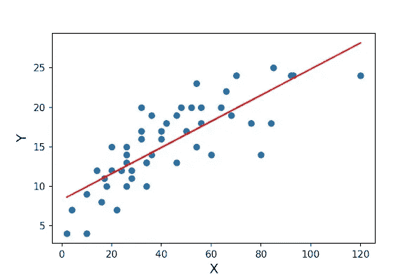

# 线性回归与逻辑回归(机器学习)

> 原文：<https://medium.com/analytics-vidhya/linear-regression-vs-logistic-regression-machine-learning-893e2ceebf9?source=collection_archive---------22----------------------->

线性回归和逻辑回归是机器学习的两种算法，主要用于数据科学领域。

**线性回归** : >它是机器学习的算法之一，被用作解决数据科学领域各种用例的技术。一般用于**连续输出**的情况。例如，如果房子的“面积”和“Bhk”作为输入给出，并且我们已经找到了房子的“价格”,那么这被称为回归问题。

机理:>下图中 X 是输入，Y 是输出值。

在上图中，点(蓝色)是我们的数据点，以分散的形式显示。穿过这些点的线是最佳拟合线。如果以误差或成本函数非常小的方式画线，则称为**最佳拟合线**，误差可以计算为:平均值(sum(sqr(点与线之间的欧几里德距离))。

选择最佳拟合线后，我们可以通过输入 X 来预测 Y 的值。

**逻辑回归** : >也是机器学习算法之一，用在用例中。一般用于分类问题。例如，如果给定学生的“CGPA ”,我们必须预测该学生是“不及格”还是“及格”,这就叫做分类问题。

机理:>下图中 X 是输入，Y 是输出。

在该图中，给出了数据点(绿色),红色曲线是给定数据点的最佳拟合。该曲线称为 Sigmoid 函数，阈值为 0.5。Sigmoid 函数将输出压缩在 0 到 1 之间，因此该函数的范围为(0，1)。

对于特定的 X 值，如果 Y 值大于 0.5，则输出为真，如果小于 0.5，则输出为假，因为它用于输出为真或假的分类问题。

***这就是线性回归 vs 逻辑回归的简短解释…***