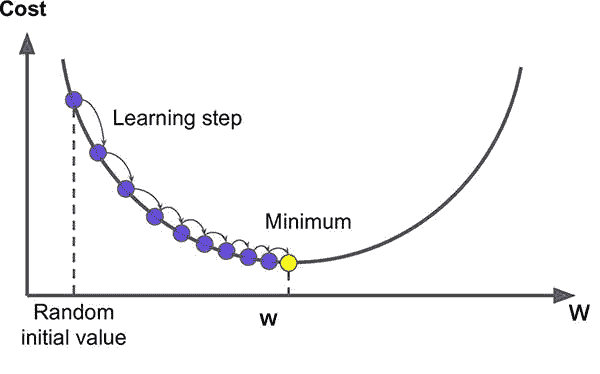

# 梯度下降导数线性回归

> 原文：<https://medium.com/analytics-vidhya/linear-regression-with-gradient-descent-derivation-c10685ddf0f4?source=collection_archive---------0----------------------->


# 先决条件

唯一的先决条件是微分和矩阵乘法。

# 什么是线性回归？


简单的线性回归基本上是线性相关变量之间的线性关系的建模，该线性相关变量随后可用于预测新的独立变量的相关变量值
为此，我们使用以下直线的方程:`y = m * x + c.`

其中 y 是因变量，x 是自变量

**例如**:我们可以根据一个人的工作经验来预测他的工资。
这里，薪水是因变量，经验是自变量，因为我们是在经验的帮助下预测薪水的。

**何时使用线性回归**:可以对因变量和自变量之间存在良好线性关系的数据进行线性回归。
线性关系的程度可以借助相关性来发现。

# 梯度下降



梯度下降是一种优化算法，可用于寻找可微函数的全局或局部最小值。

## 各种各样的假设和定义。

假设我们有一个自变量 x 和一个因变量 y.
为了形成这 2 个变量之间的关系，我们有方程:
`**y = x * w + b**`
其中 **w** 是权重(或斜率)
**b** 是偏差(或截距)
**x** 是自变量列向量(例题)，
**y** 是因变量列向量(示例)
我们的主要目标是找到正确定义变量 **x** 和 **y** 之间关系的 **w** 和 **b** 。 我们借助一种叫做**损失函数的东西来实现这一点。**

**损失函数:**损失函数是表示我们的预测值与因变量的实际值偏离多少的函数。

重要提示:*我们正试图找到* ***w*** *和* ***b*** *的值，以使我们的损失函数最小化。*

## 实施梯度下降的线性回归所涉及的步骤

1.  随机初始化权重和偏差，或者用 0 初始化(两者都可以)。
2.  用这个初始权重和偏差进行预测。
3.  将这些预测值与实际值进行比较，并使用这些预测值和实际值定义损失函数。
4.  借助微分，计算损失函数如何随权重和偏差项而变化。
5.  更新权重和偏差项，以便最小化损失函数。

# 用数学实现


自变量和因变量的例子分别为

## 1 .假定

假设我们有一个 **x** 和 **y** 向量，如上图所示(*上图只是一个例子*)。

## 2.将 w 和 b 初始化为 0

**w** = 0， **b** = 0

## 3.用现在的 w 和 b 做一些预测，当然会错。

`**y_pred = x*w + b**`，其中 y_pred 代表预测的 y 值。
这个 y_pred 也会像 y 一样是一个向量。

## 4 .定义损失函数

`**loss = (y_pred — y)²/n**`
其中 n 是数据集中实例的数量。很明显，这个损失函数代表了预测值与实际值的偏差。
这个损失函数也将是一个向量。但是，我们将对向量中的所有元素求和，将其转换为标量。

## 5.计算( **∂** (损失)/ **∂w)**

> 实变量函数的导数衡量的是函数值相对于自变量变化的敏感度。

我们可以用微积分来找出损耗相对于 ***w*** 如何变化。

```
**loss = (y_pred — y)²/n****loss = (y_pred² + y² — 2y*y_pred)/n** *(expanding the whole square)***=>( (x*w+b)² + y² — 2y*(x*w+b))/n** *(substitute y_pred)***=> ((x*w+b)²/n ) + (y²/n) + ((-2y(x*w+b))/n)** *(splitting the terms)***Let A = ((x*w+b)²/n )
Let B = (y²/n), 
Let C = ((-2y(x*w+b))/n)****A = ( x²w² + b² + 2xwb )/n** *(expanding)* **∂A/∂w = ( 2x²w + 2xb )/n** *(differentiating)***∂B/∂w = 0** *(differentiating)***C = (-2yxw — 2yb)/n
∂C/∂w = (-2yx)/n** *(differentiating)*
```

所以，∂loss/∂w 将所有这些术语相加:

```
**∂loss/∂w = (2x²w + wxb — 2yx)/n
=> (2x(x*w + b — y))/n**
```

于是，损失相对于 ***w*** 的导数被发现是:
`**(2/n)*(y_pred — y)*x**` **。我们姑且称之为 dw。**

如果我们对 ***b*** 进行相同的损失微分，我们将得到:
`**(2/n)*(y_pred — y)**` **。我们姑且称之为 db 吧。**

这个 dw 和 db 就是我们所说的*“渐变”*

## 6.更新 w 和 b


图 6.1

正如我们在图 6.1 中看到的，如果我们随机初始化权重，它可能不会导致损失函数的全局最小值。
我们有责任将权重更新到损失最小的点。我们已经在上面计算了 **dw** 。

**dw** 无非是考虑到 **w** 的初始位置，损失函数在点 w
的切线的斜率。

## **需要理解的重要一点:**

**在上面的图表中，当 w 的初始值较大时，损失正切的斜率将为正，需要减小它以达到全局最小值。
如果 w 的值很低，并且我们想要增加它以达到全局最小值，那么在 w 点的损耗正切的斜率将是负的**

我们希望 w 的值稍微低一点，以便达到损失函数的全局最小值，如图 6.1 所示。

我们知道在上图中 dw 是正的，我们需要减少 w。
这可以通过:

```
**w = w — alpha*dw
b = b — alpha*bw**
```

其中α是一个介于 0.1 到 0.0000001(近似值)之间的小数值，这个α称为学习率。
*这样做，我们可以减少* ***w*** *如果斜率为负***w****w****

## ****7。学习率****

**学习率α是我们必须手动选择的，也是我们事先不知道的。选择它是一个试错的问题。
我们不直接从 **w** 中减去 **dw** 的原因是因为，这可能会导致 w 的值发生太大的变化，并且可能不会以全局最小值结束，而是离它更远。**

## **8.训练循环**

**计算梯度和更新权重和偏差的过程被重复几次，这导致权重和偏差的优化值。**

## **9.预言；预测；预告**

**在训练循环之后，权重和偏差的值现在被优化，这可以用于在给定新 x 值的情况下预测新值。**

**`**y = x*w + b**`**

# ****结论****

****

**梯度下降线性回归就是这样。
来自“机器学习”的学习表示学习了 **w** 和 **b** 的梯度，然后更新 w 和 b 的部分。**

# **谢谢你**