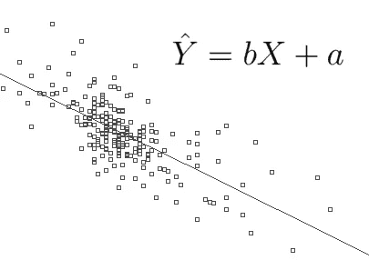

# 单输入线性回归

> 原文：<https://medium.com/analytics-vidhya/linear-regression-with-one-input-ee51d458552f?source=collection_archive---------19----------------------->



来源:维基共享资源(Loi_d ' Okun.png:用户:gribecoderivework:—Jtneill—Talk【公共领域】)

线性回归通常是许多 ML 爱好者开始的第一个话题。这将回顾单输入线性回归背后的基本数学，以及如何用 python 实现它。

新年伊始，我挑战自己每天学习一个新的 ML 相关概念。我的灵感来自我在 Reddit 上看到的一个帖子。它从各种模型的基本线性回归开始。现在我开始深入算法背后的数学，并开始实现我自己的算法。在第一个主题中，我将讨论单输入线性回归。

# **什么是线性回归？**

简单来说，线性回归就是求解 y = mx + B 中的 m 和 B，在整个中学阶段，当你求解直线方程时，你实际上是在做线性回归。那么我们从哪里开始呢？除了导入数据，第一步是实现假设函数或 y = mx + B。

```
**def** hypothesis(x, m, b):
    p = list()
    **for** i **in** x:
        p.append(i * m + b)
    **return** p
```

在这种情况下，我们只需将向量 x 乘以 m，再加上 b，就可以得到 y 向量。

下一部分是评估我们对 m 和 B 的猜测与实际值相比有多好。一种方法是实现成本函数，即假设值和期望值之间的均方差。如果你还不明白那是什么意思，没关系，我会先看一下代码，然后再看一个例子。

```
**def** cost_function(x, y, m, b):     
  c = 0     
  **for** i **in** range(len(x)):         
    h = m * x[i] + b         
    loss = h - y[i]         
  c += loss**2     
  **return** (1/len(x) * 0.5 * c)
```

我们的成本函数的一般目的是确定我们的参数做得有多好。如果我们绘制成本函数，我们得到它是一个凸函数，这意味着有一个点，在那里有一个全局最小值。这就是为什么我们使用梯度下降。梯度下降让我们慢慢地向下移动成本函数，直到我们找到局部极值。

```
**def** gradient_descent(x, y, m, b, alpha, iter):
    z = len(y)
    theta_hist = []
    cost_hist = []
    **for** i **in** range(iter):
        h = hypothesis(x, m, b)
        grad_m = 0
        grad_b = 0
        **for** j **in** range(z):
            grad_m += (h[j] - y[j]) * x[j]
            grad_b += h[j] - y[j]

        m = m - alpha * grad_m
        b = b - alpha * grad_b
        theta_hist.append([m,b])
        cost_hist.append(cost_function(x, y, m, b))
    **return** theta_hist, cost_hist
```

上面的函数计算成本函数下移多少。一般形式是 B = B(old) — alpha * sum(h — y)其中 alpha 是学习率，我们将预测值和实际值之间的差异相加。m 是一样的，除了我们把α乘以当前的 x 值。

剩下的就是把所有的东西结合在一起。

```
**import** **numpy** **as** **np #use numpy to generate random list**
np.random.seed(42)
x = 2 * np.random.rand(100,1)
np.random.seed(41)
y = 4 + 3 * x + np.random.randn(100,1)
x = list(x)
y = list(y)t_history, t_cost= gradient_descent(x, y, 0, 0, 0.05, 50)theta = t_history[-1]
```

其中θ是具有最终 m 和 b 值的列表。

感谢您阅读我第一篇关于不使用任何库实现线性回归的文章。我想我会用多元线性回归做同样的事情，但是我会用 numpy，因为向量和矩阵运算太难了。