# 用 Python 从头开始线性回归

> 原文：<https://medium.com/analytics-vidhya/linear-regression-with-python-from-scratch-aa2ba12c117f?source=collection_archive---------15----------------------->


用 Python 进行机器学习

有三种类型的机器学习类别:

1.  监督学习
2.  无监督学习
3.  强化学习

线性回归算法属于监督学习的范畴，在这一范畴中，我们得到了数据中每个例子的“正确答案”。线性回归是最简单的学习算法，它通过从给定的先前数据中学习来帮助预测正确的答案。

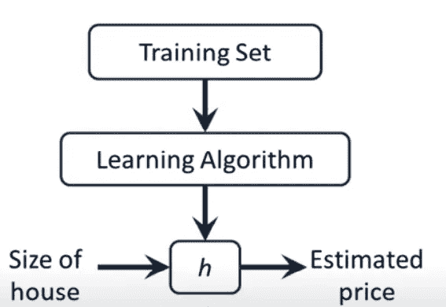

线性回归框图(图 1)

这里基本上“h”是我们的假设函数，该函数给出如下:

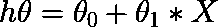

图 2

这个函数基本上预测 Y 是 X 轴在 X 上的某个直线函数。这个模型被称为一元线性回归或一元线性回归，因为这里只有 X 个变量。我们必须找到θ_ 0 和θ_ 1 的最佳可能值，这样我们就可以在数据上拟合最佳可能的线性线，如下图所示。

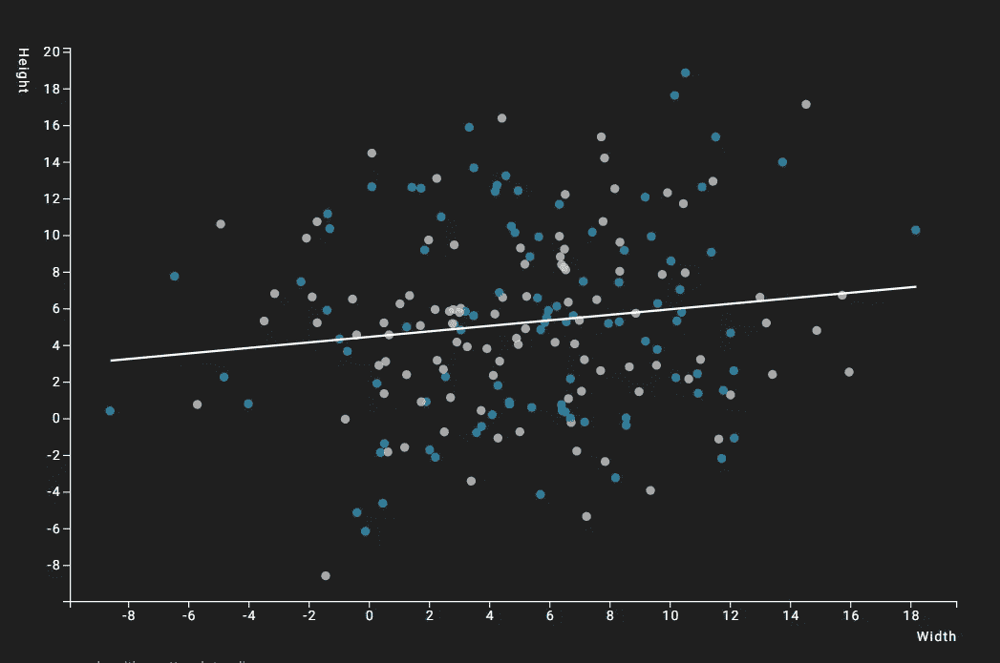

图 3

## 模型表示

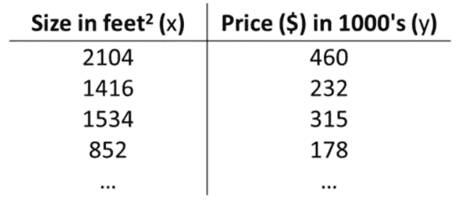

图 4

**符号:**

m =训练示例的总数[例如:2104，1416，1534，852，…]

n =特性总数[例如:以英尺为单位的尺寸(X)，千片订量的价格(Y)]

**参数:**


这里θ_ 0 和θ_ 1 是参数

> 我们的座右铭是选择θ_ 0 和θ_ 1，因此对于我们的训练示例(x，y)，该假设接近 y

为了获得假设函数的最佳值，我们将使用一个成本函数来最小化θ的值，这将给出最符合给定数据的θ的最佳值。

## 成本函数/平方误差函数

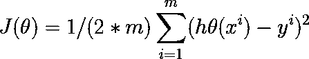

线性回归的代价函数(J)是预测 y 值(pred)和真实 y 值(y)之间的**均方根误差(RMSE)** 。

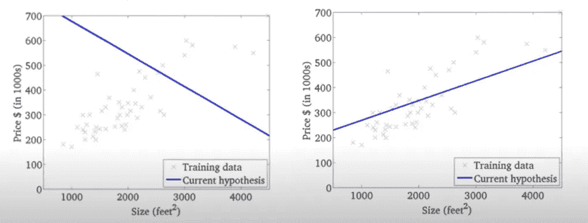

图 5

在上面图像的左侧，在**最小化θ[Theta]的值**之后，该线对数据拟合得不好。在图像的右侧，我们得到该线对数据拟合得很好的图形。

## 梯度下降

梯度下降是一种优化算法，用于找到使成本函数(cost)最小化的函数(f)的参数值。

用于最小化 J(θ_ 0，θ_ 1)

**概要:**

1.  从θ_ 0 和θ_ 1 的某个值开始[ **比如θ_ 0 = 0&θ_ 1 = 0**
2.  不断改变θ_ 0 &θ_ 1 以减小 J(θ_ 0，θ_ 1)，直到我们有希望达到最小值。

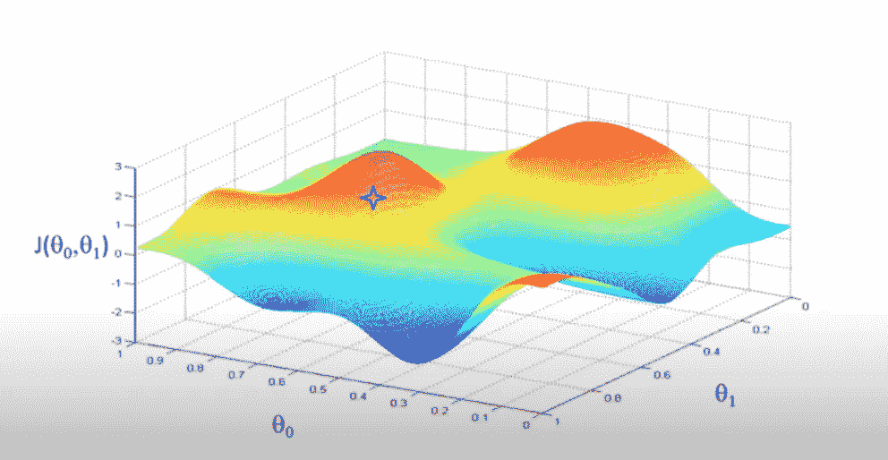

图 6

在上图中，星号是θ随机值。有时，我们从零值开始，这只是一个例子。在将 aθ的值随机初始化或初始化为零后，它将环顾平面，算法将向收敛方向迈一小步。在迈出一小步后，它将从新的位置再次迈出一小步，这样，它将收敛到局部最优。让我们直观地看看这个。

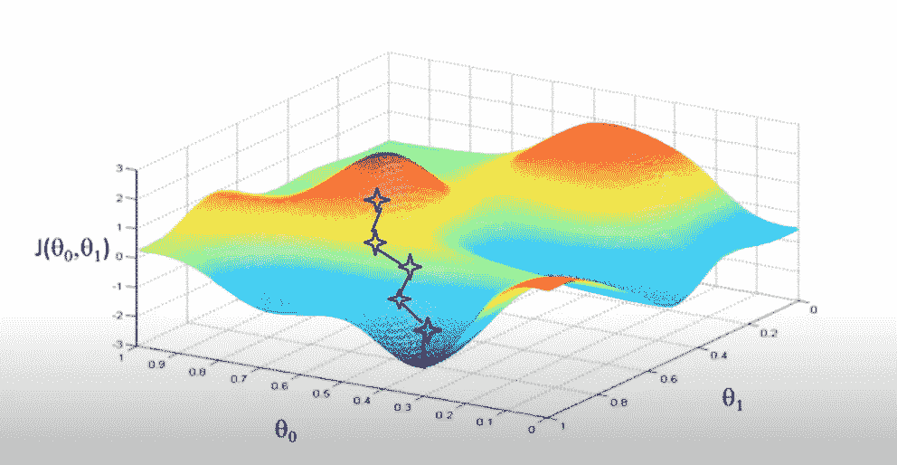

图 7

这样，它现在收敛到局部最优，看算法。

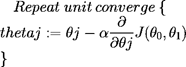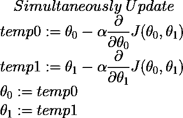

**上述方程的推导**:

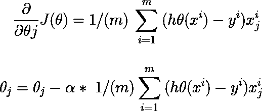

> *这里α[alpha]是我们的学习率。*

如果α[alpha]太小，渐变会很慢，因为它需要一步一步地更新。如果α[alpha]太大，梯度下降可能超过局部最优，并且可能无法收敛甚至发散。


图 8

所以尽量选择α[alpha]的值，比如 0.001，0.003，0.01，0.1，…

## **用 python 实现**

我们将看到并尝试预测出租车的出租车费数据集。

**导入包**

```
import pandas as pd
import numpy as np
import matplotlib.pyplot as plt
```

**导入数据集**

```
data = pd.read_csv("cab_fare.csv")
data.head()ID  Distance  fare_amount  passenger_count          
       "0        0  5.393882         15.0              1.0  
       "1        1  0.014134         52.0              6.0  
       "2        2  5.523719         15.5              1.0  
       "3        3  1.392056          6.5              1.0  
       "4        4  4.150647         11.0              1.0  
       "...    ...       ...          ...              ...                      
       "16044  122  1.962983          8.1              1.
       "16045  123  3.400518         12.5              2.0                      
       "16046  124  1.617977          8.5              1.0                     
       "16047  125  2.466481          8.0              1.0                      
       "16048  127  1.498280          8.5              1.0
```

**将数据拆分成 X 和 Y** 和**并转换成矩阵**

```
X_1 = data.drop(['fare_amount','pickup_datetime','ID'],axis=1)
y_1 = data['fare_amount']
Y_1 = np.expand_dims(Y_1,axis =1 )X = np.matrix(X_1)
X.shape = (16049, 2)Y = np.matrix(Y_1)
Y.shape = (16049, 1)m,n = X.shape           #m =16049 n =2X0 = np.ones((m,1))
X = np.hstack((X0,X))   #Concatenating X0 is our bias and our X
```

**初始化θ[theta]的值**

```
theta = np.zeros((n+1,1))  # initially assigning the value to zeros
print(theta)[[0.]
 [0.]
 [0.]]
```

**创建我们将在程序中使用的函数**

```
def prediction(X,theta): prediction = X*theta
    return predictiondef cost(y,pred): m,n = y.shape
    J = (1/(2*m))*(np.sum(np.square(pred - y)))
    return Jdef grad(X,prediction,y):

    g = (1/m) * (X.T * (prediction - y))
    return gdef LinearRegression(X,y,theta,alpha,epoch):

    j_history=[]

    for i in range(epoch):

        pred = prediction(X,theta)
        J = cost(y,pred)
        g = grad(X,pred,y)

        theta = theta - alpha*g

        j_history = np.append(j_history,J)

        print("Epoch : ",i," ","cost : ",J)

    x = np.linspace(0,epoch,epoch)
    plt.ylabel("cost function")
    plt.plot(x,j_history,color='r')
    plt.xlabel("No. of iterations")
    plt.title("Decreasing of cost function")

    return theta,pred
```

**调用函数**

```
theta,pred = LinearRegression(X,y,theta,alpha = 0.03,epoch = 1000)Epoch :  0   cost :  107.22753436974266
Epoch :  1   cost :  14.868966072066558
Epoch :  2   cost :  10.872687041778397
Epoch :  3   cost :  10.66332230545673
Epoch :  4   cost :  10.61995377513655
Epoch :  5   cost :  10.586946000902037
Epoch :  6   cost :  10.557104107786772
Epoch :  7   cost :  10.529680767063443
Epoch :  8   cost :  10.504281786250193
Epoch :  9   cost :  10.480591591287318
Epoch :  10  cost :  10.458350239402089
Epoch :  11  cost :  10.437343188331878
Epoch :  12  cost :  10.417393249074857
Epoch :  13  cost :  10.3983539796047
Epoch :  14  cost :  10.380104249118626
Epoch :  15  cost :  10.362543764862313
Epoch :  16  cost :  10.345589391029318
Epoch :  17  cost :  10.329172119456064
Epoch :  18  cost :  10.3132345766786
Epoch :  19  cost :  10.297728972361188
Epoch :  20  cost :  10.282615410929923
Epoch :  21  cost :  10.267860502088192
Epoch :  22  cost :  10.253436217282786
Epoch :  23  cost :  10.239318948563623
.
.
.
..
Epoch :  999 cost :  9.357530142476707
```

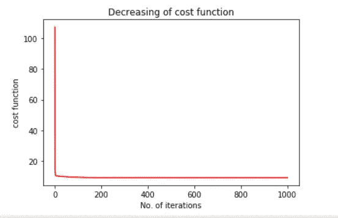

我们可以在上面的图像中看到，随着纪元的进行，值在减少。

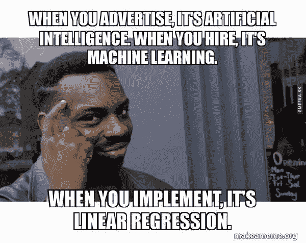

如果你没有看过我之前关于 K-means 聚类的博客，点击这个链接:[https://medium . com/analytics-vid hya/K-means-clustering-with-python-77 b 20 c 2d 538d](/analytics-vidhya/k-means-clustering-with-python-77b20c2d538d)

如果你觉得这篇文章有帮助，请鼓掌👏拍手可以让更多的人看到一个帖子。