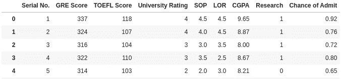

# 张量流线性回归

> 原文：<https://medium.com/analytics-vidhya/linear-regression-with-tensorflow-161f35a6ef3f?source=collection_archive---------18----------------------->

## **万物张量流**


照片由[埃纳耶特·拉希姆](https://unsplash.com/@raheemsphoto?utm_source=medium&utm_medium=referral)在 [Unsplash](https://unsplash.com?utm_source=medium&utm_medium=referral) 上拍摄

所以，你知道数学，你知道如何回归你的数据，你也知道如何用 Scikit-Learn 或 Statsmodels 在 python 中实现它们，这对于解决任何回归问题可能都是绰绰有余的。但是，不如我们更进一步，使用“非常神奇”的张量流，以非常传统的方式执行线性回归？

我的名字是 Pranab，这是我(希望)关于数据科学、机器学习和统计的许多文章中的第一篇。通过这篇文章，我想解释我用 [Tensorflow](https://www.tensorflow.org/) 执行线性回归的方法。我将分享每一行代码，同时描述它们背后的逻辑解释。

我们将使用研究生入学数据集，可以在这里下载。我们将建立一个简单的线性回归模型，只有一个预测变量

> 这里的目标不是建立一个性能最佳的模型，而是尝试使用 tensorflow 来解释这个模型

**首先要做的事情**

```
import numpy as np
import pandas as pd
import tensorflow.compat.v1 as tf
tf.disable_v2_behavior()
```

因为我们将在这里使用 tensorflow v1，所以我们在第 4 行禁用 v2

**我们来看看数据**

```
data = pd.read_csv('Admission_Predict.csv')
data
```



数据

在接下来的步骤中，我们将建立一个简单的线性回归模型，以' *GRE 分数'*为预测因子，预测'*录取机会'*变量。在简单的数学中，我们想建立等式

**Y = WX + B** ，其中

Y =目标变量
X =预测变量
W =权重
B =偏差项

**声明占位符**

在 tensorflow 中，我们从定义占位符和变量开始。
**占位符**是 tensorflow 声明用于训练模型的特征的方式。在这种情况下， **X** 和 **Y** 是占位符，或者换句话说，分别来自数据集的“ *GRE 分数*”和“*录取几率*”。在训练模型时，我们在梯度下降的每一步中输入这两个特征的值。稍后我会详细讨论这一点。

```
num_features = 1
x = tf.placeholder(dtype=float, shape=(None, num_features))
y = tf.placeholder(dtype=float)
```

shape 属性定义提供给 x 的输入矩阵的形状。在这种情况下，由于我们正在训练单变量线性回归，因此 num_features 设置为 1

**声明变量**

tensorflow 中的变量是经过训练的变量。在我们的例子中， **W** 和 **B** 。
*这些是 tensorflow 变量，确保不要将它们与 python 变量混淆* 变量需要用某个值进行初始化。最常见的做法是给它们分配随机值

```
W = tf.Variable([tf.random_normal(shape=[num_features,1])])
B = tf.Variable(0.05)
```

**建立关系**

一旦我们完成了变量和占位符的声明，我们需要建立它们之间的关系，即 ***Y = WX + B.*** 之后，我们定义误差函数(损失函数)和我们用来减少损失的优化器

```
#perform matrix multiplication and predicted y
xW = tf.matmul(x, W)
ymodel = tf.add(xW, B)#calculate error aka loss function
error = tf.reduce_sum(tf.square(y-ymodel))

#define optimizer. In this case gradient descent
optimizer = tf.train.GradientDescentOptimizer(0.00001)
train = optimizer.minimize(error)
```

我们使用 global_variables_initializer 对象来初始化所有变量

```
init = tf.global_variables_initializer()  
sess.run(init)
```

**进给数据和训练**

我们首先使用 Sklearn 的 StandardScaler 方法标准化我们的数据，并在嵌套 for 循环的帮助下迭代每个历元的每个示例(也称为[随机梯度下降](https://en.wikipedia.org/wiki/Stochastic_gradient_descent)),并将它们馈送到我们的占位符‘x’和‘y’

```
scaler = StandardScaler()
x_data = scaler.fit_transform(data['GRE Score'])
y_data = data.iloc[:,8]
training_epochs = 500for epoch in range(training_epochs): 
    for (_x, _y) in zip(x_data, y_data): 
        sess.run(train, feed_dict = {x : _x.reshape(1,num_features),     y : _y})
```

让我们也打印出每 10 个时期的损失和变量值

```
 if (epoch + 1) % 10 == 0: 
        c = sess.run(error, feed_dict = {x : x_data, y : y_data}) 
        print("Epoch", (epoch + 1), ": cost =", c/x_data.shape[0], "W =", sess.run(W), "b =", sess.run(B))
```

运行上面的代码片段后，模型将自我训练，并且应该显示每 10 个时期的损失。下面显示了**损失与时期**的关系图，我们可以清楚地看到收敛


损失与时代

为了对新数据进行预测，我们首先保存训练变量 **W** 和 **B** ，并将我们的测试数据输入等式 **Y = WX + B.**

```
weight = sess.run(W) 
bias = sess.run(B)def predict(x, w, b):
    predictions = np.dot(x,w) +b
    return predictionsy_hat = predict(x_data, weight, bias)
```

我们可以用下图所示的散点图交叉检查我们的预测值和原始值


最佳拟合线

这就把我们带到了文章的结尾。您可以在这个 github 链接中的[tensor flow 中找到一个通用代码来执行简单和多重线性回归](https://github.com/Pranab1011/tensorflow_for_everything/blob/main/Regression_with_tensorflow.ipynb)

在我的下一篇文章中，我将讨论在 tensorflow 中使用逻辑回归执行分类任务。

在那之前，谢谢你，注意安全

> *我们的建筑也是一个动词*——马修·麦康纳**