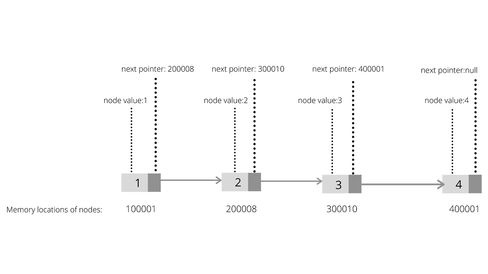
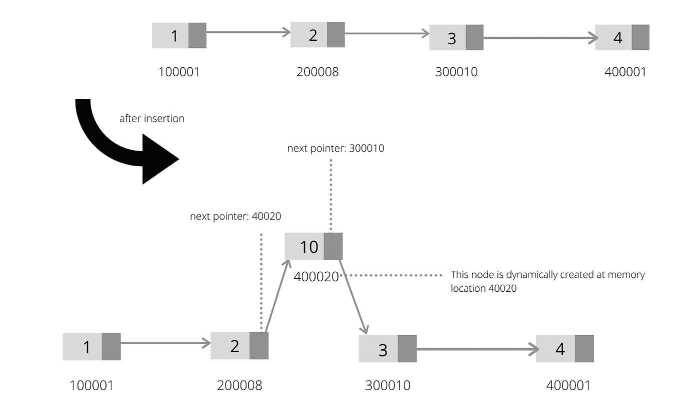

# 面向初学者的链表

> 原文：<https://medium.com/analytics-vidhya/linked-lists-for-beginners-77a1b8e5c9a5?source=collection_archive---------18----------------------->

## 什么是链表？

链表只是一个数据节点序列，其中每个节点指向另一个节点。链表的起始节点称为头节点。每个节点都有一个数据值和一个指向它旁边节点的指针。所以基本上，我们只需要知道链表的头节点就可以访问它的任何元素。



## 链表和数组有什么不同？

数组是存储在连续内存位置的元素的集合，而链表中的节点可以存储在不同的内存位置，如上图所示。我们可以通过索引直接访问数组中的任何元素，相反，链表必须从头节点开始遍历才能访问特定的节点。话虽如此，在链表中插入/删除新元素要容易得多，因为在数组中，插入或删除元素会导致数组的一部分移位。数组是静态的，也就是说，创建一个数组意味着你保留了计算机内存的某个固定部分，这个部分有时可能不够用，有时可能会闲置。链表本质上是动态的，这意味着节点可以在随机的内存位置、任何地方和任何时间从我们计算机的未使用内存池中创建。然而，链表中的节点需要额外的内存空间来保存指向下一个节点的指针值。因此，链表可以更好地利用内存，但是在访问特定节点时代价更高。

## **遍历链表:**

链表的特征仅仅在于它的头节点。我们可以遍历链表，访问每个节点的 *next* 指针，从头节点开始，不断循环，直到找到不指向任何内容的节点，即其 *next= NULL* 。这就像通过几个车站到达一个地址，每个车站都有到另一个车站的地址，这个过程最终会把你带到你的最终目的地。

## **在链表中插入/删除:**



假设我们在第二个和第三个节点之间插入一个节点。

*   找到第二个节点，即遍历列表，直到找到第二个节点。
*   创建一个新节点。这里，一个新的节点是在一个随机的内存位置动态创建的，比如说 40020。
*   最初，第二个节点的 next 指向第三个节点。现在，第二个节点的 next 应该指向新创建的内存位置，即 40020。
*   新创建的下一个节点应该指向第三个节点，即 300010。

删除节点可以用类似的方式完成。

## 使用 Python 实现链表:

```
class node : 
 def __init__(self, value=None):
  self.value=value 
  self.next=None#lets make our own linked list 
class MyLinkedList:
 def __init__(self):
  self.head=None #This is to check if the linked list is empty.
 def is_Empty(self):
  if self.head==None:
   return True
 else:
   return False#This is to add a new nodes to our linked list
 def add_node(self,data): 
  new_node= node(data) 
  if self.is_Empty():
   self.head=new_node 
  else:
   tmp_node=self.head 
   while (tmp_node.next): 
    tmp_node=tmp_node.next
   tmp_node.next=new_node   def add_begining(self,data):
   new_node=node(data)
   if self.is_Empty():
    self.head=new_node
   else:
    start_node=self.head
    self.head=new_node
    new_node.next=start_node def show_list(self):
   start=self.head 
   while start is not None:
    print(start.value)
    start=start.nextmy_list = MyLinkedList() 
my_list.add_node(4)
my_list.add_node(3)
my_list.add_begining(1)
my_list.add_begining(2)
my_list.show_list()
```

用 python 实现链表也会帮助你更好地理解 OOP 的概念。您将了解我们如何创建自己的类，创建自己的对象，以及这些对象如何调用类函数。为了方便起见，我将解释代码的每一部分。

让我们开始…

```
class node :
 def __init__(self, value=None):
  self.value=value
  self.next=None
```

类*节点*被定义为具有两个属性:一个*值*，保存节点的实际值；一个*下一个*，保存指向其下一个节点的引用/指针。 *__init__()* 函数被称为构造函数，当类*节点*的任何对象被创建时自动调用。该函数初始化所创建节点的属性。无论何时创建任何节点，它都是独立的，直到我们将它添加到一个列表中，这就是为什么我们将它的 *next* 初始化为 null。函数中的 *self* 参数是调用该函数的对象的指针。

```
class MyLinkedList:
 def __init__(self):
  self.head=None#This is to check if the linked list is empty.
 def is_Empty(self):
  if self.head==None:
   return True
 else:
   return False#This is to add a new nodes to our linked list
 def add_node(self,data): 
  new_node= node(data) 
  if self.is_Empty():
   self.head=new_node 
  else:
   tmp_node=self.head 
   while (tmp_node.next): 
    tmp_node=tmp_node.next
   tmp_node.next=new_nodedef add_begining(self,data):
   new_node=node(data)
   if self.is_Empty():
    self.head=new_node
   else:
    start_node=self.head
    self.head=new_node
    new_node.next=start_nodedef show_list(self):
   start=self.head 
   while start is not None:
    print(start.value)
    start=start.next
```

当创建类 *MyLinkedList* 的任何对象时，调用 *__init__()* 函数。我们上面定义的类，即*节点*用于创建节点，而类 *MyLinkedList* 用于创建一个链表，其中*节点*对象可以被添加以形成一个列表。如前所述，对于一个链表来说，仅仅一个头就足以表征其自身，这意味着如果我们知道头节点，那么列表中的所有节点都可以被访问。每当 *MyLinkedList* 的对象被创建时(每当 *__init__()* 被调用时)，就会创建一个空列表，其*头*指向 null。

如果列表为空，函数 *is_Empty()* 返回 True，否则返回 False。当列表被初始化时，它的*头*被设置为空，这意味着*头*不是*节点*而是空的。如果没有节点被添加到列表中，那么*头*必须为空。

函数 *add_node()* 用于在列表末尾添加一个新节点。可能有两种情况:要么我们添加一个空节点，要么我们在一个非空列表的末尾添加一个新节点。如果列表为空，那么我们必须将新节点作为列表的*头*。如果列表不为空，那么我们必须遍历列表的结束节点，然后将新节点添加到列表中。

```
my_list = MyLinkedList() 
my_list.add_node(4)
my_list.add_node(3)
my_list.add_begining(1)
my_list.add_begining(2)
my_list.show_list()
```

这里， *my_list* 是类 *MyLinkedList，*的对象，它调用该类的 __init__()函数，并将其头初始化为 null。类似地，对象 *my_list* 调用 *add_node()* 函数，一个节点被添加到列表中。使用 *show_list()* 功能可以将列表打印出来。

感谢阅读！