# 链接列表— Idea

> 原文：<https://medium.com/analytics-vidhya/linked-lists-idea-256837d6ae3b?source=collection_archive---------24----------------------->

在数组中，所有的元素都需要连续存储。让我们来看看这个阵列的一些缺点——

1.  增加阵列非常耗时；每当大小增加时，先前的元素被复制到新的位置，以便元素是连续的。
2.  删除时，被删除数字后面的元素提前一个位置。

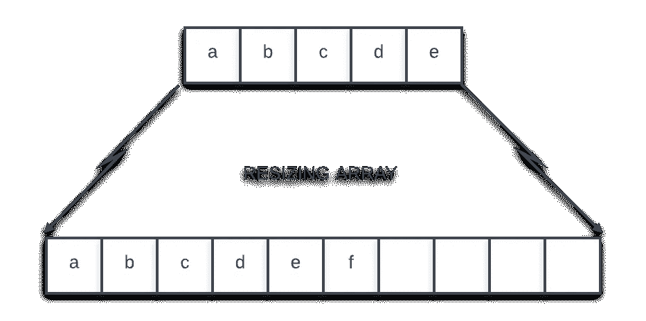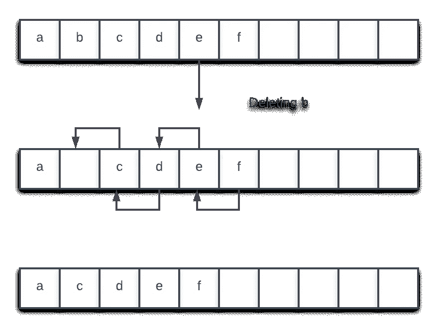

上述两个过程都需要 O(N)(线性)时间。如果我们需要在常量时间内执行插入和删除操作呢？为此，我们使用一个名为链表的数据结构。这是一种线性数据结构。

# 链表的概念

我们需要一个数据结构来在固定时间内在给定位置插入和删除一个元素。链表的思想是将元素存储在不同的位置，并用指针将它们与上一个和下一个元素连接起来。指针是存储地址的变量。

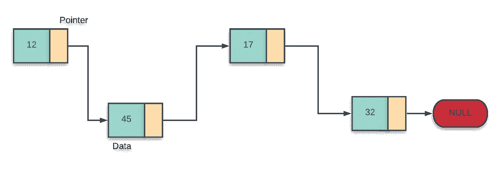

黄色部分是存储下一个节点(块)地址的指针。最后一个块的指针值为 NULL，这意味着它不指向任何东西。我们通常存储第一个块的地址，称为链表的头。

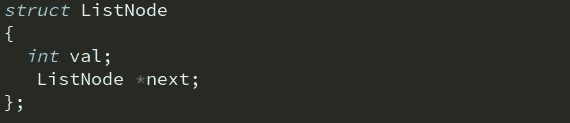

# 插入

可以在很多地方插入—

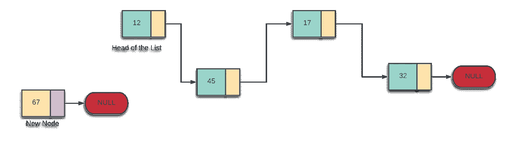

## 1.起初

新节点开始指向列表的头部，并成为新的头部。

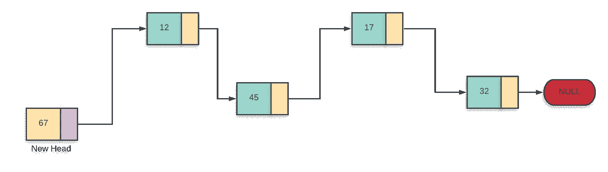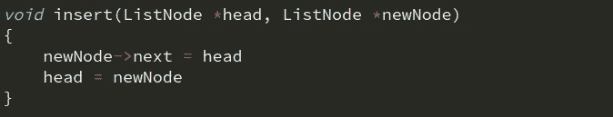

## 2.最后

最后一个节点开始指向新节点，新节点成为最后一个节点。

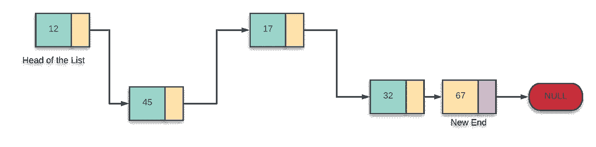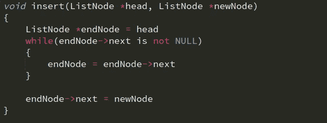

## 3.在给定的位置

给定节点后，我们需要在给定节点后插入节点。如果位置给定了，我们需要找到节点，之后我们必须插入它。
假设我们必须在第二个节点后插入节点-

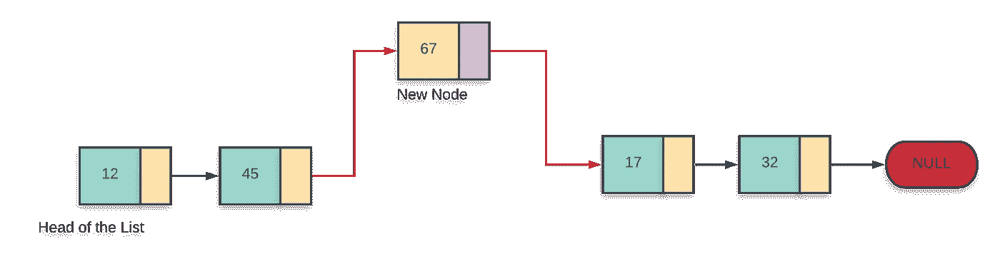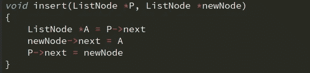

第二个节点现在指向新节点，新节点指向第三个节点。
以上所有操作在插入时都需要恒定的时间。搜索一个节点需要线性时间；如果我们想在插入过程中找到一个节点，这将需要线性时间。

# 删除

同样的删除方式可以在三个位置进行。

## 1.删除第一个节点

将第二个节点作为新的头部，然后删除前一个头部。

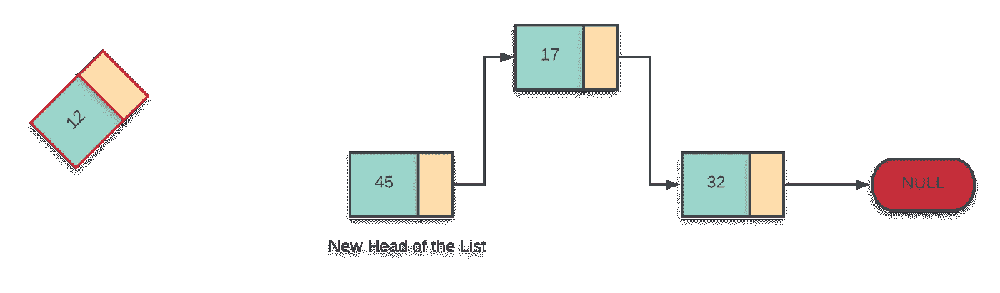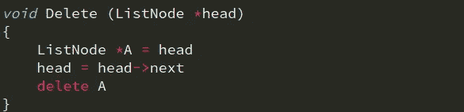

## 2.删除最后一个节点

最后一个节点之前的节点开始指向 NULL，最后一个节点被删除。

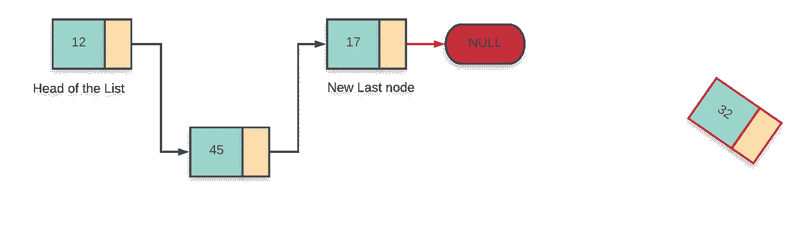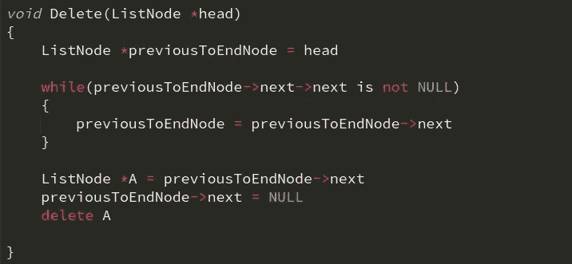

## 3.删除给定节点

假设我们要删除第二个节点。我们将使第一个节点指向第三个节点；这就是为什么第二个节点不属于这个列表的原因。然后它将被删除以释放内存。

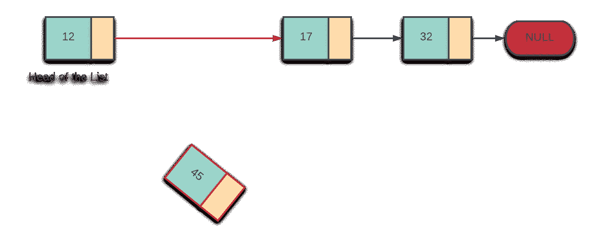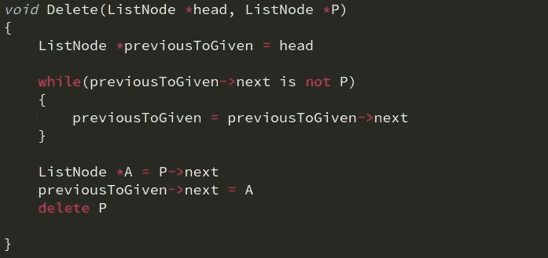

这些操作也需要恒定时间。

# 搜索

在链表中搜索总是花费线性时间，因为我们必须去检查每个元素。

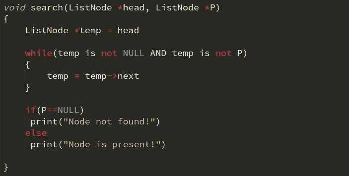

# 与数组的比较

链表提供了在固定时间内插入和删除的优势，但是在不使用额外资源的情况下，随机访问给定位置的元素是困难的。这是链表的一个缺点。希望你喜欢学习。