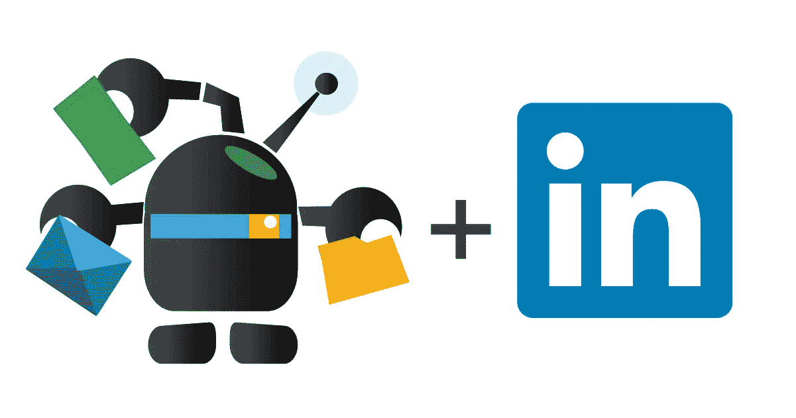
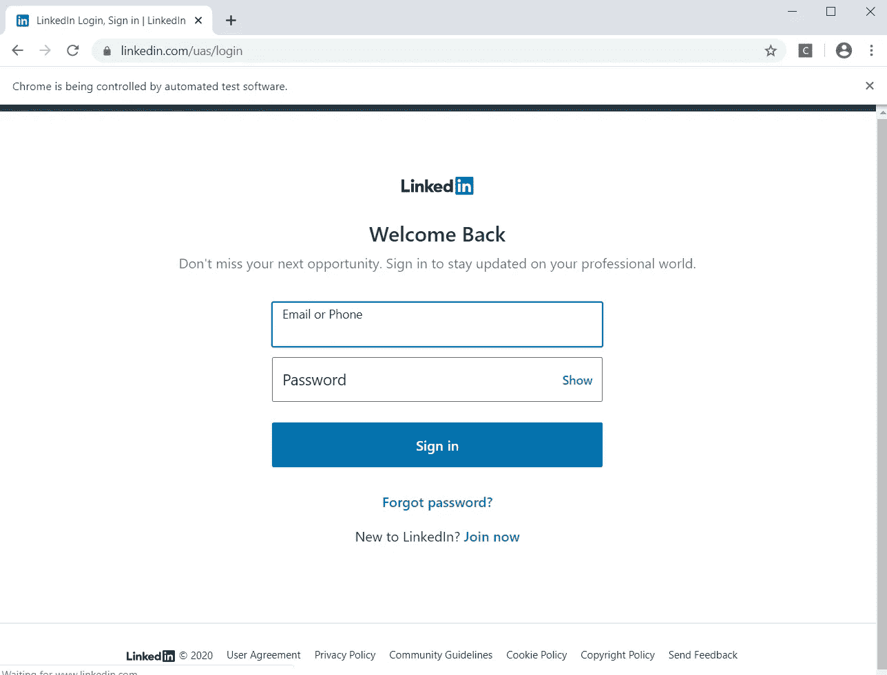
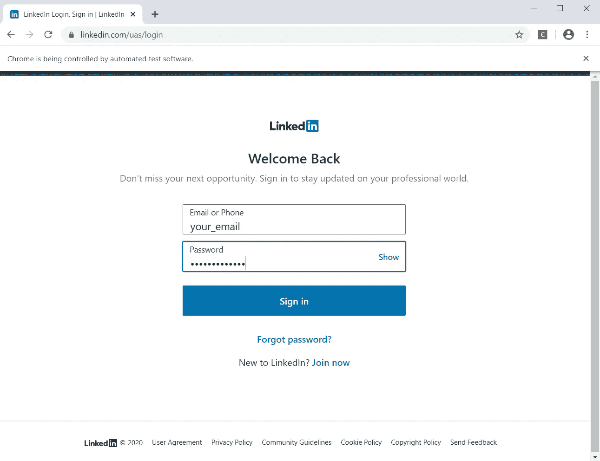

# Linkedin Bot(使用 Selenium 的 Web 自动化)

> 原文：<https://medium.com/analytics-vidhya/linkedin-bot-web-automation-using-selenium-4d1fe011dd90?source=collection_archive---------16----------------------->



# **概述**

这篇文章是关于强大的 web 自动化库 Selenium 和它在 python 中自动登录不同的著名社交媒体网站的实现。有时花时间登录你的社交媒体并记住凭证是值得的。Web 自动化是当今最热门的领域之一，被大规模的组织用来自动化他们不同的过程。

但是对于今天的文章，我们只考虑 *Linkedin* 在网络自动化的帮助下自动登录。

将要使用的工具/库如下
**python****selenium****time****chrome 驱动**

# 按照以下步骤开始

1.  下载 Chrome webdriver，使 Selenium 能够与您的浏览器连接。
2.  转到[http://chromedriver.chromium.org/downloads](http://chromedriver.chromium.org/downloads)
3.  根据您的浏览器版本下载所需版本的网络驱动程序
4.  现在提取下载的 zip 文件并复制。exe 文件复制到 Python 主目录中

# 让我们开始编码吧

a.创建 Linkedin.py 文件
b .导入库(*假设您已经安装了上面提到的库*

```
from selenium import webdriver
from selenium.webdriver.common.keys import Keys
import time
```

c.创建一个名为 Linkedin 的类，并在其中创建一个函数，用你的*用户名*、*密码*作为参数登录。

```
class Linkedin:
    def __init__(self,username,password):
        self.username=username
        self.password=password
        self.bot=webdriver.Chrome(PATH_TO_BROWSER_DRIVER)
```

在 *webdriver.chrome()* 中给出你的 chrome 驱动的路径

d.在名为 login 的同一个类中创建一个函数

```
def login(self):
        bot=self.bot
        bot.get("https://www.linkedin.com/uas/login")
        time.sleep(3)
        email=bot.find_element_by_id("username")
        email.send_keys(self.username)
        password=bot.find_element_by_id("password")
        password.send_keys(self.password)
        time.sleep(3)
        password.send_keys(Keys.RETURN)
```

这里 *bot.get* 将获得 linkedin 的 url，3 秒钟后，bot 将通过 id“username”找到元素，它将填充您提供的用户名。

e.现在调用上面的类并按 login

```
load=Linkedin("your_email","your_password")
load.login()
```

f.现在一切都完成了，键入下面的命令来执行

```
$ python3 Linkedin.py
```

同样，你可以使用相同的概念自动登录到几个社交媒体账户。

# **结果**

当我们运行代码时，selenium 将打开 chrome 驱动程序。


之后它会自动输入 linkedin 的链接



然后输入用户给的**电子邮件**和**密码**，点击**登录。**



# 暂时就这样吧！

希望这篇文章能对想学习 web 自动化的人有所帮助。