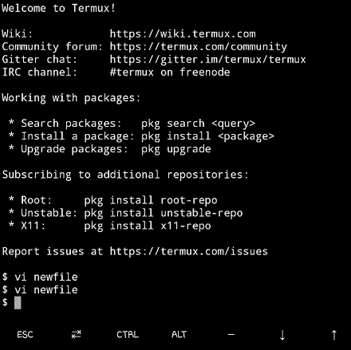
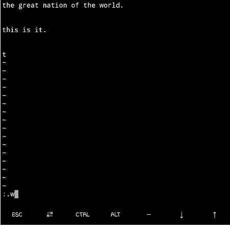
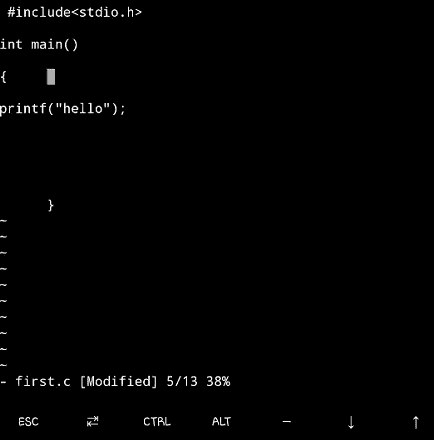

# LINUX 第 1 卷—VI 编辑器

> 原文：<https://medium.com/analytics-vidhya/linux-volume-1-the-vi-editor-9e328579838?source=collection_archive---------13----------------------->

> LINUX 的 VI 编辑器都在一个编辑器中，因为它能让你得到你想要的任何东西。这里是如何**——纳根德拉辛格亚达夫**

[赛·基兰·阿纳加尼](https://unsplash.com/@_imkiran?utm_source=unsplash&utm_medium=referral&utm_content=creditCopyText)在 [Unsplash](https://unsplash.com/s/photos/linux?utm_source=unsplash&utm_medium=referral&utm_content=creditCopyText) 上的照片

你所能做的就是创建任何语言的任何程序，然后用一个扩展名保存它，宾果你已经创建了你的程序，现在运行它并到处玩。

M**VI 编辑器中的 odes—**

Vi 编辑器拥有如下所述的 3 种模式—

VI 编辑器中的照片模式(照片来源 MS word)

1.  **插入模式—** 在此模式下，用户可以随时编辑、更新和删除数据。要进入插入模式，请按键盘上的 insert 键。
2.  **命令模式—** 在此模式下，我们可以执行各种操作，例如将光标从一个位置移动到另一个位置，或者搜索左括号。默认情况下，VI 编辑器加载到命令模式。

**Esc —** 该键用于从插入模式切换到命令模式。

**3。执行模式—** 使用冒号键(:)调用该模式。使用这种模式，可以编译或执行程序。

**: —** 该键用于从命令模式切换到插入模式。

在**执行模式下*(。点)*** 代表光标所在的当前行。

**注意—** 每种模式的使用取决于上述模式中使用的命令。

> *在 VI 编辑器中，要多次重复一个字符，你需要在**模式下插入******，*首先键入一个字符> 60a* > Esc 键。***

***这里的 ***60a**** 是指在屏幕上追加 *** 60** 次。因此，*将在屏幕上打印 60 次。***

********** 在VI 编辑器中，一个段落用一个空行来表示。在 windows 中，回车键代表一个新的段落。你必须在 VI 编辑器中按两次回车键来创建一个新的段落。***

********** 在 VI 编辑器中句子都以一个( ***)结束。*** )点号，或者 ***！*** )还是( ***？*** )。***

*******$*** 代表文件的最后一行。***

***OVI 中的**运算符—*****

***VI Editor 最强的特性是可以在命令模式下使用命令的组合。***

******运算符*** 如下所述—***

1.  ******d*** -删除(数据删除后保持命令模式)。***
2.  ******y***——代表 ***猛拉*** 或 ***复制*** *。****
3.  ******c*** -更改(删除数据，模式从 ***命令模式更改为 ***插入模式*** )。******
4.  ***！-过滤器***

******注:*** 一个 ***操作符*** 不能执行任何功能，但与一个命令一起工作或者操作符本身被使用两次。当操作符被使用两次时，它就会起作用，或者可以在当前行上看到效果。***

***H**VI 编辑器长什么样？*****

***我使用 Turmux 作为 Linux 来演示命令。这款应用程序可以从 play store 下载，在 android 和 iPhones 上是免费的。虽然程序的编译确实需要安装，但只需按照应用程序中说明的步骤进行即可。***

******

***照片-VI 编辑器***

******

***照片-VI 编辑器处于初始阶段***

***C熊出没移动键—***

***一般来说，人们可以在键盘上看到那些箭头键，称为 ***箭头键*** 。光标移动键或 ***箭头键*** 正在命令模式下使用。它们是 ***的四种类型*** 如:***

1.  *****h** —将光标向左移动一个字符。***
2.  *****k** —将光标向上移动一个字符。***
3.  *****l** —将光标向右移动一个字符。***
4.  *****J** —将光标下移一个字符。***

***C 程序的编译—***

******

***图 Linux 中 C 语言的编译器类型***

******cc*** 和 ***gcc*** 编译器总是返回 ***a.out*** 文件作为目标文件。编译时，如果发现错误，将生成一个. out 文件。***

***C**c++程序的编译—*****

******

***图 Linux 中 C++的编译器类型***

***C++和 G++编译器总是将 ***a.out*** 文件作为目标文件返回。编译时，如果发现错误，将生成一个. out 文件。***

***E **xtras for a.out 文件—*****

***在多用户登录的情况下，如果所有用户都编译了他们的程序，那么最后编译的程序 ***a.out 文件将被执行*** ，因为 Linux 是基于网络的操作系统。***

## *****用户自定义输出文件生成—*****

***`*myprogram.c -o myprogram.out*`***

******-o** 用于指定用户自定义的输出文件名。***

## ***来执行上面的文件—***

***`*./myprogram.out*`***

****这将执行您的程序。***

## *****我们为什么用(。/Filename)执行程序时？*****

***(。符号)表示用户的根目录，它稍后搜索 bin 目录并执行 a.out 文件。每个程序都是在调用 bin 目录路径后执行的。***

## *****我不想用(。/文件名)—*****

***如果是这样，你必须在你的 ***home*** 目录下创建一个 ***bin*** 目录。为此:***

***`***mkdir bin***`***

***`***cd bin***`***

***现在继续在 ***bin*** 目录下创建所有程序。来编译你的程序—***

***`***cc myprogram.c -o myprogram.out***`***

***在 **$** 提示符下，您可以使用以下命令执行程序***

***`***myprogram.out***`***

***你的程序会成功执行。***

***J **oining text —*****

******3j***-删除两行或多行之间的新行字符。***

***Segmentation 故障—***

***当您试图在 Linux 中使用受限的内存区域时，会出现分段错误。有两种类型的系统架构—***

1.  *****32 位—** 如果你声明一个整型变量，它在内存中占据 2 个字节。***
2.  *****64 bit —** 如果声明一个整型变量，它在内存中占用 4 个字节。***

*****一切都基于所使用的系统架构类型。****

***M停泊地点—***

***我们可以在一个文件中定义 26 个用户定义的位置，这样我们就可以直接跳到一个特定的位置。这些位置可以标记为—***

***一个 Z***

***一个 z***

## ***如何标记位置？***

***要标记位置，请将光标移动到适当的位置。 ***m*** 代表标记，用这个我们可以标记一个位置比如:***

******m***-代表加价***

***比方说 ***ma*** (是表示将该位置标记为 a 的命令，以此类推。)***

***例如，如果您想将光标从一个位置快速移动到另一个位置，语法是:***

*******'a* -** 表示跳到名为 ***a*** 的位置。****

****Escape 到 Linux shell —****

****嗯，这可以通过两种方式实现——****

## *******方法 1*** —****

****在 ***执行模式下******VI 编辑-*******

*******:sh***——这会让你在 shell 提示符下返回。在后台，文件被加载到**RAM 中。******

****在这个*或者 ***shell 提示符*** 上，执行下面的命令从 ***Shell 提示符***——跳转到 ***VI 编辑器********

********ctrl+D***-这会让你直接进入 ***VI 编辑器********

## *****方法 2 —*****

********ctrl+Z -*** 暂停作业并返回 shell 提示符。被执行进入 ***命令模式*** 。*****

*****在这个***$提示符*** 或 ***shell 提示符*** 上，执行下面的命令从 ***Shell 提示符***——跳转到 ***VI 编辑器*—*******

********fg***——这会让你直接进入 ***VI 编辑器。********

*****T何 VI 编辑命令—*****

1.  ********:x* *或* *:wq* —** 用于保存和退出文件。*****

**********

*****图 1.1—x 命令的使用(执行前)*****

**********

*****图 1 . 2——x 命令的使用(执行后)*****

*****2. ***:q* —** 如果没有进行任何更改，退出文件。*****

**********

*****图 2.1—q 命令的使用(执行前)*****

**********

*****图 2.2-q 命令的使用(执行后)*****

*****3. ***:w*** —在命令模式下保存并返回。同时工作和储蓄。*****

**********

*****图 3.1 —使用 **:w** 命令(执行前)*****

**********

*****图 3.2 —使用 **:w** 命令(执行后)*****

******例如— W 文件名*****

******这将把数据保存在新文件中*****

*****4. ***cc*** 或 ***gcc*** —用于编译一个 C 程序。*****

**********

*****用 cc 编译 C 程序*****

**********

*****用 gcc 编译 C 程序*****

*****5. ***c++*** 或***g++***——都是用来编译 c++程序的。*****

*****6. ***:q！*** —不保存退出文件。*****

**********

*****在 first.c 文件中的 Mods 之后并从文件中退出*****

**********

*****未使用 ***:q*** 保存 First.c 的帖子截图和空格*****

*****7. ***:x！*** —强制将数据保存在只读文件中并退出。*****

**********

*****在执行之前:x！命令*****

**********

*****执行**后:x！**命令*****

*****8.***:w！*** —将数据强制保存在只读文件中，并返回命令模式。*****

**********

*****执行**前:w！**命令*****

**********

*****执行**后:w！**命令*****

*****9. ***:w！q*** —强制保存只读文件中的数据，并退出文件。*****

**********

*****执行**前:w！q** 命令*****

**********

*****执行**后:w！q** 命令*****

*****10. ***:。w*** —只保存光标所在的那一行。*****

**********

*****在执行 ***之前:w*** *命令******

**********

*****执行**后*:。w*** *命令，关闭 VI 编辑器，再打开看看结果。******

*****11. ***:$w*** —仅保存最后一行，与光标位置无关。*****

**********

*****在执行 ***之前:$w*** *命令。******

**********

*****执行 ***:$w*** *命令后。******

*****12. ***:。，w*** —保存从当前行到文件末尾的数据。*****

**********

*****放置光标。*****

**********

*****在执行 ***之前:，w*命令*******

*****13.***:10w**new file***—仅保存新文件中的第 10 行。*****

*****14. ***:1，5w newfile*** —将第 1- 5 行的数据保存到新文件中。*****

*****15. ***3j*** —将光标从当前位置向下移动 10 行。*****

**********

*****在执行**3jT7*命令之前********

**********

*****执行 ***3j*** *命令后******

*****16. ***w*** —将光标向前移动一个单词。*****

**********

*****在执行 **W** 命令之前*****

**********

*****在执行 **W** 命令之前*****

*****17.***5w***—向前移动光标五个字。*****

**********

*****执行 **5W** 命令前*****

**********

*****执行 **5W** 命令后*****

*****18. ***b*** —将光标向后移动一个单词。*****

**********

*****在执行 **b** 命令之前*****

**********

*****执行 **b** 命令后*****

*****19. ***5b*** —向后移动光标五个字。*****

**********

*****在执行 **5b** 命令之前*****

**********

*****执行 **5b** 命令后*****

*****20. ***B*** —将光标向后移动一个单词。*****

**********

*****在执行 **B** 命令之前*****

**********

*****执行 **B** 命令后*****

********b*** 和 ***B*** 的区别在于我们不能用 ***B*** 的数字。因此，如果你想在单词之间寻找快速跳转，用 ***B*** 是做不到的。*****

*****21.***e***—将光标移动到单词的末尾。*****

**********

*****在执行**e*e*命令之前*******

**********

*****执行 ***e*** 命令后*****

*****22. ***3e*** —将光标移动到第三个单词的末尾。*****

**********

*****在执行**3*e*命令之前。*******

**********

*****执行 **3 *e* 后**命令。*****

*****23.***0***—零用于移动光标在开始或行中。*****

**********

*****执行 **0** 之前*【零】*命令。*****

**********

*****执行 **0** 后*【零】*命令。*****

*****24. ***$*** —将光标移动到行尾。*****

**********

*****在执行 **$** 命令之前。*****

**********

*****执行 **$** 命令后。*****

*****25. ***%*** —将光标移动到第一个匹配的括号处。括号可以是“{ }”、“[]”。要执行此操作，首先将光标移动到您想要与之匹配的括号上。*****

**********

*****执行**%%***命令前。******

**********

*****执行**%*%*****命令后。*******

******26. ***+/ —*** :在同一列上下移动光标。******

************

******在执行 **+** 命令之前。******

************

******执行 **+** 命令后。******

******27. ***H*** —将光标移动到屏幕的第一行。******

************

******在执行 **H** 命令之前。******

************

******执行 **H** 命令后。******

******28. ***M*** —将光标移动到屏幕的中间一行。******

************

******在执行 **M** 命令之前。******

******29. ***L*** —将光标移动到屏幕的最后一行。******

************

******在执行 **L** 命令之前。******

************

******在执行 **L** 命令之前。******

******30. ***G*** —将光标移动到文件最后一行的开头。******

************

******在执行 **G** 命令之前。******

************

******执行 **G** 命令后。******

******31.**4*G*—********

******32. ***ctrl+d*** —向下滚动半页。******

******33. ***ctrl+u*** —向上滚动半页。******

******34. ***ctrl+f*** —与 page down 键作用相同，在屏幕上向下滚动一页。******

******35. ***ctrl+b*** —与 page up 键作用相同，在屏幕上向上滚动一页。******

******36.***’。***-将光标移动到先前修改的行。******

******37.***]'***-将光标移动到下一个小写字母。******

******38.***['***——将光标移动到前一个小写字母。******

******39.***(***——将光标移动到当前句子的开头。******

******40.***)***——将光标移动到下一句的开头。******

******41.***{***——将光标移动到当前段落的开头。******

******42.***}***—将光标移动到下一段的开头。******

******43. ***x*** —删除光标位置下的一个字符，文本自动从右向左移动。******

************

******在执行 **x** 命令之前******

************

******执行完 **x** 命令后******

******44. ***5x*** —删除光标位置下的 5 个字符，文本自动从右向左移动。******

************

******在执行 **5x** 命令之前******

************

******执行完 **5x** 命令后******

******45. ***X*** —用作退格键，它删除光标所在的字符，但不删除单词。******

******46. ***滚动锁定键*** —用于锁定键盘。在 Linux 中，屏幕上什么也不显示。******

******47. ***dd*** —删除光标所在的整行。******

************

******在执行 **dd** 命令之前******

************

******执行 **dd** 命令后******

******48.**2dd**—删除光标所在位置的 10 行。******

************

******在执行 **2dd** 命令之前******

************

******执行 **2dd** 命令后******

******49.**ctrl+w**—从光标位置向左删除整个单词(在插入模式下有效)******

******50.*或*-删除光标位置到行尾的文本。********

**************

*******在执行 **d$** 命令之前*******

**************

*******执行 **d$** 命令后*******

*******51. ***dw*** —从光标位置删除整个单词。*******

******52. ***4dw*** —从光标位置删除 4 个单词。******

*****53.****2j***—删除两行或多行之间的新行字符。******

**********

*****执行**前的 *2j* 前的**命令*****

**********

*****执行 ***2j*** 命令后*****

*****54.***y $***-复制光标所在的一行。*****

**********

*****在执行 **Y** 命令之前*****

**********

*****执行 **Y** 命令后*****

**********

*****执行 **P** 命令后，显示复制的文本被向前放置或粘贴在当前光标位置。*****

**********

*****执行 **P** 命令后，显示复制的文本被反向放置或粘贴。*****

*****55.***-********

******56. ***d$-*********

*****57. ***yG-********

*****W **在 VI 编辑器中处理多个文件-*******

*****VI 编辑器的执行模式提供了处理多个文件的功能，使用它你可以打开多个文件。在 ***执行模式下打开多个文件:使用 e*** 。在文件 ***之间切换:执行模式下使用 e#*** 。*****

*****当您在文件之间切换时，VI 编辑器会显示一条警告消息，提示您保存数据，然后继续在文件之间切换。*****

********Linux*** 是一个****访问管理*** 系统的例子，在这里你可以以一种 ***顺序*** 的方式访问 ***数据*** ，就像你从你的 ***中读取*** ***数据*** 一样同样，在有多个****文件*** 的情况下，你不能从第一个 ***文件转到第三个*****文件*** 。************

****在命令模式下，我们可以使用 ***ctrl+n*** 来切换文件。有两种方法可以做到这一点:****

## ******方法 1 -******

*******步骤 1 -*** 首先在 ***VI 编辑器*** 中创建任意 ***文件*** ，打开如下图所示:****

********

******vi 注。******

*******步骤 2 -*** 在命令模式下，按下 ***后，按下*** 键，键入下图:****

*******:e 注 2*******

****这会暂时在后台打开 ***备注*** 文件，在前台打开 ***备注 2*** 文件。****

********

*******:e 注 2*******

********

******注 2** 文件被打开。****

## ****方法 2-****

******步骤 1-******

****比如说-**VI*text 1 text 2*******

****根据上面的例子，我们可以说，如果我们同时打开了多个文件，那么首先会显示 ***text1*** 。****

****当您同时处理多个文件时，屏幕上会显示第 ***个文件的内容*** 。要在文件之间切换，在 ***执行模式下*** :****

*******:使用 n*** *命令。*****

*******:w*** *命令*用于 ***保存******返回******命令模式*** 。****

******第二步-******

****转到第二个第一个文件使用- ***:rew ……代表 rewint*******

****:!-用于在不保存的情况下在文件之间切换。****

*******:q！*******

*******:rew*******

****I **将文件或 Linux 命令输出插入现有文件******

****比如说，你有**两个** **文件**在 **VI** **编辑器**中打开为:****

*******vi 第一个. c*** *和* ***vi 第二个. c、*** *下面是* ***命令*** *提供给被* ***执行的*** *中的*****

1.  ********:r 文件名***——用于 ***将*** 的内容插入到现有文件中。*****
2.  ********:r second . c***——用来将 ***中*** 的内容复制到中 ***second.c*** 中 ***first.c*** 。*****
3.  ********:r！cal***-复制屏幕上显示的当前月份和年份日历。*****
4.  ********:r！ls-l*** -*****

*****SS**拆分窗口-*******

*****VI 编辑器允许用户将一个窗口分割成多个窗口。一个窗口可以是一个空窗口，也可以将一个文件分成多个窗口。*****

1.  ********:sp***——用于 ***拆分******同一个文件*** 成 ***多个窗口*** (用于 ***执行*** 模式)。*****
2.  ********【ctrl+w】***-用来在窗口之间切换，就在窗口之间移动光标而言。*****
3.  ********ctrl+w+***-增加光标所在窗口的大小。*****
4.  ********【ctrl+w-***:缩小光标所在窗口的大小。*****
5.  ********:新增***——打开一个空白窗口。*****
6.  ********:on***-全屏最大化当前窗口，关闭所有其他窗口。*****

*****N **amed 缓冲液-*******

********VI 编辑器*** 将旧的删除文本存储到一个 ***未命名的*** ***缓冲区*** 中，这样用户在任何时间点只能访问一个缓冲区。*****

*****当用户试图将文本从一个文件移动到另一个文件时(使用 ***:e*** ***文件名*** )， ***默认缓冲区*** 或 ***未命名缓冲区*** 的内容会自动丢失。为了解决这个特殊的问题，VI Editor 提供了多达 26 个特殊命名的缓冲区，它们的命名来自:*****

********a_ _ _ _z********

*****用户必须将 **"** 与缓冲区名称一起使用，以便对其进行访问。*****

**********

*****已命名的缓冲区已解释(背景说明— MS word)*****

*****当数据被复制并粘贴到第二个文件中时，名为 ***名为*** 名为 ***a*** 仍然存在。*****

*****如果一个指定的缓冲区已经包含了一些数据，比如文本，那么 VI 会覆盖现有的数据。Vi 编辑器使用大写缓冲字母将文本添加到现有的缓冲区中。*****

*****如果希望在命名缓冲区中追加数据:*****

********"A7YY -*** 这将把数据追加到命名的缓冲区 a 中。*****

********注:*** 命名缓冲区数据与命名缓冲区一起销毁，因为它存在于命名缓冲区中。*****

*****C定制 VI 编辑器-*****

*****VI 编辑器使用 ***。exrc*** 文件和 ***vim*** 使用 ***。vimrc*** 文件在每个单个用户的主目录下。*****

*****在哪里，*****

*********vim*** 是 VI 编辑器的改进版。*****

****** ***。exrc*T3、**T5。vimrc** 扩展用于改变 ***VI 编辑器*** 的行为。*******

*****要改变 VI 编辑器的行为，如果这些文件类型不存在，那么您必须创建一个新的。*****

**********

*****Fig —更改 VI 编辑器行为的命令*****

*****以上如图所示的所有命令都将在 ***VI 编辑器*** 的 ***执行*** ***模式*** 中使用。如果您希望暂时保留对定制的 ***VI 编辑器*** 的更改，请使用 ***VI 编辑器*** 的 ***执行模式*** 中的所有三个命令。*****

*****如果您希望永久保存更改，则修改 ***。exrc*文件。*******

*****乙 **举证责任**—*****

1.  *****$ **谁** -在美元提示符下，你将了解所有登录到机器上的用户。*****
2.  *****$ **我是谁****——告诉你你的机器细节。*******
3.  *******$ **写用户名** -输入信息并发送。要退出，请按 ctrl+d。您将导航回美元提示。*******
4.  *******$ **mesg n** -停止接收消息。*******
5.  *******$ **消息 y** -启用消息。*******

*******D是一个名称-*******

*******对于任何建议，如果需要，可以给作者回信。这篇文章是根据作者的全部知识编写的。有些命令可能不起作用，因为这取决于您使用的 Linux 的风格。*******

*******几乎不可能获得命令执行的所有截图，但是，我们试图在一个地方获得所有截图。*******

## *******点击关注按钮，如果你想知道更多关于即将到来的好故事。*******

*******F在 Instagram 上找到我-*******

*******[https://www.instagram.com/thoughtspu89/](https://www.instagram.com/thoughtspu89/)*******

*******F **在 Linkedin 上找到我—*********

******* [## Nagendra Singh Yadav -技术作家-首都| LinkedIn

### 3 年作为测试工程师的丰富经验(手动和自动化测试)。

www.linkedin.com](https://www.linkedin.com/in/nagendra-singh-yadav-84a586192/)******* 

*******在推特上找到我-*******

******* [## 纳根德拉·辛格·亚达夫

### 纳根德拉·辛格·亚达夫的最新推文(@bonscot94674500)。一个热衷于学习计算机新技术的技术极客…

twitter.com](https://twitter.com/bonscot94674500)******* 

*******F **在 ORCID -** 上找到我*******

******* [## 纳根德拉·辛格·亚达夫(0000-0002-9591-4491)

### 纳根德拉·辛格·亚达夫的 ORCID 记录。ORCID 为个人提供了一个标识符，当他们…

orcid.org](http://orcid.org/0000-0002-9591-4491)******* 

*******F **在区块链生态系统上找我-*********

******* [## 纳根德拉·辛格·亚达夫-区块链生态系统

### 向 Nagendra Singh Yadav 请求(点击“查看源”链接继续)。点击“查看源”后…

www.blockchainecosystem.io](https://www.blockchainecosystem.io/nagendra)******* 

*******F **找我上学术界-*********

 *******[## Academia.edu 比卡内尔大学

### Academia.edu 是一个分享和跟踪研究的地方。

bikaneruniversity.academia.edu](https://bikaneruniversity.academia.edu/NagendraSinghYadav)******* 

*******在谷歌学术找到我-*******

*******[https://scholar.google.com/citations?hl=en&user = XRUSDkwAAAAJ](https://scholar.google.com/citations?hl=en&user=XRUSDkwAAAAJ)*******

*******在 ResearchGate 上找到我-*******

******* [## 纳根德拉·辛格·亚达夫|计算机应用硕士|比卡内尔工程学院，比卡内尔…

### Nagendra Singh Yadav 是 Eudoxia 的国际计算机科学委员会(ICCS)的全球助理秘书长

www.researchgate.net](https://www.researchgate.net/profile/Nagendra_Singh_Yadav)******* 

*******给我找许多故事-*******

******* [## 纳根德拉·辛格·亚达夫——许多故事

### 阅读并讨论纳根德拉·辛格·亚达夫的许多故事

www.manystories.com](https://www.manystories.com/@nksyadav100)******* 

*******F **在渣土架上找到我-*********

******* [## 纳根德拉·辛格·亚达夫

### Nagendra Singh Yadav 的联系偏好我更喜欢在晚上(下午 5 点到 10 点之间)通过社交媒体进行推介……

muckrack.com](https://muckrack.com/nagendrasinghyadav)******* 

*******F **在 Snapchat 上找到我-*********

 *******[## Snapchat 上的 n_yadav3702

### 看这个故事！

www.snapchat.com](https://www.snapchat.com/add/n_yadav3702)******* 

*******我的 **博客-*********

******* [## 纳根德拉·辛格·亚达夫

### 如果你没有准备好迎接大学生活之外的世界，你将无法在这个行业生存，除非你…

nagendrasinghyadav.blogspot.com](https://nagendrasinghyadav.blogspot.com/)******* 

*******F **在 Quora 上找到我-*********

******* [## 纳根德拉辛格·亚达夫

### NagendraSingh Yadav，ICCS 全球助理秘书长(2020 年至今)。纳根德拉·辛格·亚达夫是全球助理…

www.quora.com](https://www.quora.com/profile/NagendraSingh-Yadav)*******