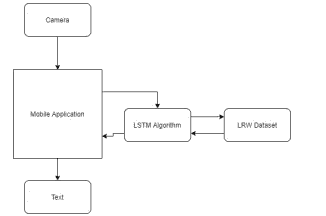

# 使用人工智能的唇读文本

> 原文：<https://medium.com/analytics-vidhya/lip-reading-to-text-using-artificial-intelligence-5cd03d1036f1?source=collection_archive---------17----------------------->

> 这个应用程序使用智能手机的摄像头来检测一个人的嘴唇运动，并将其转换为文本。这使用 LWR 数据集来可视化嘴唇的每个动作。在观想之后，这将被转换成一种人们可以容易理解的形式。

唇读是一种当正常声音不可用时理解和视觉解释嘴唇运动的技术。正如我们所知，这被听力受损的人广泛使用，这样他们就能够处理来自其他人的一些信息。

弄清楚如何唇读包括创造和排练某些能力，可以使程序简单得多，并逐步成功。其中包括:

*   学会利用说话者的嘴、牙齿和舌头的发展所发出的信号。
*   阅读和评估由外表、非语言交流和与所说的话有关的动作所给出的数据。
*   用视觉来帮助调谐。
*   使用早期的信息来填补理解中可能出现的漏洞，因为很难仔细阅读所说的每个单词。
*   奇怪的是，阅读较长的单词和完整的句子比阅读较短的单词更简单。

# **算法**

长短期记忆(LSTM)是一种用于深度学习领域的人工递归神经网络(RNN)架构。不像标准的前馈神经系统，LSTM 有批评协会。它不仅能处理单一的信息焦点(例如图片)，还能处理信息的整体排列。一个典型的 LSTM 单元由一个单元、一个信息门、一个出口通道和一个远眺门组成。手机通过自由支配的时间间隔进行回忆，三个入口通道引导数据进出手机。LSTM 系统适合于根据时间安排信息来订购、准备和做出期望，因为在一个时期安排中的重要场合之间可能存在模糊跨度的松弛。LSTMs 的创建是为了管理在准备常规 rnn 时可能遇到的引爆和消失倾斜问题。

# 方法学

所提出的系统包括一个移动应用程序，该应用程序使用相机来捕捉嘴唇运动，并使用 LSTM 算法将其转换为文本，并且该应用程序使用 LRW 数据集来使用相机捕捉的特征以转换为文本。

**系统架构**

过去的研究表明，CNN 和 RNN 模型都可以单独完成更好的唇读确认执行。我们发现，基于考虑的一半一半系统 CNN-LSTM 可以额外提高执行力。基于安排的考虑工具可以应用于用时间安排 PC 视觉识别的任务，并且帮助模型集中于视频的一些连续数据。考虑到光线、点和信息图片清晰度的影响，我们利用了相机的优越性质，提出的模型是用 RGB 图片准备的。

通过利用依赖于 VGG19 的模型来改进 CNN，并且它确实排除了最后两个完全关联的层，并且我们继续根据 ImageNet 的预先准备参数来准备模型。VGG19 的结构图如图 5 所示，VGG19 的贡献是 224 × 244 像素的 RGB 画面。这样，CNN 的产量是 4096 × 10，并且考虑组件熟悉 LSTM 系统来加权关键帧。从该点开始，系统展开两个完全关联的层和一个 SoftMax 层进行分组。

# 结论

现在，CNN 和基于考虑的 LSTM 的神经系统设计被提议用于唇读确认框架。CNN (VGG19)立刻将视觉亮点从嘴部 ROI 中分离出来。在这一点上，我们利用基于考虑的 LSTM 来熟悉边缘级突出之间的分组负载和连续数据。最后，利用两个完全关联的层和一个 SoftMax 层完成了分组。测试数据集是由我们自主开发的，由三名男性和三名女性组成。美国英语的方式来表达数字从零到九，每一个先进的发音被分离成自主视频剪辑，每个自由发言人肯定没有准备好熟练的演讲。测试结果表明，与一般的 CNN-RNN 模型相比，所提出的设计可以在没有任何其他数据集的情况下从嘴唇区域图片的排列中充分预见单词，并且所提出的模型在测试数据集上的正确率为 88.2%，比一般的 CNN-RNN 模型高 3.3%。在未来的研究中，我们将在连续交流记录的数据集上建立唇读确认模型，包括来自新闻交流和真实场景的视频测试，以研究所提出的非特定人视频话语确认框架的方法。