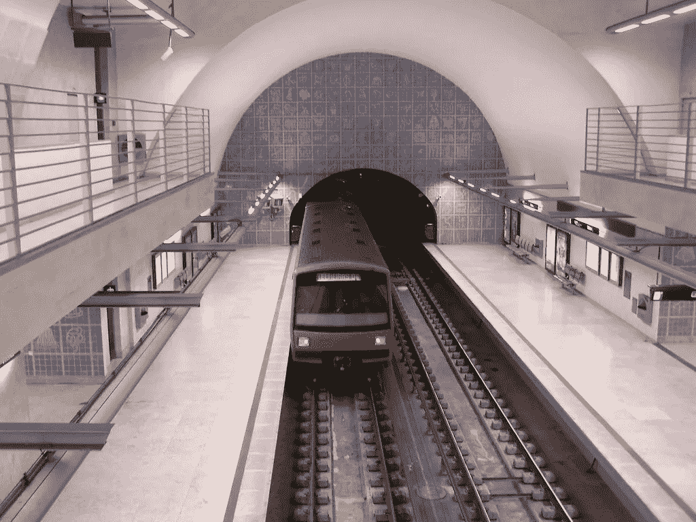
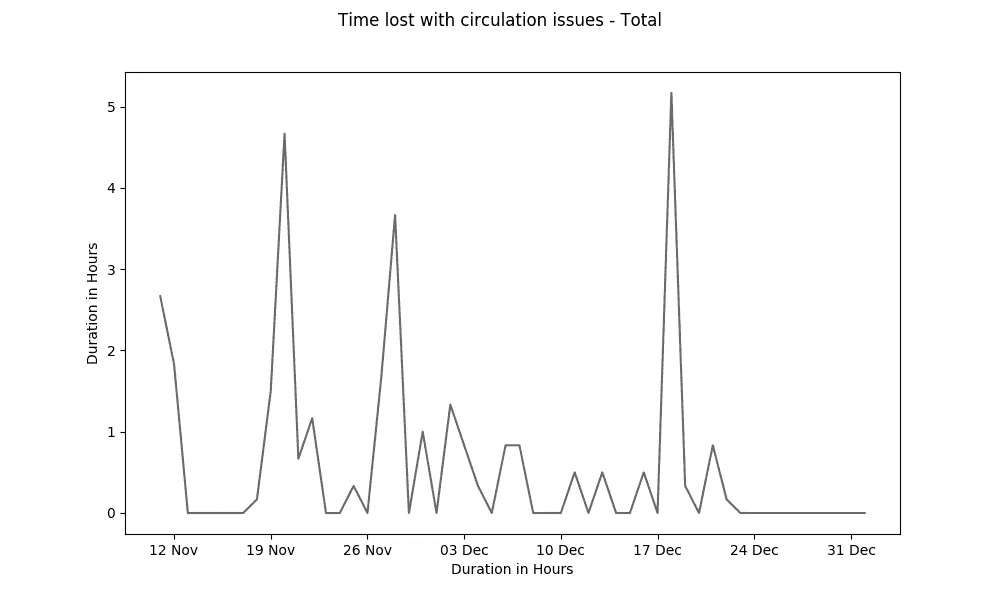
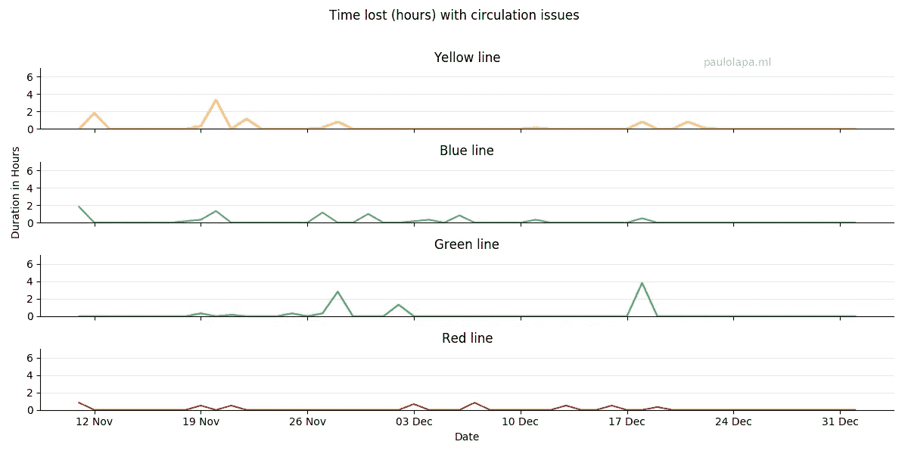
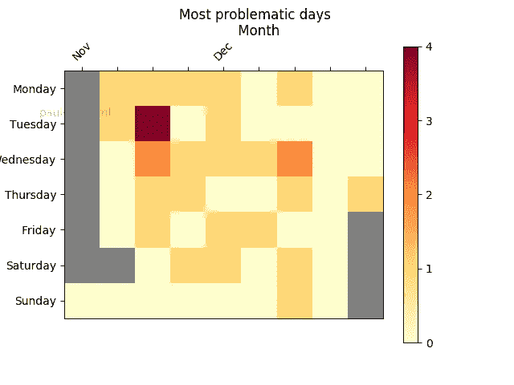
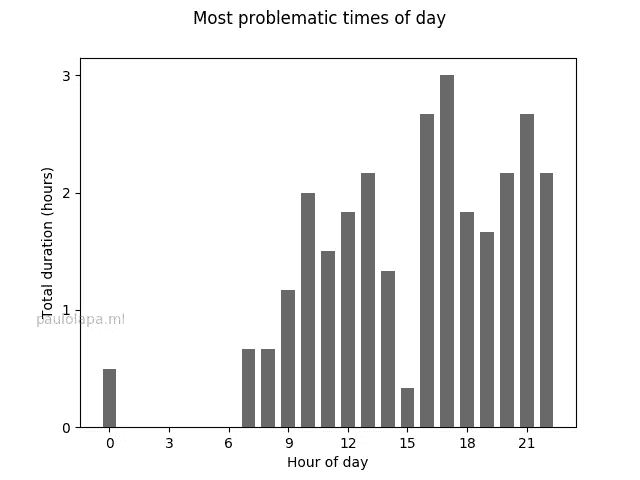
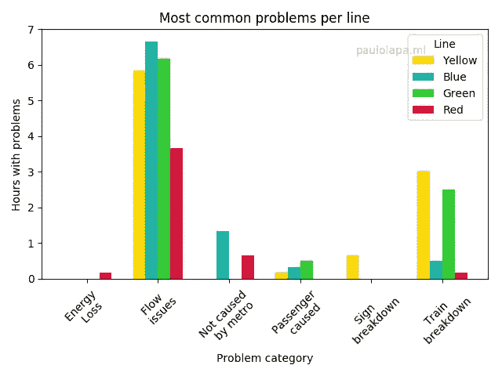

# 里斯本地铁，为什么这么晚？

> 原文：<https://medium.com/analytics-vidhya/lisbon-subway-a-study-on-its-delays-73d6915470b?source=collection_archive---------7----------------------->

对大多数人来说，地铁是游览里斯本的首选(也是唯一的)交通方式。对许多人来说，这也是每天沮丧和令人汗流浃背的延误的来源。

> 对于葡萄牙的标准来说，地铁系统相当庞大:网络长度为 45 公里，连接 56 个车站，2018 年为 1.69 亿乘客提供服务。2019 年网络峰会是葡萄牙最大的活动之一，为期 4 天，吸引了超过 500 万乘客。

你真的决定采取数据驱动的方法，并试图了解延迟是否像他们一样频繁，或者只是不幸的[生存偏差](https://en.wikipedia.org/wiki/Survivorship_bias)。

[科尼利厄斯·基贝尔卡](https://www.flickr.com/photos/77704362@N00)的【Telheiras】在 [CC BY-SA 2.0](https://creativecommons.org/licenses/by-sa/2.0/?ref=ccsearch&atype=rich) 下获得许可

葡京地铁的网站提供了一个[公共 API](http://app.metrolisboa.pt/status/getLinhas.php) ，实时显示网络的当前状态。带着树莓 pi 和 python scraper ( [github](https://github.com/plapa/lx_subway_scrapper) )我开始了解这些故障和问题有多常见，希望能让你休息一下。

在过去的 7 周里(从 2019 年 11 月 10 日到 2020 年 1 月 2 日)，我以 10 分钟的间隔(减去一些互联网中断)抓取了上述页面，一眼就可以看出它可能不仅仅是一个负面的集体记忆:

有问题的日子是正常的:在有数据的前 35 天，18 天至少看到一个问题。大多数时候，只有一条线路有问题(我们会看到谁是受此困扰的可怜通勤者)，但在 11 月 19 日，所有四条线路都面临麻烦，12 月 19 日也是问题最多的一天。很高兴看到圣诞节休战，在圣诞节-新年周期间没有任何问题。

故事的另一面是，虽然故障频繁发生，但时间往往很短:在我有数据的 3559 个地铁运营小时中(即 37 天内的 4 条线路)，只有 32 个小时遇到了问题。

# 在哪里？

“Um mal nunca vem só”，厄运从不降临。循环问题经常一次出现在两三行中，通常是黄色和蓝色，或者绿色和蓝色。

此外，虽然黄线的通勤者必须等待最长时间才能解决问题，但蓝色的通勤者几乎每天都被困。红线相对来说毫发无损——也许是因为它更年轻，或者是与机场连接的重要性。

# 什么时候？

颜色表示有问题的地铁线路数量

显而易见，周日是乘坐地铁的最佳时间——尽管可能不是最有用的。工作日总是很复杂，但事情似乎在周三特别糟糕，在周二和周四更容易。请注意，周二和周三有一些异常值。

总的来说，地铁似乎在高需求时期过得很艰难，因为在圣诞节期间发行数量较少，然后在 1 月 2 日城市开始恢复工作时再次恶化。

另请注意，灰色单元格颜色保留给没有数据的日期，灰白色/黄色表示没有事件。

当在一天中进行分析时，似乎问题可能会在一天中发生，特别是在上午 10 点到下午 2 点出现一个小高峰。然而，主要的瓶颈出现在下午，尤其是从下午 5 点到晚上 8 点。请注意地铁在凌晨 1 点到 6 点之间关闭。

我认为这是由于人们下班回家的下午时段乘客急剧增加，以及随着时间的推移，网络缺陷越来越严重。

# 为什么？

缺乏判断力不是循环停止的原因，但列车故障是，而且也很常见:记录的 6 小时问题是因为与列车故障有关的问题。

但是，到目前为止，最常见的问题是流量问题(对于那些乘坐地铁的人来说，可怕的“existem problemas de circula，o tempo de espera pode ser superior ao normal”消息)，22 小时注册。然而，这感觉更像是一个包罗万象的类别，因为没有给出任何细节。

还有更罕见的问题，如信号故障(< 1 小时)、能量损失(< 1/2 小时)，最后，乘客事故和非里斯本地铁引起的问题(均为 1 小时)。

如前所述，黄线和蓝线似乎是受影响最大的。似乎每条线路都有自己的问题——黄线上的信号问题；或者火车故障在黄线和绿线也很常见。

特别是，“与地铁无关”的问题只出现在蓝线和红线上，根据我的经验，这可能是由两条线路交汇的 S. Sebastiã站发生的事件引起的。

有趣的是看到红线乘客是表现最好的——只有那里没有乘客事件被记录，但也许我们应该给它一个能量银行。

> 你听说过那个做火车项目的男孩吗？
> 
> 他必须记录所有的事情！

我希望你喜欢这篇文章，我决定尝试一下 python 中的数据可视化和 web 抓取。如果你想和我联系，给我写个评论。

如果你经常乘坐地铁，查看一些关于地铁状态的实时信息可能会很有趣:一个 [twitter 机器人、](https://twitter.com/lxmetro)T2、Under LX 网站和各自的 [Android 应用程序](https://play.google.com/store/apps/details?id=im.tny.segvault.disturbances&hl=pt_PT)。

此外，本周葡京地铁[庆祝其 60 周年庆典](https://www.publico.pt/2019/12/27/economia/fotogaleria/metro-lisboa-historia-fotografias-399319)，这使得里斯本的交通更加便利，也改变了我们在这座城市的生活方式。恭喜你！

编辑:1 月 12 日:我根据 reddit 的反馈更新了一些情节。

1 月 13 日:添加了错别字和 metro 介绍