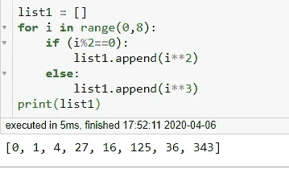
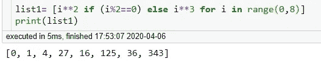
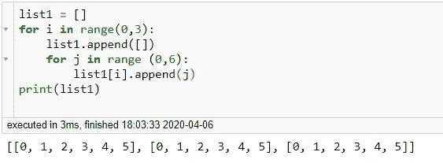
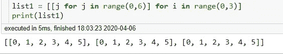

# 列出理解

> 原文：<https://medium.com/analytics-vidhya/list-comprehensions-9de2f2752c72?source=collection_archive---------20----------------------->

列表理解允许你只用一行代码就能生成同样的列表。list comprehension 将 for 循环和新元素的创建合并到一行中，并自动追加每个新元素。

让我们从一个例子开始——

> *我们如何在一行中写出下面的代码—*

```
list1 = []
for i in range(0,8):
    list1.append(i**2)
print(list1)
```

*输出为— [0，1，4，9，16，25，36，49]*

**在如下所示的列表理解中——我们将首先从列表中我们想要的输出开始，然后是 for 循环条件。**

```
list1 = [i**2 for i in range(0,8)]
print(list1)
```

如果您运行上面的代码，您将得到相同的输出。

# ***If-else in List Comprehension***—

**示例** —(简单的 If 条件):*您只想要列表中的偶数*

```
list1 = []
for i in range(0,8):
    if (i%2==0):
        list1.append(i)     
print(list1)
```

> ***如何将这段代码缩减为一行—***

```
list1= [i for i in range(0,8) if (i%2==0)]
print(list1)
```

两者都会给出这个输出— [0，2，4，6]

## 如果我们有**一个 if-else 条件—** 呢

**示例** — *我们想对偶数求平方，对奇数求立方*



平方——偶数，立方——奇数

> 我们如何使用列表理解来实现这一点-



使用列表理解

***注意:如果只有“If”条件，则将其写在“for 循环”之后，但如果有两个“if-else”条件，则将其写在“for 循环”之前(如上例所示)***

# **嵌套列表理解:——**

```
I want to create a matrix which looks like below:

matrix = [[0, 1, 2, 3, 4, 5],
          [0, 1, 2, 3, 4, 5],
          [0, 1, 2, 3, 4, 5]]
```

使用列表—



我们如何使用列表理解在一行中实现相同的代码—



太好了:)我们完成了列表理解。让我知道这个解释是否有帮助。更多关于 python 主题的解释请关注我。

我的下一篇博客会上 [***字典理解***](/@deepti.agl16/dictionary-set-comprehensions-a970a9552327?source=friends_link&sk=2a7de1e37a16da5e42d204c3b21e979f) 。

我的 Github 链接:-[https://github.com/DeeptiAgl?tab=repositories](https://github.com/DeeptiAgl?tab=repositories)