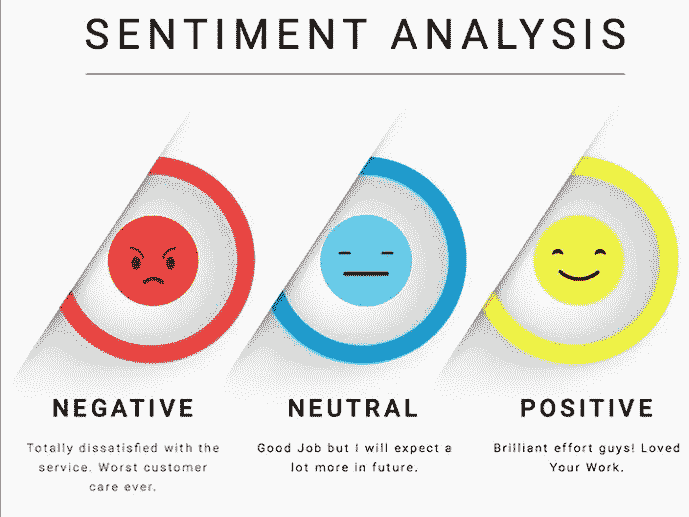

# 对情感分析很重要的库列表。

> 原文：<https://medium.com/analytics-vidhya/list-of-libraries-important-for-sentiment-analysis-3f97eb8485c3?source=collection_archive---------4----------------------->

在这篇博客中，我将分享几个重要的 python 库，它们可以用来分析句子或单词的情感。

## [**1。NLTK**](http://www.nltk.org)

它代表**自然语言工具包**。它是执行情感分析最流行也是最有用的库。

发布于 2001 年，由宾夕法尼亚大学开发。

NLTK 库包括名称实体**识别、标记化、词性(POS)和主题切分。** NLTK 还拥有很好的第三方扩展选择，以及其他库中最广泛的语言支持。

## **2。**[**text blob**](https://textblob.readthedocs.io/en/dev/)

这是一个轻量级的 Python 库，支持用于情感分析开发的 Python 2 和 Python 3。

发布于 **2013** 由 **Steven Loria 开发。**

TextBlob 具有基于规则的集成情感分析功能，具有两个属性:-

**A .主观性**

**B .极性。**

使用 TextBlob 和 VADER(价感知词典和情感推理器)的工作流是使用 TextBlob 进行情感分析的最流行的方法之一。

## [**3。空间**](http://www.spacy.io)

**SpaCy** 是一个运行在 **Cython 上的多平台环境，**cy thon 是 Python 的一个超集，支持为 Python 开发快速执行的基于 C 的框架。因此，根据 Jinho D. Choi 等人的研究，SpaCy 是目前运行最快的解决方案

发布于 **2015** 由**爆炸 AI** 开发

与 **NLTK 不同，SpaCy** 专注于工业用途，并保持最小有效的工具集，与 NLTK 相反，更新取代以前的版本和工具。SpaCy 的预建模型解决了基本的自然语言处理领域，如命名实体识别、词性(POS)标记和分类。

我希望你喜欢这个博客。欢迎在评论区分享你的想法，也可以和我联系:-
Linkedin—[https://www.linkedin.com/in/shreyak007/](https://www.linkedin.com/in/shreyak007/)
Github—[https://github.com/Shreyakkk](https://github.com/Shreyakkk)
Twitter—[https://twitter.com/Shreyakkkk](https://twitter.com/Shreyakkkk)
insta gram—[https://www.instagram.com/shreyakkk/](https://www.instagram.com/shreyakkk/)
Snapchat—shreyak 001
脸书—[https://www.facebook.com/007shreyak](https://www.facebook.com/007shreyak)

谢谢你。