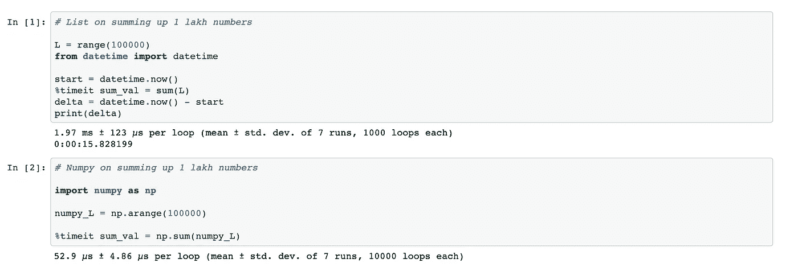
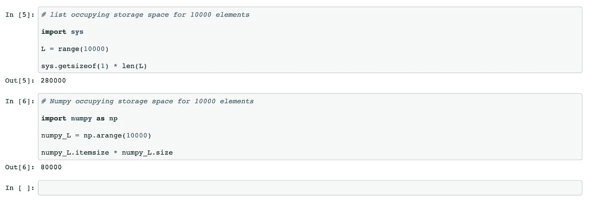

# 列表与数字比较

> 原文：<https://medium.com/analytics-vidhya/list-vs-numpy-comparision-35bf921588e9?source=collection_archive---------14----------------------->

Python 列表擅长处理异构(混合)数据类型，但是当数据量很大时，它们就退居二线了。列表数据类型不适合处理大型数据集。当数据集很大时，列表性能在速度和内存方面下降的一个可能原因是因为它们的异构性。而在 Numpy 数组的情况下，它们在较大的数据集上表现良好，因为数组是同构的。

让我们看看 List 和 Numpy 数据类型在数据量很大时的执行速度。

就执行速度而言，List 与 Numpy

github 链接:[https://github . com/bvvkrishna/Deep-Dive-into-Python/blob/master/ListVsNumpy-speed test . ipynb](https://github.com/bvvkrishna/Deep-Dive-into-Python/blob/master/ListVsNumpy-SpeedTest.ipynb)

在上面，我们可以看到列表的大小是 10 万个元素。将所有元素加起来需要 1.97 毫秒，而 NumPy 中的相同操作需要 52.9 微秒。这意味着 NumPy 花费了 0.0529 毫秒，如果我们想用相同的度量单位来表示它们的话。

让我们也了解一下，当数据大小为 10000 个元素时，与 Numpy 数组相比，存储列表占用了多少空间。

就存储而言，列表与数字

github 链接:[https://github . com/bvvkrishna/Deep-Dive-into-Python/blob/master/listvsnumpystoragetest . ipynb](https://github.com/bvvkrishna/Deep-Dive-into-Python/blob/master/ListVsNumpyStorageTest.ipynb)

这里，如果我们注意到 List 需要 2，80，000 字节来存储 10，000 个元素，而 NumPy 数组需要 80，000 字节来存储相同数量的元素。

因此，总的来说，我们可以看到，当数据量增长很高时，List 的性能在速度和存储方面下降，而 Numpy 性能良好。但是这并不意味着列表没有用，因为它们能够保存混合的数据类型，并且在数据很小时工作得很好。

要深入了解 Python 内部，请在 Linkedin 上关注我-【https://www.linkedin.com/in/krishnabvv/ 